## Introduction

Understanding the colours of the web and knowing how they work is fundamental for any web developer. In the previous lesson, we’ve touched on the RGB colour system and looked at the differences between CMYK and RGB values; specifically, which is used for print and which is used for the web. In this lesson, we will further discuss the colours of the web. We will also have a look at Web Content Accessibility Guidelines (WCAG) and how colour should be applied to meet these guidelines.

|     | NOTE  This lesson contains 2 activities that you should complete. |
| :-: | :---------------------------------------------------------------------- |

## Hex and RGB colour codes

Hexadecimal colour codes are used in web design for the colours in a website and are often referred to as hex. Hex can be used in your CSS styling and are supported in all browsers.

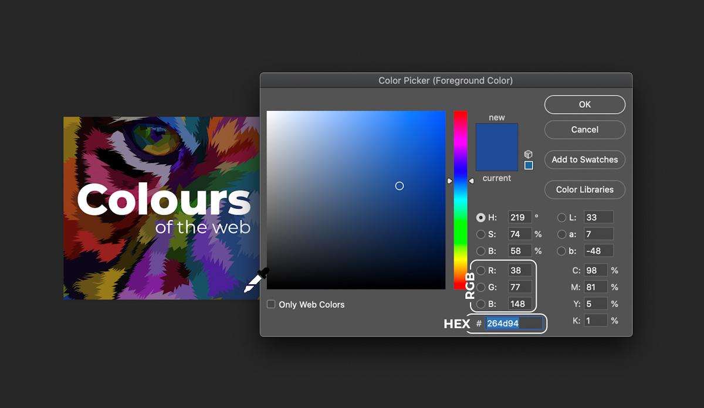

_Figure 1. An example of HEX and RGB colour codes in Adobe Photoshop._

RGB (red-green-blue) is also used on the web to represent colours, but they are written in different ways in the code.

## RGB Colours

RGB define all colours as a combination of three different values for Red, Green and Blue:

-  RGB (0, 0, 0) - this is black
   
 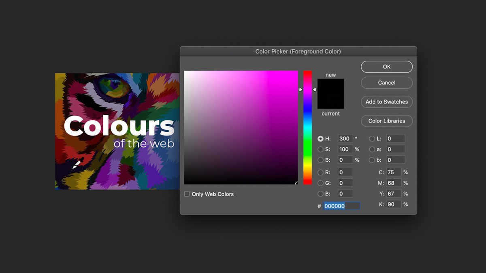

_Figure 2. RGB 000 – black._

-  RGB (255, 255, 255) - this is white

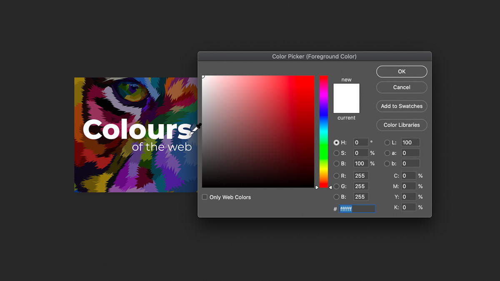

_Figure 3. RGB 255, 255, 255 – white._

Each parameter (red, green, and blue) defines the intensity of the colour as an integer between 0 and 255. Play around with different RGB values to create a colour here.

### Hexadecimal

Hexadecimal uses 16 unique digits (0-F). Decimal only consists of the numbers 0 to 9, so in order to have 16 unique numbers or digits, the letters A to F are used for the extra 6 digits in hexadecimal:

_Figure 4. Hex digits._

A hexadecimal colour code is a 6-digit colour code prefixed with #. They look like this:

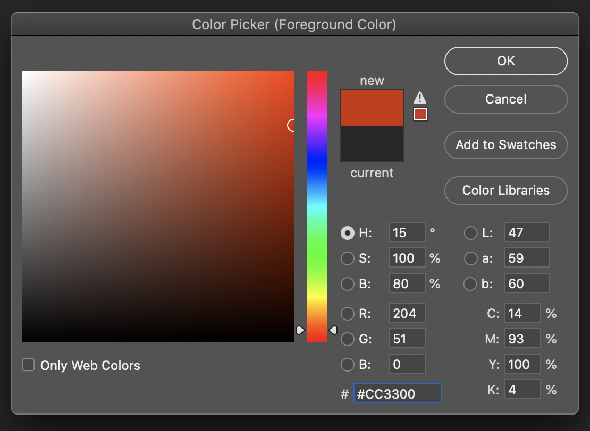

_Figure 5. #CC3300._

To understand the letters and numbers used after the #, a hexadecimal colour is specified as:

_Figure 6. #RRGGBB a hexadecimal colour._

In the #RRGGBB above: the first two digits denote red, the second two digits is for green, while the last two digits represent the blue shade. The hex colour system converts each value to hexadecimal. In reality, it’s still representing the same RGB value, just in another form. You may have heard it mentioned that RGB is a 24-bit colour. Since each of the three colours needs to have an equal portion of the 24-bits, it means that each of the three colours is represented by 8 bits. Otherwise known as a byte. This explains why the value range for each of the colours in RGB is 0 to 255 since 0 is the lowest value you can store in a byte and 255 is the highest.

How does this relate to hexadecimal? Every hexadecimal digit is represented by four bits, which means that every byte of an RGB value can be represented by two hexadecimal digits, for instance:

- 255 is 11111111 when written as a byte (a binary bit string)

- If that byte is divided into two separate bit strings, it becomes 1111 and 1111

- When the bit string 1111 is converted to hexadecimal, it becomes the digit F.

- So that means, when written next to another, the bit strings 1111 and 1111 becomes FF.

- This makes a decimal value of 255 equal to a hexadecimal value of FF.

- So an RGB value of 255, 255, 255 would get converted to FF, FF, FF which is written in hexadecimal colour notation as #FFFFFF.

With this logic, you’ll define how much red, green, and blue are in a colour by defining hexadecimal values between 00 and FF for each of the 3 parameters, instead of values in the decimal range of 0 to 255 like in RGB.

For the hex symbols going from 00 to Ff, 00 is dark/min colour/or black, and FF is bright/max colour/or white.

For example: 

#0000FF - is displayed as blue, because the blue component is set to its highest value (FF), and the others are set to 00.

_Figure 7. #0000FF displayed as blue._

Each number denotes the intensity of that particular colour, some other examples:

_Figure 8. #FF0000 only red (no green, no blue)_

)

_Figure 9. #00FF00 -- only green (no red, no blue)_

#FFFFFF -- if all colours are in equal intensity, you get white.

_Figure 10. #FFFFFF all white text._

#000000 -- if no colour is present, you get full black.

_Figure 11. #000000 all black text._

**Abbreviated hex codes**

Hex codes like #FFF, #000, #0F0 or even #ABC are hex codes that use three digits. This is the shorter way of writing a code which is three pairs of identical digits: #FFFFFF, #000000, #00FF00 or #AABBCC.

### Which one should you choose when coding?

Many developers find hex values easier to read, so they use hex. Most design programs also provide the colour values in hex. At times, RGB is also used in CSS, as you can add an alpha value which is helpful when wanting to change the opacity of the colour. Bear in mind that when an alpha value is added to RGB, it becomes ARGB, which is a 32-bit colour and no longer a 24-bit colour. An extra byte of information is added to define the opacity/transparency of the colour.

See the infographic below for a better understanding of the use of the different colour system and when to use each one.

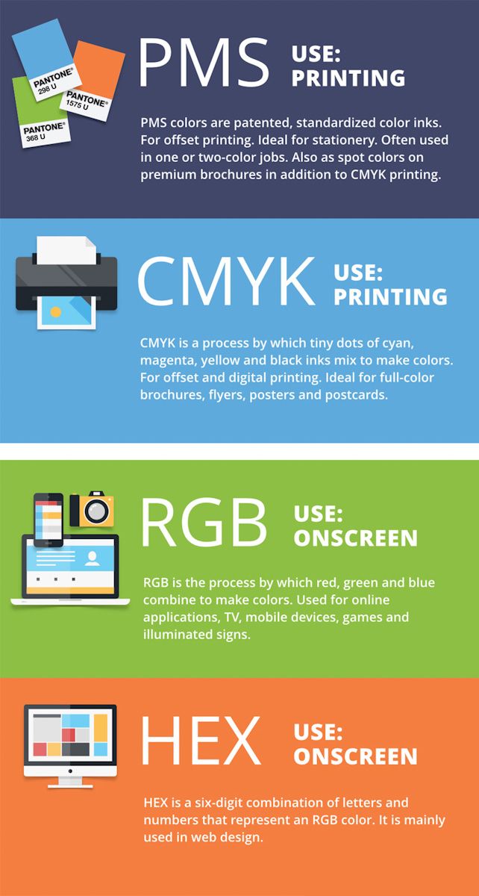

_Figure 12. PMS, CMYK, RGB and HEX explained (Kiss, 2020)_

## Web Content Accessibility Guidelines (WCAG)

Most restaurants, universities, shopping malls, and other public spaces cater for people with disabilities. Specifically individuals that cannot walk and are bound to a wheelchair. Have you ever noticed the wheelchair sign or the ramp outside a shopping mall that gives access to these individuals? Just as the architects and builders took them into consideration by providing them specialised access, so too does a front end developer need to do when designing and developing a website.

### What is WCAG

As mentioned earlier, WCAG stands for Web Content Accessibility Guidelines and was put into practice to make web content more user friendly for those with disabilities. Disabilities include, among others, colour blindness, low vision, or no vision at all, individuals with hearing problems, and individuals that are sensitive to flashing lights.

People with disabilities are trying to accomplish the same things daily as people without a disability. They just need specialised tools to achieve their goals. Think of individuals with a colour-blind disability. Will they be able to distinguish between the call to action (CTA) button if it was green and the background if it was red? Probably not, they would have a hard time figuring out where the CTA is to add that pair of shoes to the cart. Will the flashing animation cause a problem with hypersensitive individuals? What about those individuals that suffer from low vision? Will they be able to see the physical address hosted in the footer if the text is small? These are all things that you as a front-end developer need to take into consideration. Your website needs to cater to these people just like it would for individuals without disabilities.

For this lesson, we will take a closer look at the different types of colour blindness and what tools you as a developer can use to design a website with these individuals in mind.

## Colour Blindness

Colour blindness affects approximately 300 million people worldwide. The most common colour blindness is known as the ‘red/green colour blindness . Individuals that suffer from red-green colour blindness struggle to tell the difference between red and green.

According to the National Eye Institute the different types of colour blindness are red-green colour blindness, blue-yellow colour blindness and complete colour blindness (National Eye Institute, 2019).

_Red-green colour blindness_

**Deuteranomaly.** The most common type of red-green colour blindness. It makes green look more red. This type is mild and doesn’t usually get in the way of normal activities.

**Protanomaly.** Makes red look more green and less bright. This type is also mild and usually does not get in the way of normal activities.

**Protanopia and Deuteranopia.** Both of these make individuals unable to tell the difference between red and green.

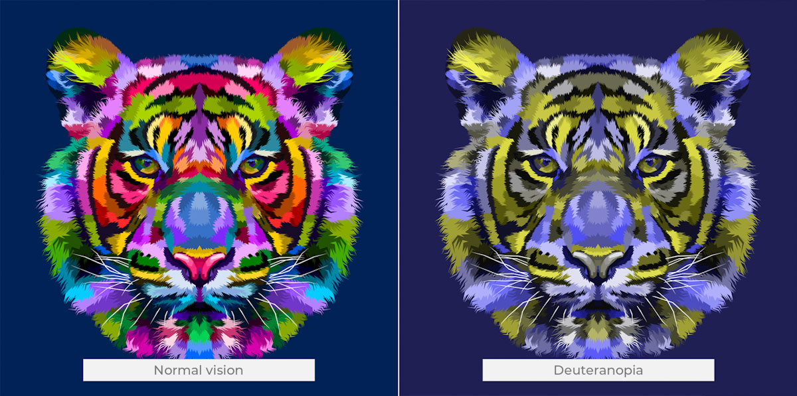

_Figure 13. The difference between normal vision and Deuteranopia._

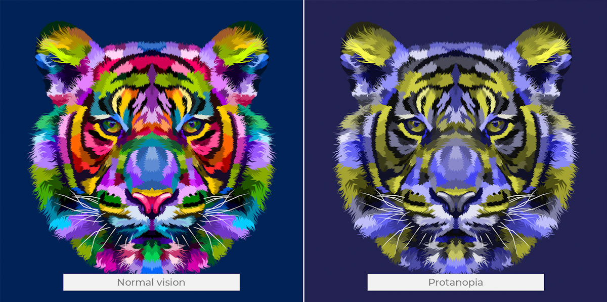

_Figure 14. The difference between normal vision and Protanopia._

_Blue-yellow colour blindness_

The National Eye Institute (2019) further explains that the blue-yellow colour blindness is the less-common type of colour blindness. For individuals suffering from this type of disability it’s hard to tell the difference between blue and green and between yellow and red.

Tritanomaly makes it hard to tell the difference between blue and green, and between yellow and red.

Tritanopia makes it hard to tell the difference between blue and green, purple and red, and yellow and pink. It also makes colours look less bright.

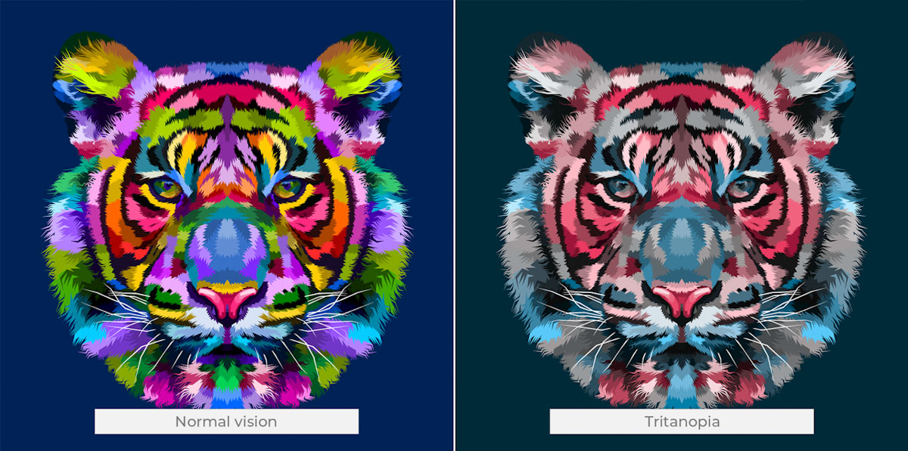

_Figure 15. The difference between normal vision and Tritanopia._

_Complete colour blindness_

Monochromacy is when someone is completely colour blind, they can’t see colour at all. This deficiency is quite rare.

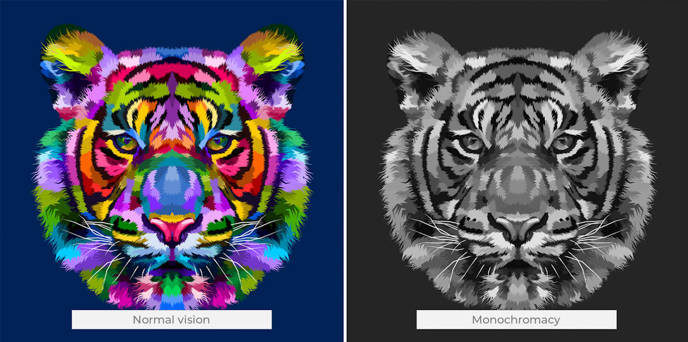

_Figure 16. The difference between normal vision and someone who is completely colour blind._

### Tools to ensure good colour

To ensure there is a good contrast between colour you can use the following online tools:

_Color Oracle_

Color Oracle is a free colour blindness simulator for Windows, Mac, and Linux. It takes the guesswork out of designing for colour blindness by showing you in real time what people with common colour vision impairments will see. Download the app and install it on your device. Then check you work to see if there is a clear differentiation between colours.

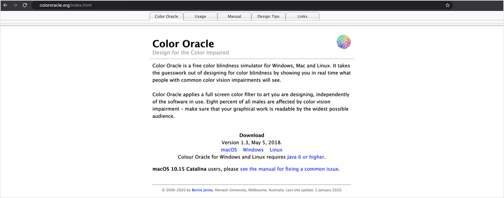

_Figure 17. colororracle.org._

_Toptal_

With toptal.com you enter the website URL that needs to be colour checked. The website will then provide you with filters from which you can choose from. These include common colour impairments. After the website has generated the result it will be displayed in the preferred colour filter.

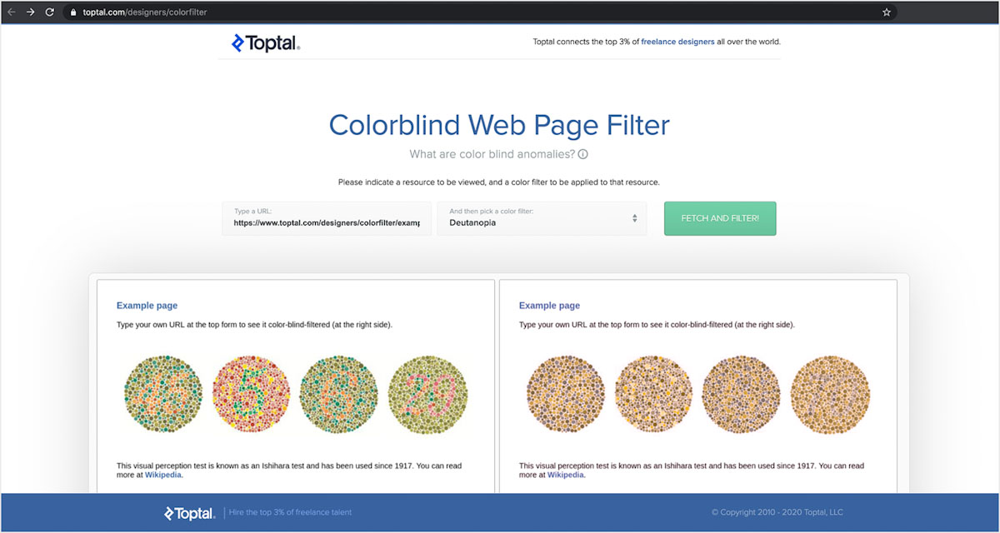

_Figure 18. Topal.com colorblind web page filter._

It’s vital that your website that caters for everybody’s needs. For instance, individuals with a colour blind deficiency are not able to tell red and green apart, but they need to be able to see the difference between the colours on your website. Use tools such as these to check whether it is possible to differentiate the various colours used on the website, before deploying to the public.

## Activities

### Activity 1

| WATCH  

| Video: [Accessibility for Web Design](https://www.linkedin.com/learning/accessibility-for-web-design/welcome?u=43268076) (2m 35s) by Derek Featherstone. He uses real scenarios to explain how a website can cater for individuals with disabilities. |
| :-: |

### Activity 2

| READ  From David Kadavy's book Design for Hackers: Section: 'How the visual system works' (pages 201-206) (1h)]|
| :-: |

## Lesson Task

### Goal

Explore the selected colour-blind simulator, Toptal. Get to know the tool, and become familiar with how the visually impaired see colour.

### Brief

Go to Toptal's Colorblind Web Page Filter and enter any three websites of your choice. Now do a colour-blindness check on different web pages and see the results.

-  Are there distinct differences?

-  Can you spot potential difficulties for colour-blind users?

-  Do a search and test other online colour-blindness simulators to find the best tool for you.

### Bibliography

Kiss, E. (2020). What’s the difference between PMS, CMYK, RGB and HEX? Retrieved July 2020, from Neglia Design: https://negliadesign.com/ask-a-designer/whats-the-difference-between-pms-cmyk-rgb-and-hex/

colourblindawareness.org. (2020). Colour Blindness. Retrieved July 2020, from colourblindawareness.org: http://www.colourblindawareness.org/colour-blindness/types-of-colour-blindness/

National Eye Institute. (2019). Types of Color Blindness. Retrieved July 2020, from National Eye Institute: https://www.nei.nih.gov/learn-about-eye-health/eye-conditions-and-diseases/color-blindness/types-color-blindness
