## Introduction

It is vital to have on a website the correct images for the target audience, icons that are appealing, and call-to-action buttons that draw the viewer’s attention to specific actions. In this lesson, we discuss how to choose the right content for a website not only for aesthetics, but also to ensure the website is relatable to the target audience and assists them in reaching the end goal.

| NOTE  This lesson contains 4 activities that you should complete.

## Content

### Content is king

When we consume content, whether it is in a magazine or on our favourite website or social media platform, we want what we are looking for immediately and without much effort. It is essential to ensure that content is of the highest quality, easy to comprehend, and aesthetically pleasing. Not only will a website that is appealing leave a memorable impression, but it will also come across as credible. Credibility is a fundamental attribute in the ever-changing world of online content. Without engaging and credible content, a business will go unnoticed.

### What is content on a website?

Visual language is a form of communication that is constantly spoken around us and to us. Just as you would verbally tell a family member a story about an incident that happened at a social gathering, so should a good web design do the same, but only visually. It should communicate the essential information quickly and effortlessly to the online user and guide them to finish the journey they have started. Content is information and, on a website, it consists of photographs, text (written information), colour, typefaces, navigation graphics (such as icons and call- to-action buttons), and brand identity elements (such as the logo of a company).

### Designing for the target audience

Before we explore the vast and ever-changing realm of website content, let's first start with the who. An inexperienced designer may not understand why it is important to design with the target audience in mind. When focusing on the fundamentals, all that seems to matter is good design, interaction, and satisfying the client requirements. But to satisfy the client requirements, you need to understand the fundamental needs of the client. One aspect of this is to understand who the target audience is.

You need to have a good understanding of who your client's target audience is before you can even start to think of what elements to use on the company's website. Think about it like this; say you are tasked to design a website for children advertising a play park. You then decide to go for colours that are dark - consisting of black, grey and to add some emphasis you choose white. There, you have a colour palette consisting of three colours. You should be good to go. Not quite. How do you think your target audience, which is mainly children of about 7 years old, would feel when accessing your website? Would they feel excited about visiting your venue? Unfortunately, not. They would ask their parents to take them somewhere else, because the colours on the website didn't excite them.

Look at the example below; which photo would you use for a website selling activewear to young adults aged 20 – 35 years old? You would probably use the photo on the right because the woman is most likely of the same age as the target audience. Therefore, she would be more relatable to the audience your client wants to reach.

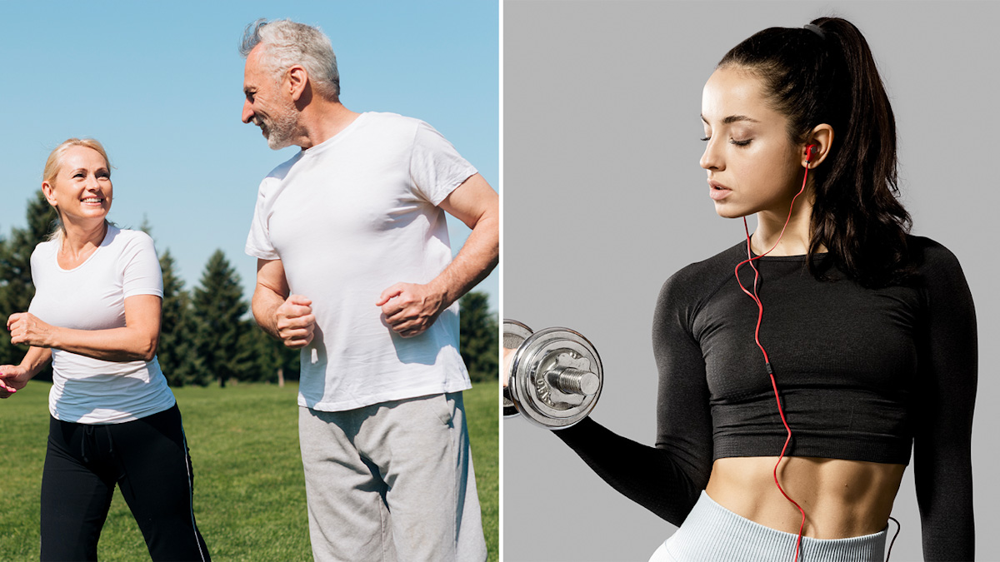

_Figure 1. An example of photo choice according to the target audience._

### Good knowledge of the key demographics and psychographics of a target audience is vital in getting to know them better.

- Demographics refers to the physical, like age, race, and gender.
- Psychographics refers to psychological factors such as a persons' beliefs, values, spending habits, and motivations.

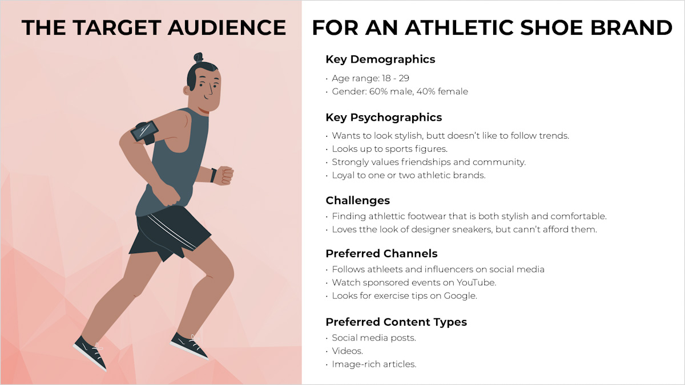

_Figure 2. An example of the target audience for an athletic shoe brand (Santo, 2019)_

## Choosing photographs for a website

Photos are vital elements to create appealing and engaging websites. Choosing the right images to use on your webpage is essential in the planning and design of your page. Not only does the photo need to look appealing, but it also needs to have meaning. Lastly, the image needs to fit the overall design and colour palette of the brand.

### Key aspects when choosing photos

### Quality is important

Photos with a low resolution or grainy and out of focus images should not be used. Images may be scaled to a smaller size, but never larger as this may lead to pixilation. Furthermore, images should be scaled at a fixed aspect ratio to avoid stretching and distortion. The selected images should clearly illustrate the brand or website topic.

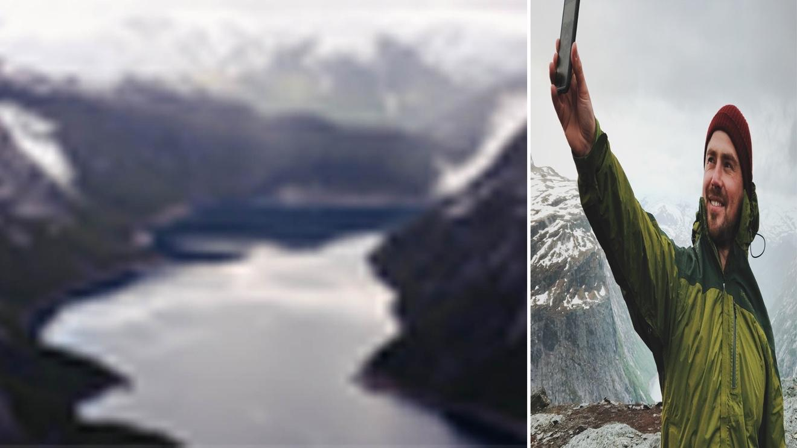

_Figure 3. When images are of bad quality and stretched out of proportion_

_Figure 4. Good quality images that are in perfect proportion is more attractive._

### Unique and original

Look for original photos and avoid photos that look too much like stock imagery or ones that are commonly used. Think of what you are trying to portray and do not go for the obvious photo. As a rule of thumb, avoid any images in the first couple of pages of stock library search results since most people will select these. Find images that are unique with a twist on what you are looking for, so try to be imaginative.

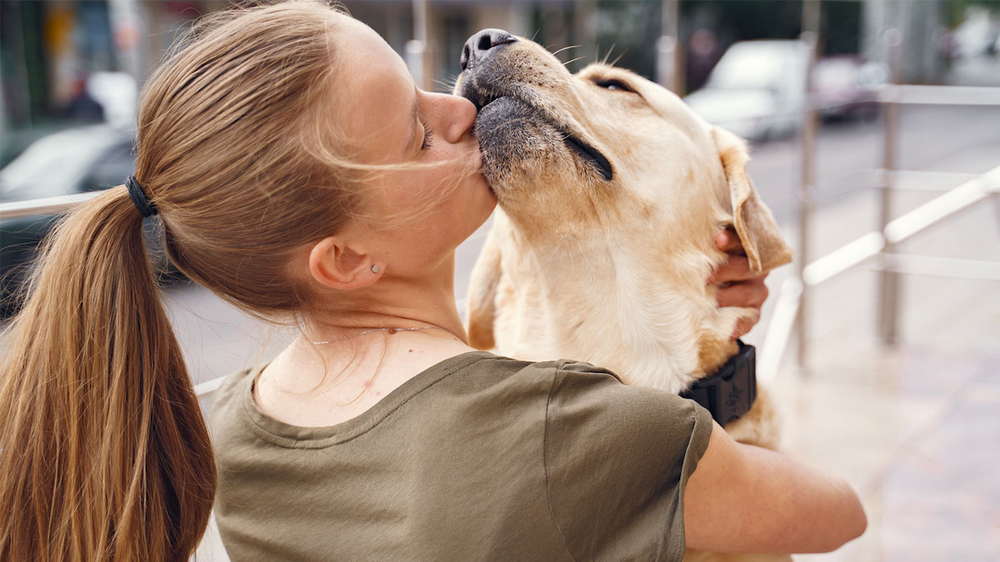

_Figure 5. This image is unique and tells a story between pet and owner._

### Use believable and appropriate people

Use people in the photos that are believable examples of your target audience. The users should feel that these are real, everyday people using your brand. Use people that your target audience can relate to. For example, a young hip clothing company wouldn't have images of senior people on their website.

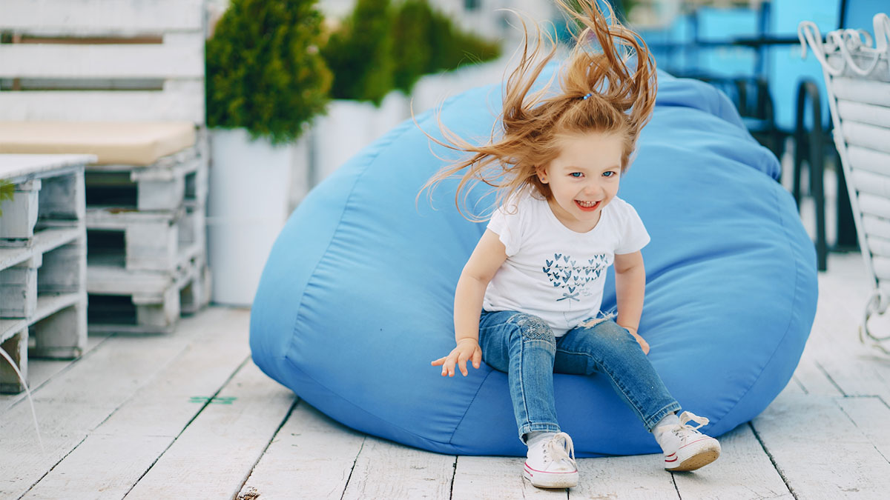

_Figure 6. The company sells bean bags for children. A good example of showcasing the target audience interacting with the product._

### Think of the emotional response to the photo

Photos of people smiling, for example, give a happy, positive feeling.

_Figure 7. A good example of a happy moment captured by the camera lens._

### Employ images with utility

Useful photos help the user better understand how a product is used, showing them the product, so the user can get a feel for how it looks and works. The image of the website below contains a photo showing the product and the app used with the product. Users can quickly see how they work together:

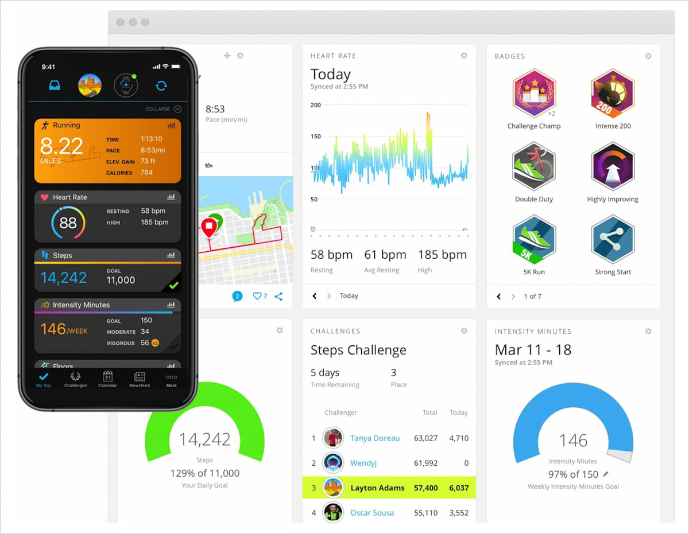

_Figure 8. Garmin Connect providing useful information with regards to their downloadable app (garmin.com, 2020)_

### Composition

The layout of the elements in a photo or image is known as composition. Photos can be busy with many different features / subjects in the picture; or they can be simple with just one subject in the photo and a lot of white or empty space.

The benefits of white space in photos are that it is easier for the user to focus on the main subject, and in design, the white space can be used for text and headings.

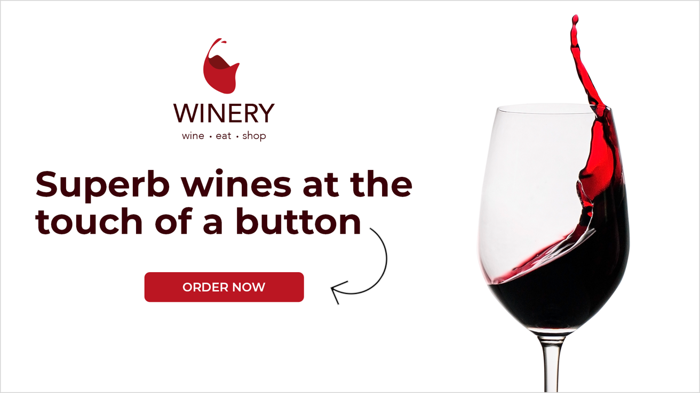

_Figure 9. An example of white space used for a logo, text, and a call to action button._

### Crop images to show what is essential

There may be distracting parts of the background that are unnecessary. Also, pick colours that go with the colour palette of the website when choosing images.

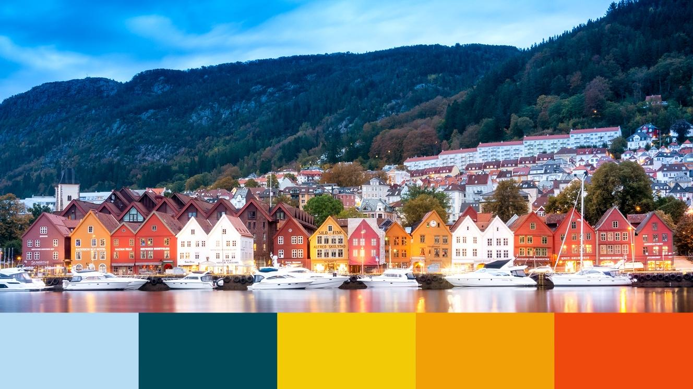

_Figure 10. The colour palette and image work together perfectly._

### Avoid using busy background images

These will bring a cluttered, overcrowded feel to a website. It's also best to avoid placing written text on a very busy photo. If the design needs writing to be placed on an image, use a colour with the opacity levels adjusted to make the text stand out more. This ensures that the user can clearly see what the message is.

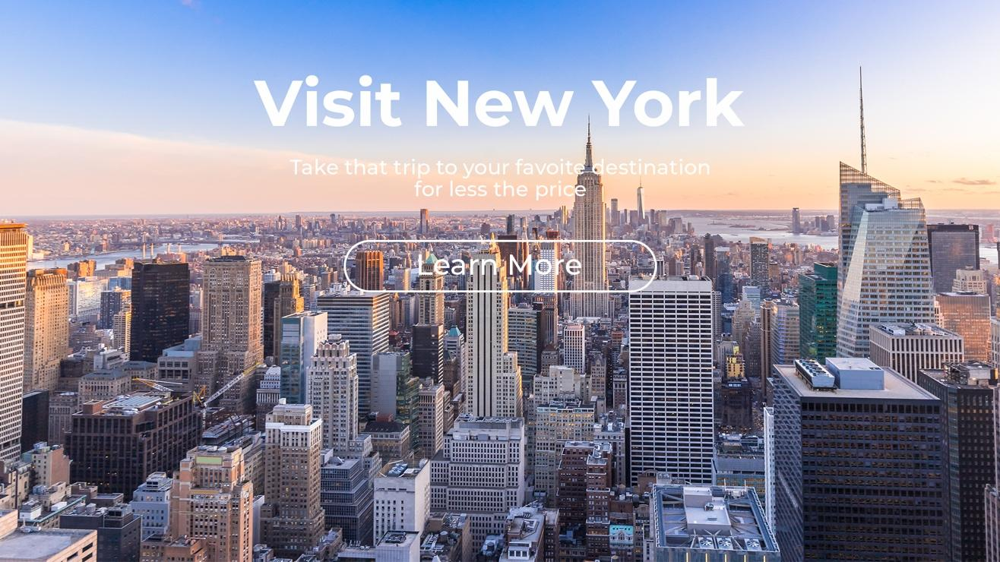

_Figure 11. The information on this design is hardly visible because the background image is too cluttered._

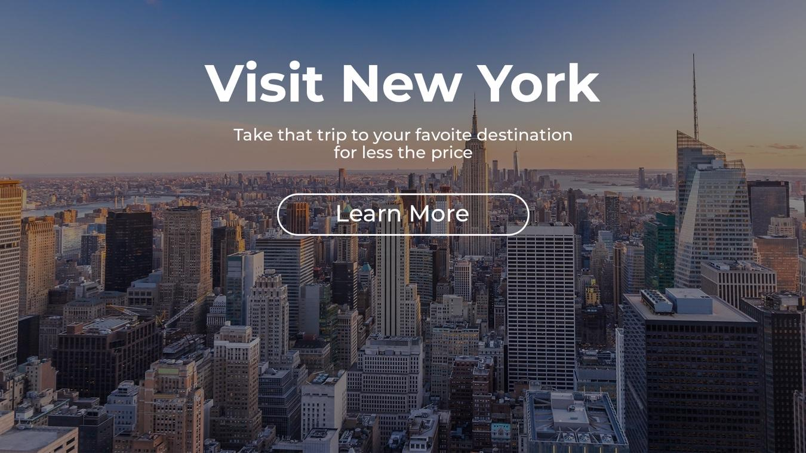

_Figure 12. The black colour overlay makes the information more visible._

### Use the Rule of Thirds

The rule of thirds in photography is a composition rule, and as mentioned previously, layout and composition are the placement of individual elements on a page or screen. It's no different when it comes to the rule of thirds. With this rule, a photo is evenly divided into thirds (three columns and three rows). The focal point of the photo, which would be the subject, is then placed either along one of the lines or at the intersection of the dividing lines. The rule of thirds makes for more attractive looking photos.

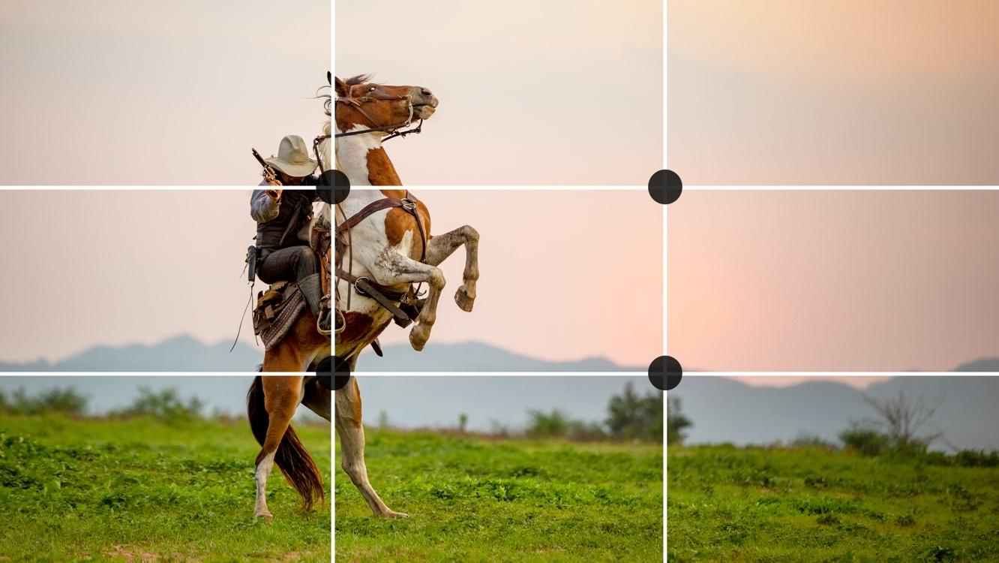

_Figure 13. An example of the rule of thirds in photography._

### Photography resources

Sometimes photography can be quite intimidating. That is why useful resources for photography can assist in getting high-quality images that are produced by professional photographers. These websites are all well-known for their free stock images. But before downloading any photos, make sure you understand what is required from you with regards to the licencing and the use of photos.

Free stock sites: [www.freepik.com](http://www.freepik.com/), [www.pixabay.com](http://www.pixabay.com/), [www.unsplash.com](http://www.unsplash.com/) and [www.librestock.com](http://www.librestock.com/) Websites that sell photographs can be quite expensive, but the images will probably be of a higher quality and you would have a bigger selection to choose from. With some free stock sites, you have the option to subscribe as a premium member, meaning certain photos are regarded as ‘premium selection’ and the only way for you to download those is by paying for them.

Paid stock sites: [www.shutterstock.com](http://www.shutterstock.com/), [www.gettyimages.com](http://www.gettyimages.com/), [www.istockphoto.com](http://www.istockphoto.com/) and [www.stocksy.com](http://www.stocksy.com/)

### Image optimisation

In web design, we measure the resolution of an image in pixels. Pixels are small dots that make up an image. The more pixels per square inch, the better quality of the photo. The fewer pixels per square inch, the lower the quality of the photo and the smaller the file size. The standard resolution for a web image is 72 dpi (dot per inch) often referred to as screen resolution. In print, the number is much higher and would be 300 dpi, making the file size of the photo much bigger that it would be for web.

It's vital to ensure the photos that will be used on a website is appropriately optimised for the web. When images are big in file size, they will take longer to load and in return create much frustration with the online user. This would result in an overall poorer user experience. Photos should be of high quality, but not bigger than a file size of 200kb - 500kb. Adobe Photoshop is an excellent tool for the resizing of images, but many free online tools would also be able to resize pictures effortlessly.

In the image below the picture on the left has a file size of 113mb, whereas the picture on the right has a file size of only 556,4kb after being optimised for the web. Other than the file size, not much difference is noticeable between the two.

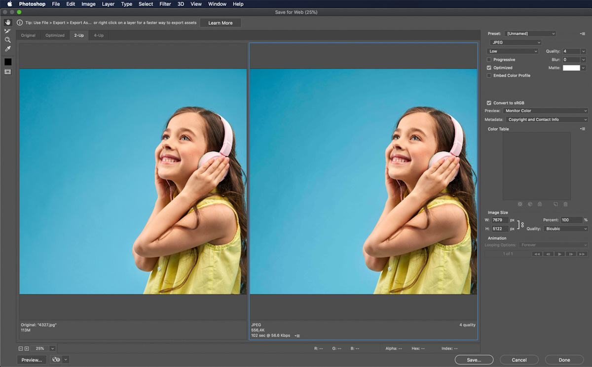

_Figure 14. Image optimisation in Adobe Photoshop._

### Raster graphics

Image editing software, such as Adobe Photoshop, is software known as raster graphics editor, meaning it is mainly designed to edit photos - whether it is resizing them, adding a filter, or adding and eliminating certain elements. Raster graphics, also known as bitmap graphics, are composed of pixels and use file formats such as JPEG, PNG, GIF, TIFF and BMP.

## Copy tells the story in written word

As a web developer, you would most probably not be required to write the copy of a website, but it is good to know the basics:

- What you write and tell the user should be well researched, honest, and to the point.
- Avoid jargon, as this might confuse the user and would not provide them with the needed information.
- Talk more about the clients' experience and less about yourself.
- The user would also be more trustworthy of you when there are no grammatical errors in the copy. It's best to run the copy through a word processing program to ensure no spelling mistakes crept in by accident. Microsoft Word and Grammarly are good word processing software packages to use in this regard.

## Icons - a universal language

In web design, an icon refers to a symbol that represents an action. It's useful because it doesn't take up much space on a screen and brings a lot of appeal to a website. More importantly, icons are universal. It doesn't matter what language the user speaks; they would be able to understand what is being conveyed. Therefore, icons are vital for good navigation on any website. But icon design is far more intricate and complicated than just adding a symbol to circle and giving it colour. Icons should be clear as to what they represent, and they should be recognisable. They should help, rather than confuse the user.

### Key aspects when choosing icons

#### Use icons that are relevant to the genre of the website

If you are tasked to design a website for a pharmaceutical company, for example, you will use icons that are more corporate in style than the more playful icons that might be used on a lifestyle website. The icons shouldn't be seen as a separate entity but should form a unity with the overall genre and design of the website.

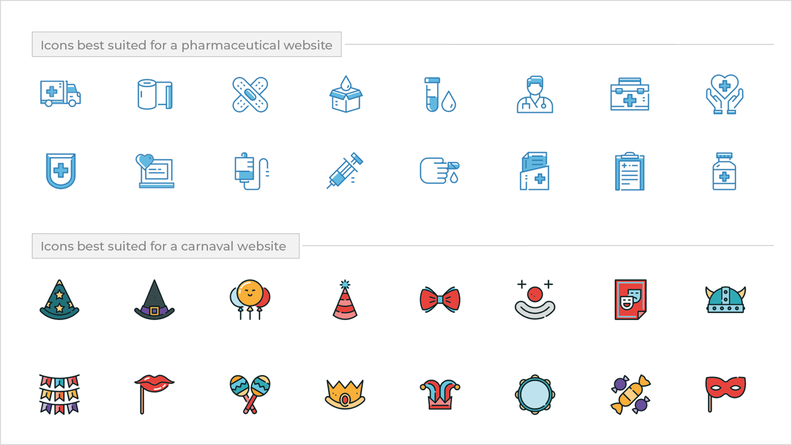

_Figure 15. Different style icons for different type of websites._

#### Icons should be in line with the corporate identity of a business

It wouldn't make sense to use icons that don't reflect the corporate identity. For example, the colour palette for your clients' brand consists of red, dark blue, light blue, and white. The icon set you want to use on the site should be the same colour as that of the brand. If an icon includes text, the font used should be the same as that of the company's corporate identity.

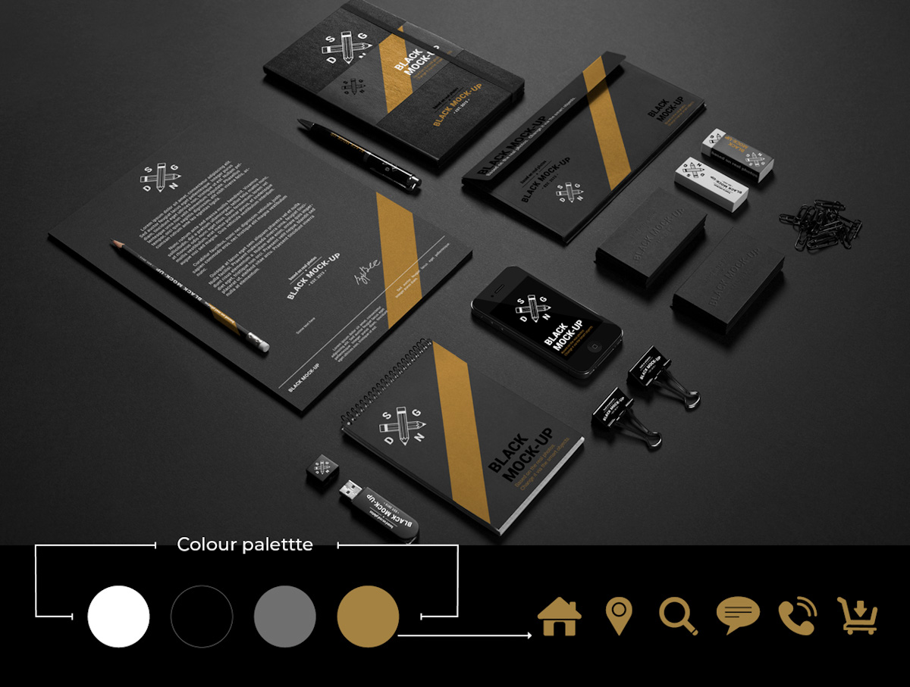

_Figure 16. The icons used for this company’s website consist of a colour present in their corporate identity._

#### Size matters

Creating icons for smaller (mobile) as well as bigger (desktop) screens are critical. That's where the saying 'the simpler, the better' comes in handy. Imagine you use a set of icons that are so intricate in detail that when scaled down, the user can hardly see what the icon represents. How would they know where it would lead them? Would they even be bothered to find out? The short answer is no. Always make sure that icons are simple enough but informative and self-explanatory to guide the user in the direction they wish to go.

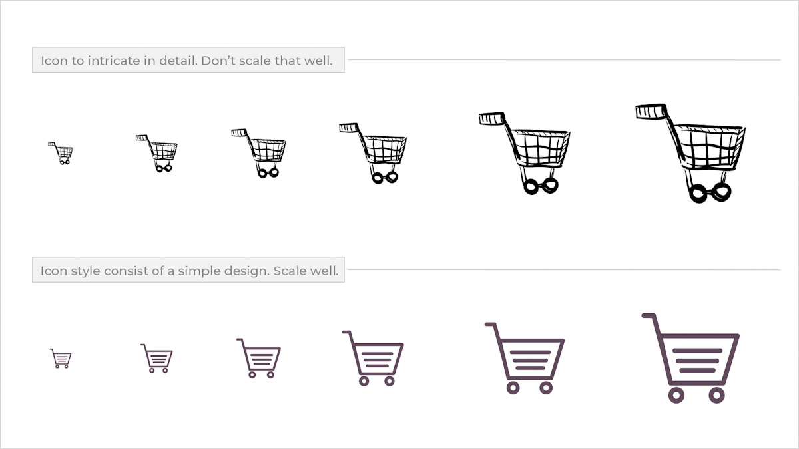

_Figure 17. The icon at the top is to intricate in detail that some detail gets lost when scaled down. The icon at the bottom consist of a simple design style and scale better and is more recognisable._

#### Similar in style

It's crucial to be consistent and use icons that have similar visual characteristics. The icons on your website should almost feel like a family. For example, if you decide to go for a more rounded shape icon, it should be consistent across. If one icon has an outline border, then all of them should have the same outline border. In the end, all icons should be consistent in style, colour, and size.

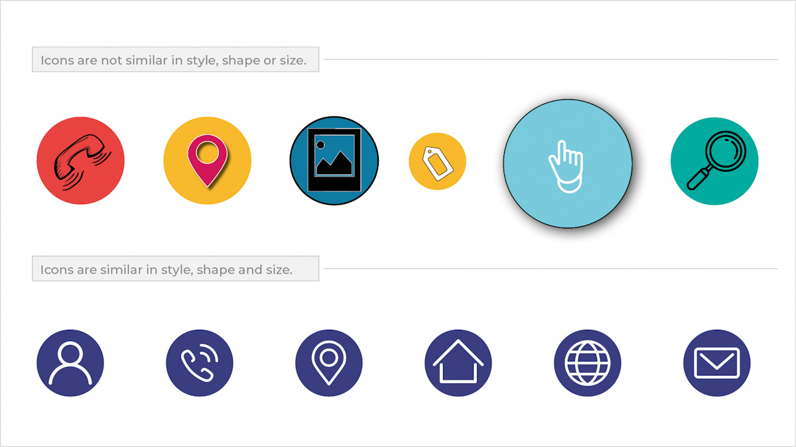

_Figure 18. The icon set at the top is inconsistent in style, size, and shape. The icon set at the bottom are consistent in style, size, and shape._

#### Quality control

As with everything in design, high-quality work is vital in achieving visually appealing designs. Icons should be of high quality and not pixelate. It's, therefore, best to design and edit icons in software intended specifically for that purpose. Tools such as Adobe Illustrator and Adobe XD are helpful in this regard. These programs assist the user in producing high-quality original icons or in editing ones that have been found online.

Good places to find free icons are [www.flaticon.com](http://www.flaticon.com/), [www.iconfinder.com](http://www.iconfinder.com/) and [www.freepik.com](http://www.freepik.com/). When reusing images, make sure you understand what is required from you in terms of the licencing before you use icons form these websites.

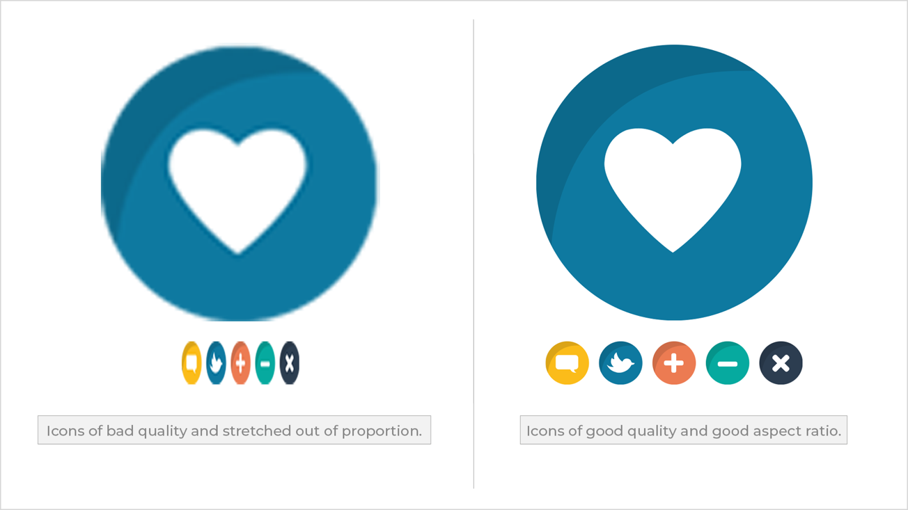

_Figure 19. Bad vs Good. The icons to the left is pixelated and stretch out of proportion. The icons to the right is of high quality and have a good aspect ratio._

### Vector graphics

As discussed earlier, Adobe Photoshop is a good tool to use when editing photos. With icons, you would use a vector-based program such as Adobe Illustrator. Adobe XD also can edit and design icons. A vector graphic consists of points and paths; thus, it has the ability to be increased and decreased in size without the graphic losing quality. That is not the case when it comes to raster graphics. The more a photo is increased in size, the more quality it will lose. Vector graphics use file formats such as .ai (Adobe Illustrator), .crd (Coral Draw), .svg (Scalable Vector Graphics) and .eps (Encapsulated PostScript). Although this may seem more daunting at first, it becomes easier once you learn how to use these file formats in a software package such as Adobe XD.

## Call-to-action buttons to motivate

Call to action buttons (CTA) are visible on almost any modern-day website and are mainly used to motivate the online user to take action and guide them to the end goal. A goal is the one thing you want them to do, such as buy a product or sign up for a newsletter.

### Shape and clickability

A CTA should attract attention, and it should be designed in a way that would be irresistible for the user to not click on it. Some might say a CTA that looks like an actual button might attract more attention than one that is flat. Others would say a button that has more of flat design style is more elegant. Regardless whether it is designed to have square or rounded corners, it should fit in with the overall style of your website. Keep it simple and stay consistent with the shape of the button across the site.

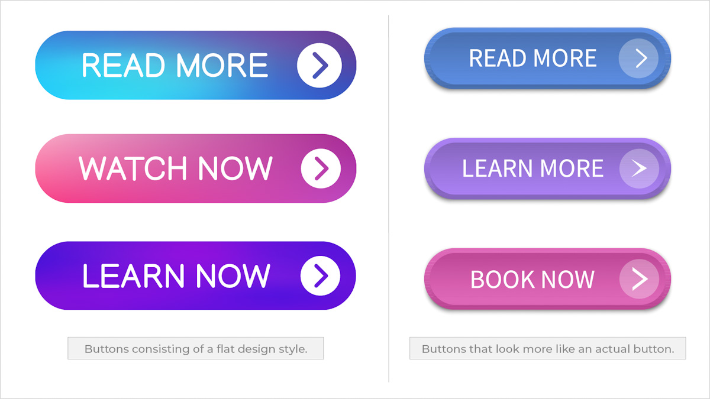

_Figure 20. Different style of buttons._

### Choose colour carefully

Colour matters and will ultimately be the one thing that would make the buttons stand out and attract attention. If you take a couple of steps back from your screen, the CTA should be clearly visible. Contrasting colours often work best, but make sure the chosen colour still forms part of the overall design of the site.

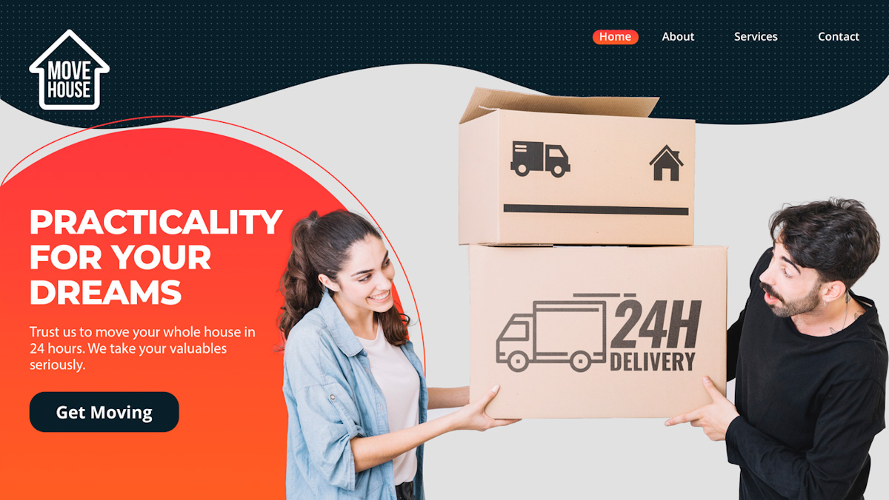

_Figure 21. The CTA is clearly visible and draw the attention of the user._

### On hover

A call-to-action button should change on hover to show the user that they are about to perform an action. It doesn't have to be a significant change. The more subtle the change the better.

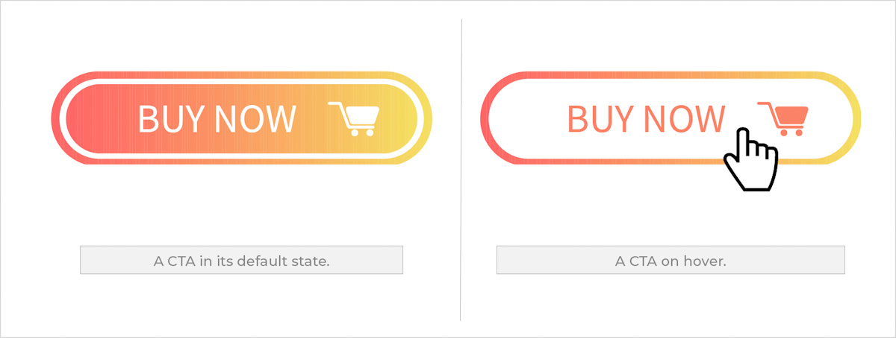

_Figure 22. A CTA in its default state and on hover._

### Action text

A successful CTA tells the user precisely what to do. They should be clear, simple and short and sweet. It shouldn't be intimidating but rather instil confidence in the user and do precisely what they say. Therefore, using action text on a button is best. These include: “Add to cart”, “Sign up”, “Free sample” or “Join now” just to name a few. See how short these are, but still, they are telling the user exactly what will happen when the button is clicked. The font used on a button should be easy to read and still be consistent with the fonts used on the website. Don't use a fancy script-like font as they are often hard to read.

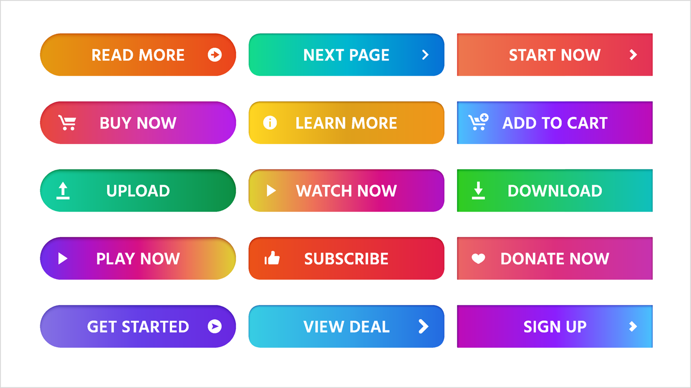

_Figure 23. Good action text being used on buttons._

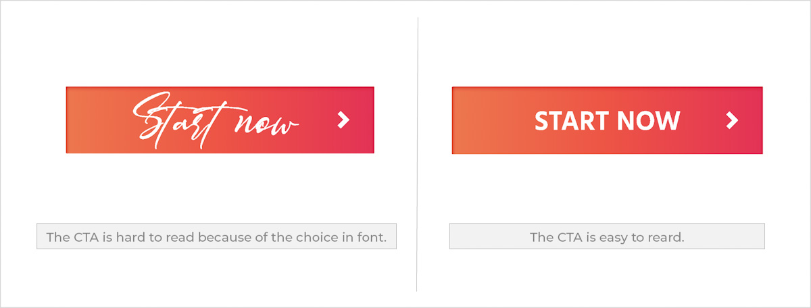

_Figure 24. The choice in font used on a CTA is crucial for the user to easily understand what the action is they need to take._

## Form

Forms are handy tools to use on a website to encourage user interaction and to gather information. A form is often the one thing that stands between the user and their goal and also the last step in the user's journey in completing their goal ((Babich, 2017)). A form should be straightforward for a user to complete them quickly and without confusion. A form consists of, among others, the following components: Labels, Input fields, Action buttons, Help and Validation.

### Labels

As the name suggests these labels your input fields. So, in short, tell the user what information you need them to place in each input field.

### Input Fields

Allow your user to fill in the form. It is the information you intend to receive from the user such as name, surname, and date of birth, for example.

### Action Buttons

These are the buttons that the user clicks to submit the information requested.

### Help

This provides support on how to fill out the form. It usually comes in the form of written text and a message 'what is this?' above the input field and next to the label, for example.

### Validation

These give the user feedback on the inputs they have submitted. Submission validations occur after the user completed the request and live inline validation occurs during the process of completing the form.

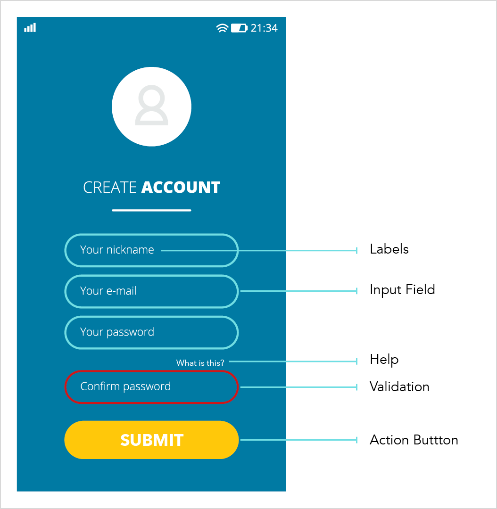

_Figure 25. An example of a form._

Poorly designed forms can discourage users from completing and submitting.

### The following tips will help you to create good forms:

- Ensure input fields are correctly aligned and spaced out with a decent amount of white space in between input field boxes.
- Don't ask the user to submit a lot of information that would make the form long. Instead focus on only the most essential information needed.
- Use fonts that are easy to read. Don't complicate things by using fonts that are harder to read, such as script fonts.
- A form should have appeal but needs to be as simple as possible. When a submission is successful, think of using colour to indicate success.
- The same goes for an unsuccessful submission. For instance, people often relate well to green being successful and red being unsuccessful.
- Avoid using dark, heavy drop shadows on any elements in a form. Not only will it take away from the overall appeal but might make it difficult to read and understand certain information. If there is a need for drop shadows use them in a subtle manner.

## Colour evokes emotion

We will discuss colour in more detail as we go along to the next module. But for now, think about what colour does to you. How does red, for example, make you feel? Would you use the colour pink on a law firm’s website? How would the target audience react when entering such a site? Colour forms a vital element on any website and even though it’s not actual information the user reads, it still evokes emotion the same way a photo would.

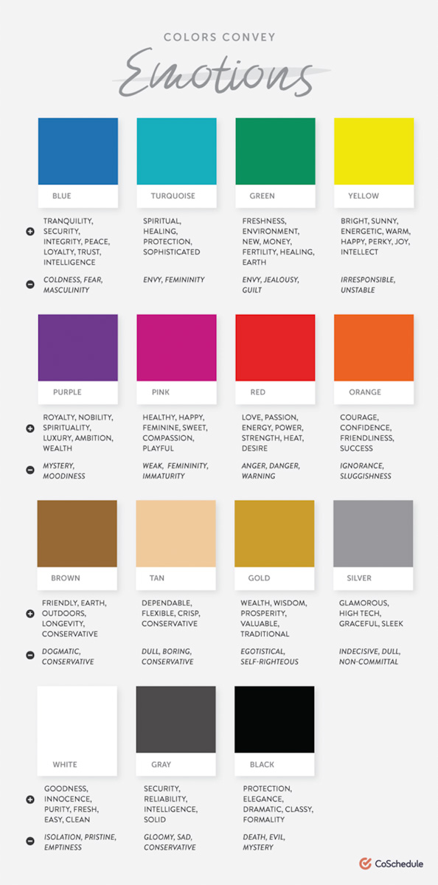

_Figure 26. Colour and emotion (Hauff, 2018)_

## Typography is powerful

Typography is another topic that needs discussion and that we will more carefully explore in the following module. But for now, it’s important to note that typography is one more vital element to website content. Like colour, it’s not actual information that a user would learn from, but it would make the overall user experience pleasant if done correctly and also bring more appeal to a website. If not, the message to the user will get lost. Think of it like this, would you take Thor, the Marvel superhero seriously if the producers of the movie decided on a font like the one below?

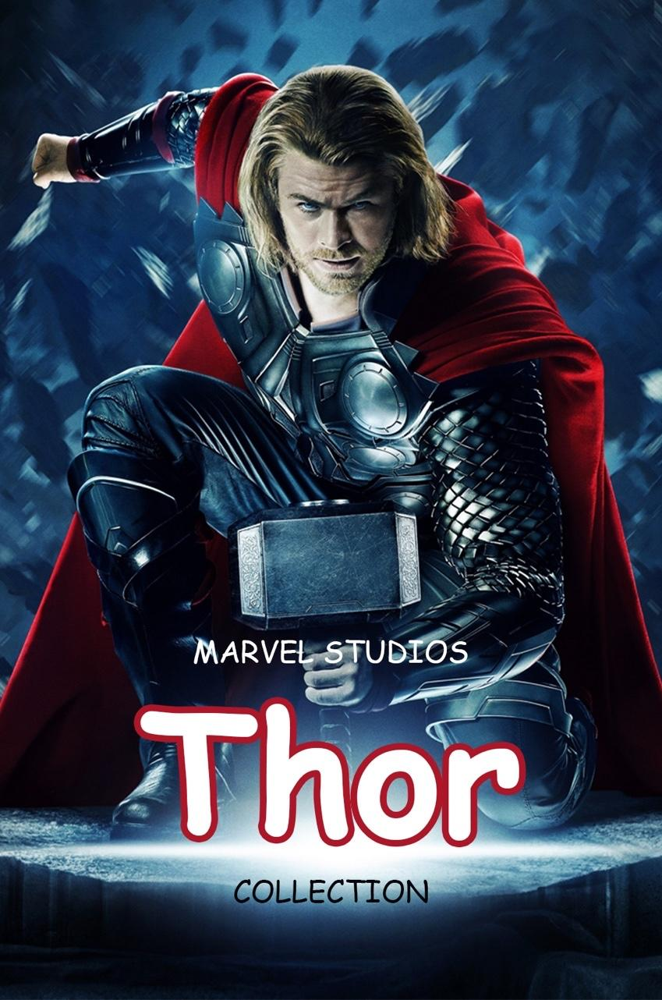

_Figure 27. A movie poster of the Marvel superhero, Thor. The chosen font makes the movie poster seem fake and not credible (DaNmArK, 2015)_

Probably not. Typography plays a significant role in communicating a brand message to the user. If done right, the user will understand, relate, and most certainly return for more. Thor is a strong character, physically and emotionally, and the chosen typography should communicate that message to the audience. You would probably use a more robust font that better expresses Thor’s personality.

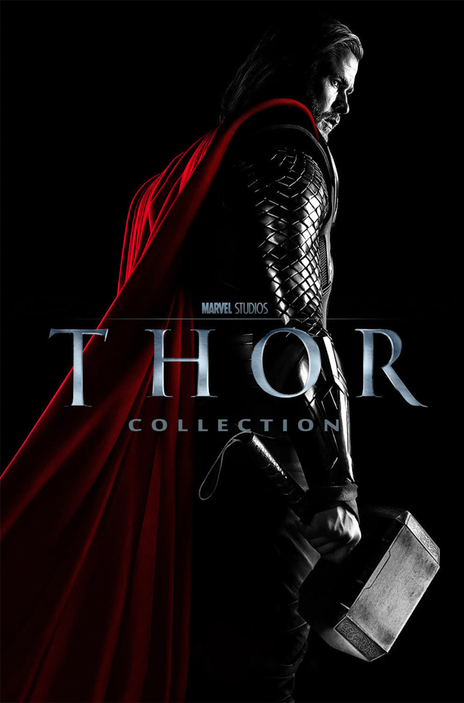

_Figure 28. The chosen font for the Thor movie poster is strong and communicates Thor’s personality to the viewer (Disney, 2011)_

Now that you have a clear idea of what to look for with regards to website content, undoubtedly, the most important take away from all of this is the target audience, and how you want to communicate the brand message to them. Every choice you make should be with them in mind; how you want them to feel about the brand and how you want them to interact with the brand.

## In summary:

-  Keep your design choices consistent across all platforms, forms, and pages.
-  Decide on an image and continue with that throughout.
-  Make sure that icons are similar in style and provide clarity on what they represent.
-  Call-to-action buttons should stand out and carry a definite action.
-  Forms should be short and easy to complete with a validation message telling the user if they were successful or not.
-  Colour should evoke the right emotion.
-  Fonts should be easy to read and assist all other elements in expressing the brand message to the online user.

## Activities

### Activity 1

| WATCH  The following video from Linkedin Learning is a short introduction into determining the target audience.  Video: [Determining the target audience](https://www.linkedin.com/learning/layout-and-composition-marketing-collateral/determining-the-target-audience?autoplay=true&u=43268076) (2m 40s) by Sean Adams. |
| :-: |

### Activity 2

| WATCH  Video: [Website Photos 101: The Photos You SHOULD Be Using & Where to Get Them](https://www.youtube.com/watch?v=hLAB69iCjg4) (12m 45) by Wes McDowell. |
| :-: |

### Activity 3

| WATCH  The following video from Linkedin Learning on using images and videos in Adobe XD.  Video section: [2. Images and vectors](https://www.linkedin.com/learning/learning-adobe-xd-2/import?u=43268076) (39m 38s) by Tom Green. |
| :-: |

### Activity 4

| WATCH  Video: [How to create forms, checkboxes & buttons - UI/UX & Web Design using Adobe XD](https://www.youtube.com/watch?v=Vm4mHkWktm8) (8m 33s) by Daniel Scott. |
| :-: |

### Activity 5

| WATCH  Video: [Form Design in Figma with Interactive Components](https://www.youtube.com/watch?v=ZWwE0GWEXDc&t=184s) (36m 32s) by DesignCourse. |
| :-: |

## Lesson Task

### Goal

Get to know Adobe XD/Figma better and practise the design and use of various design elements.

### Brief

The Winery is the name of the company that contacted you for the design of their website. They are looking for a website where their customers will be able to buy their special selection of wines online. Your task is to search for the various elements that will be present on their website. The target audience for the Winery:

### Key demographics and psychographics:

-  Age range: 30 – 40-year-old
-  Gender: 40% male, 60% female
-  The audience loves socialising with friends and family.
-  They like to shop online and buy most non-essential items online.
-  Feel loyalty to brands with values similar to theirs.

### Some challenges:

-  Struggle to find good quality wine that would age well.

### Preferred channels:

- Follow lifestyle influencers’ accounts on Instagram.
-  Enjoy watching YouTube videos about wine making.

### Preferred content types:

-  Social media posts.
-  Event marketing.
-  Videos.

### For this task create the following design elements:

-  Find photos that would speak to the target audience and showcase the brand’s products.
-  Create a colour palette for the brand.
-  Choose some fonts that will relate to the target audience and that are relevant to the brand.
-  Find icons that are informative and will assist the online user to buy products online. These can be a search, cart, location, message and contact for example.
-  Create a CTA for the online user to ‘add to cart’.
-  Create a page (1920 x 1080px) in Adobe XD/Figma.
-  Create a grid and place the design elements neatly on the page.
-  Make sure your elements are properly aligned and spaced out evenly. Each element should have its own space on the page.

## Bibliography

garmin.com. (2020, July 3). _Your day at a glance_. Retrieved from connect: <https://connect.garmin.com/>

Babich, N. (2017, July 1). _Designing Efficient Web Forms: On Structure, Inputs, Labels And Actions_. Retrieved from Smashing Magazine: <https://www.smashingmagazine.com/2017/06/designing-efficient-web-forms/>

Hauff, A. (2018). _The Know It All Guide To Color Psychology In Marketing + The Best Hex Chart_. Retrieved July 2020, from CoSchedule: <https://coschedule.com/blog/color-psychology-marketing/>

DaNmArK, P. A. (2015). _Thor 2 Wallpaper HD_. Retrieved July 2020, from 7 Themes: <http://7-themes.com/6931240-thor-2-wallpaper-hd.html>

Santo, A. (2019). _6 real-life target audience examples to help you define your own (B2B and B2C)_. Retrieved July 2020, from Brafton fuel your Brand: <https://www.brafton.com/blog/strategy/6-real-life-target-audience-examples-to-help-you-define-your-own-b2b-and-b2c/>

Disney. (2011). _Thor Collection_. Retrieved July 2020, from themoviedb.org: <https://www.themoviedb.org/collection/131296-thor-collection/images/posters>
