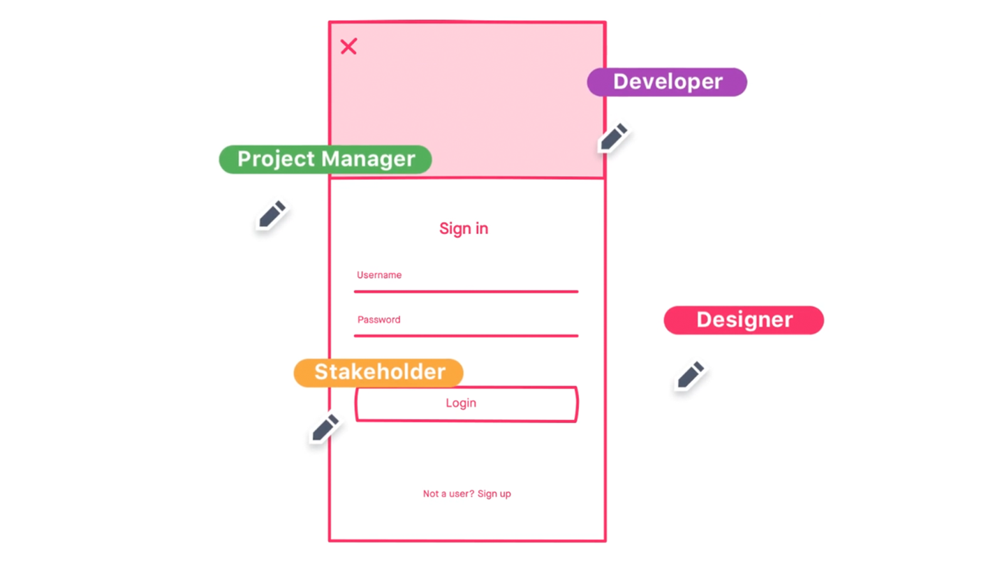
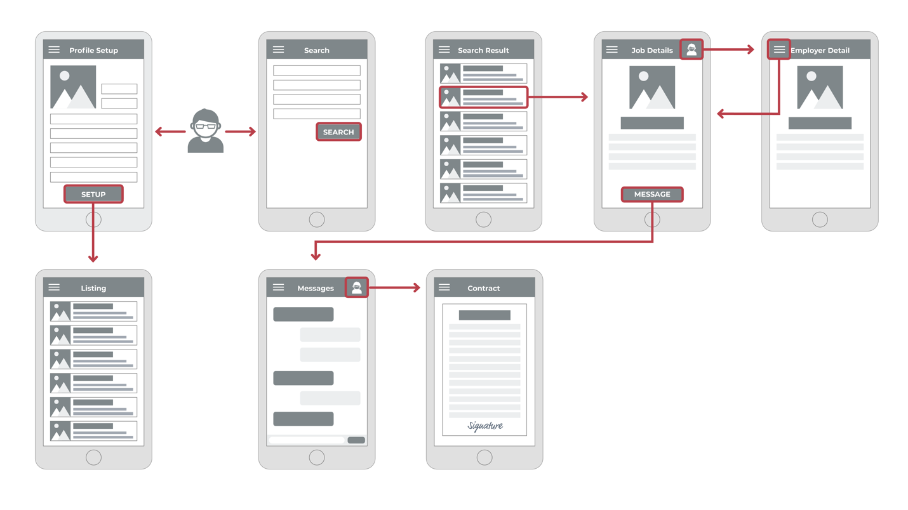
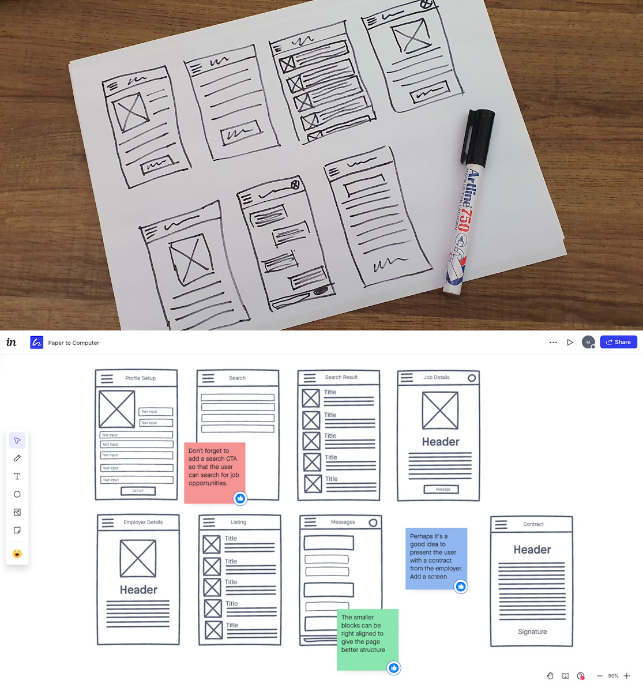
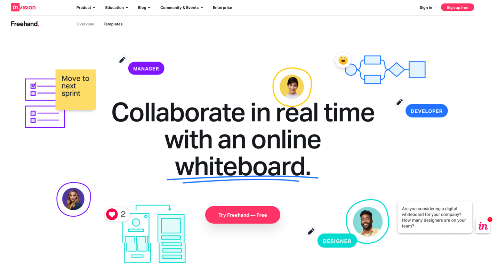
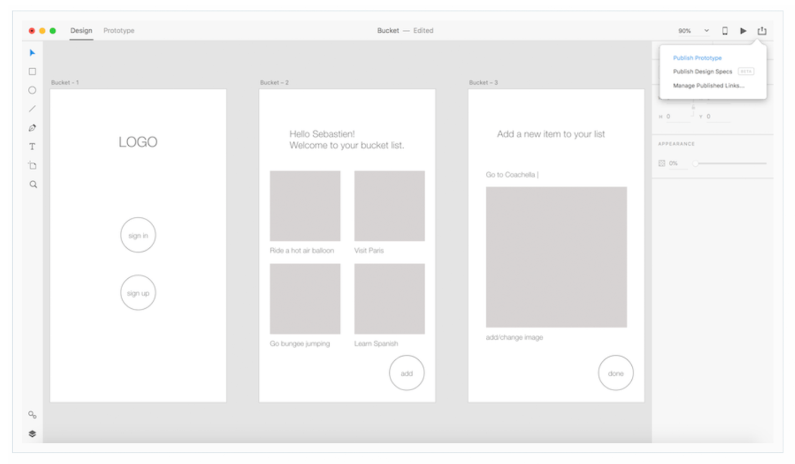
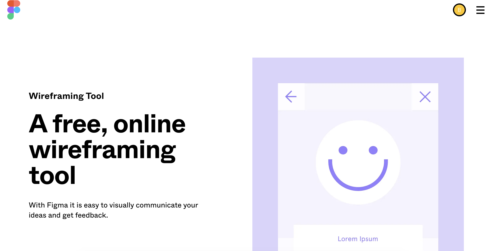
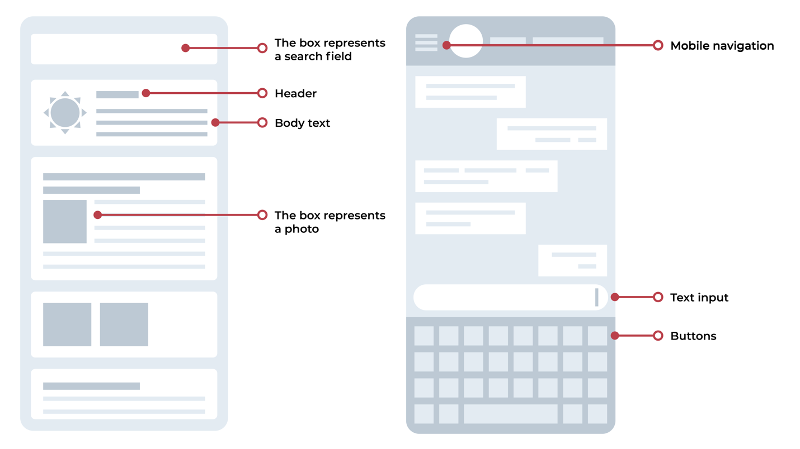
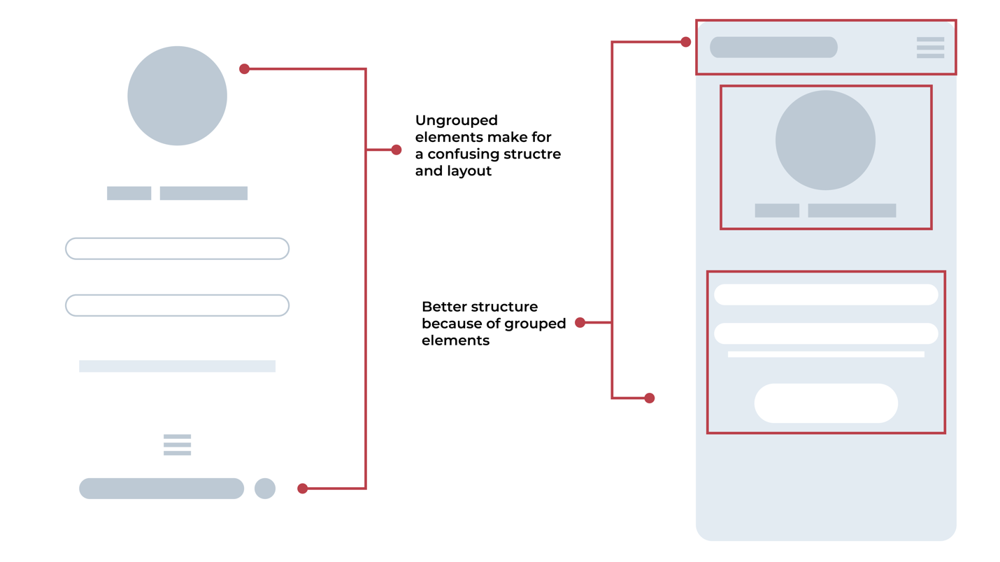

## Introduction

This lesson provides an overview of the creation and sharing of wireframes with team members to receive input and provide feedback. We will also look at some online tools to create these wireframes.

## Importance of wireframes

As we have learned in the previous lesson, wireframes are an essential step in the design process. Not only to get ideas on paper but also to get feedback from team members. Wireframes specifically look at the layout, structure and functionality of a page and how the layout will change from a big screen to smaller screens.

One other key aspect of wireframes is that when introduced early in the design process, it will iron out minor issues and ensure the basic structure is decided on, making the whole process less taxing and saving money and time in the long run.

_Figure 1: Team members contributing in InVision’s Freehand app (Source: invisionapp.com/freehand)_

## How to create a wireframe

There are four important steps to follow when creating a wireframe:

1. Research first.

2. Information architecture and user flows.

3. Paper to computer.

4. Choosing the right tools.

5. The steps are discussed below:

### Research first

Wireframes may be the first step in the design process, but we first need to spend some time researching before creating a wireframe. We need to understand our target audience. We will perform this step by conducting user research and creating user personas and mood boards. It's also a good idea to see what competitors are doing in the market and the latest trends in the world of UX.

_Figure 2: An example target audience for an online bookstore_

### Information architecture and user flows

After conducting the user research, you should have a good idea of who your target audience is and the problems you need to solve. It will also give you a clear idea of what should be included on the wireframe, how many pages you will need and the different journeys users will take to meet their goals. Ensure you have a clear plan of the user flows and information architecture of the site.

_Figure 3: An example of a wireframe user flow for a job-hunting app_

### Paper to computer

It's good to start with a low fidelity wireframe and use plain old pen and paper. When you have figured out what needs to be added and what needs to go, you can move to a medium-fidelity wireframe that will be a digital version of your wireframe.

With your wireframe recreated digitally, you will be able to share it with other team members for some feedback. Of course, you can share your paper wireframe as well, but a digital version will be easier to access, and feedback from colleagues will be more understandable.

An online, digital wireframe also alleviates problems with incorporating the thoughts from the various team members. It may allow for comments from specific team members to be visible to all team members. The image below demonstrates how the process started on paper and was then created digitally using InVision’s Freehand.

_Figure 4: The job-hunting app from paper to computer_

### Choosing the right tools

There are many online tools out there for creating wireframes, and it is up to the individual to decide which tool works best for their needs. Let's look at three popular wireframe tools.

Please click on the sections for more information.

_**Balsamiq**_

Balsamiq was started in 2008, and its main goal is to help users create software and websites that are easier to use. Balsamiq Wireframes is a graphical tool to sketch interfaces for websites, desktop and mobile applications. It's vital to take note that Balsamiq offers members a 30-day trial of their web app. After the 30-day trial is over, members need to pay for using the app.

For more info on Balsamiq, visit their website here: https://balsamiq.com/.

_Figure 5: Balsamiq.com (Source: Balsamiq.com)_

_**InVision Freehand**_

InVision Freehand assist designers in getting ideas to paper. Freehand design allows users to explore, evaluate and discuss ideas quickly. Creating wireframes through the Freehand app is effortless as the interface is easy to understand and easy to use.

For more information on Freehand, [visit their website](https://www.invisionapp.com/freehand)

_Figure 6: InVision’s Freehand app (Source: invisionapp.com/freehand)_

_**Adobe XD**_

Adobe XD is an excellent prototyping tool but can be used for wireframing as well. You will most probably use Adobe XD for mid-fidelity to high-fidelity wireframes, when team members need to see more details of the overall design and when the wireframe's functionality needs to be tested.

For more on wireframes using Adobe XD, [visit their website](https://www.adobe.com/sea/creativecloud/business/enterprise/how-to-wireframe-xd.html)

_Figure 7: Wireframes in Adobe XD (Source: webdesign.tutsplus.com)_

_**Figma**_

Figma is a web-based graphics editing and user interface design app. You can use it to do all kinds of graphic design work from wireframing websites, designing mobile app interfaces, prototyping designs, crafting social media posts, and everything in between.

For more on wireframes using Figma, [visit their website here](hhttps://www.figma.com/blog/how-to-wireframe/)

_Figure 8: Wireframes in Figma (Source: figma.com)_

## What is included on a wireframe?

Now that we have discussed some of the tools available to create wireframes let's look at what needs to be included on a wireframe. We have learned that wireframes consist of basic shapes, and only grey, black and white are used to design these. We have also learned that design elements and their looks are not essential in this process but rather where they will be placed on the page.

### Page elements

Wireframes may differ from one website to another, and you may need to add some page elements to solve a specific problem. Nonetheless, here are some essential page elements that are usually included as standard elements on wireframes:

- **Headers** - The main headers and subheaders.

- **Navigation** - The main navigation and menu items as well as the footer. Breadcrumbs can also be included if needed.

- **Content boxes** - For images and body content.

- **Place holder text** - For paragraph text and product descriptions.

- **Branding elements** - Such as the company's logo.

- **Search fields** - If the website requires a search function.

- **Buttons** - CTA buttons for users to take action.

- **Contact information** - This can be the phone number, social media and a physical address.

_Figure 8: An example of wireframe elements used to illustrate a mobile app_

Later in the design process, these page elements will become more aesthetically pleasing, but for now, they need to be as straightforward as possible. Remember, we have learned that wireframes aren't to discuss the pages' visual characteristics but rather how the structure and layout will work and where each page element will be placed.

### Groupings

When you have decided on the page elements needed for the wireframe, you need to figure out how to group these elements to make sense to a user. For example, you will group your main navigation, menu items, search field and logo and place them at the top of the page.

With the footer, you will group the contact information and social media icons and place them at the bottom of the page.

For the body content, you will be looking at grouping the content boxes and buttons and place them in the middle of the page.

This is just a very basic example, as there are many different ways to group page elements. You will most probably come up with many different versions of one page.

_Figure 9: Grouping of wireframe elements_

### Feedback from colleagues

Now that we have made sure the user flow is perfect, the target audience needs are met, and all necessary page elements have been added to the wireframe, we take our design to colleagues for additional feedback. It may become a tiring exercise as people's opinions differ from one another, and your colleagues may not think and see things the same way you do.

Nonetheless, the feedback should be seen as additional information that could make the product and experience pleasant for the user. It's always good to take feedback with an open mind, see it for what it is and not take it too personally. It's about the user, after all.

Using one of the prescribed tools mentioned, you should be able to get the team onboard digitally.

### From wireframe to prototype

After the feedback phase, you should have enough information to make some changes to upgrade and improve your design. Your low-fidelity wireframe may be a medium-fidelity wireframe at this stage. With content, copy and functionality, it will soon become a working prototype.

Keep in mind that the wireframe serves as the skeleton of the website. The content and copy is the skin, and the functionality is the muscle. Each part plays a vital role in making the website function correctly.

| WATCH  Video: [Wireframe basics: The easy way to get started](https://www.youtube.com/watch?v=aqdn7vVKygA&t=8s) (3m 10s) |
| :-: |

|  Video: [Wireframing for newbies by Balsamiq](https://www.youtube.com/watch?v=KnZrypOaVCg) (18m 45s) |
| :-: |

|  Video: [Better wireframes & sketches with Freehand from Invision](https://www.youtube.com/watch?v=lKPgRK0llO8) (7m 28s) |
| :-: |

|  Video: [Free Figma UX Design UI Essential course](https://www.youtube.com/watch?v=kbZejnPXyLM) by Bring your own Laptop (2h 57m) |
| :-: |

| READ  Article: [The Definitive Guide: How to create your first wireframe](https://careerfoundry.com/en/blog/ux-design/how-to-create-your-first-wireframe/) (15m). |
| :-: |

## Lesson Task

### Brief

For this lesson task, you will be taking the paper wireframe you have created for 'Fit for Life' in last week's lesson task and turning it into a digital online version using one of the tools discussed in this lesson. Invite fellow students, work colleges and family members to give you feedback on your design.

### Level 1 Process

- Start with exploring and finding the tool you find most comfortable to use for wireframing.

- Take your paper prototype and recreate it digitally.

- Invite others to look at what you have created and give you feedback on the layout and structure of your wireframe.

- Make sure your wireframe is suitable for both desktop and mobile devices.

- Take the feedback given to you and make the changes. It is a good idea to re-test your wireframe after making these changes to see if the structure and layout has a better flow.
