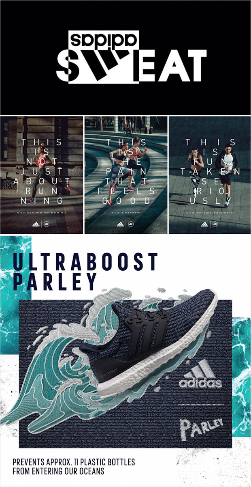
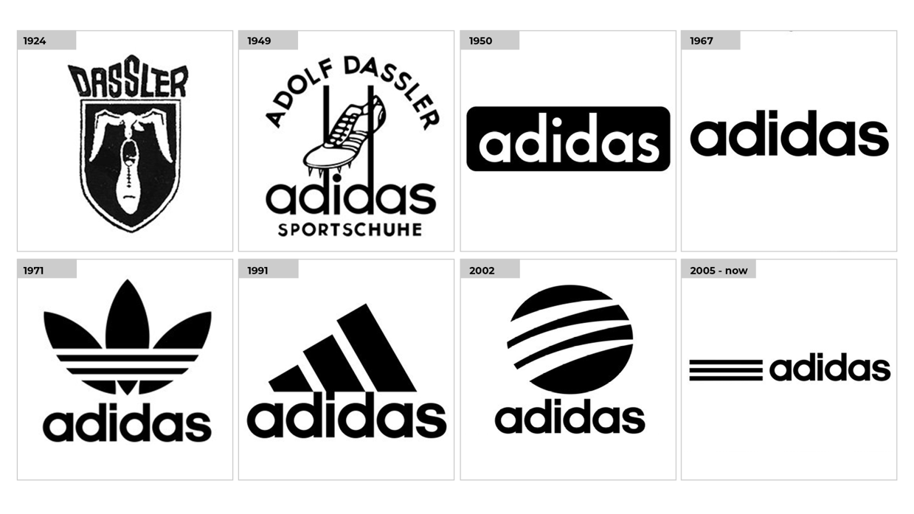

## Introduction

Does design matter? In order to understand why the answer to this question is undoubtably _yes,_ an in-depth understanding of the fundamentals of design is necessary.

> NOTE This lesson contains 4 activities for your completion. 

## Design fundamentals

There is always an alternative website offering a similar type of service or product that may be more appealing to users. To ensure that the websites that you design are appealing, ensure that you incorporate the basic fundamentals of good designing.

Below describes the fundamentals of good design.

### Good design considers the target audience

Front-end developers must design the look and feel of a website in a manner that is appealing and user-friendly for the target audience. This includes the consideration of factors such as user age group, overall theme, and category of the website. Thus, the designer’s ability and skill are not all that matter. The front-end web developer must be skilled in (apart from design techniques) analysing the target audience so that web development tools such as HTML5 and CSS3, and languages such as JavaScript, can create websites that users want to view on a daily basis.

|  | **Example:**  A developer wants to build a website for Minecraft, a decade-old, computer-based video game. 70% of Minecraft players fall within the 12 to 17-year age bracket. Thus, the developer should choose design elements wisely that young gamers would find it appealing. |
| :-- | :-- |

_Figure 1. Pixel-art style graphics. One of the most characteristic elements of the game Minecraft (Nintendo, 2018)_

### Good design is user-friendly

Users should not be expected to spend time figuring out the navigation and other aspects of the websites that you design. A fundamental principle to designing a website is to ensure it is user-friendly.

### Good design is simple

Maintaining simplicity is one of the most important aspects front-end web development. No-one wants to spend too much time on a website that is cluttered with links, buttons, and text. As you may have experienced yourself, this tends to become very frustrating.

Keep things simple by:

- Displaying only essential information on each page.
- Providing a link to lead the user quickly to further, more detailed, information.
- Presenting information in a clear manner (this is discussed further in the following tab)

### Good design takes typography, colour, and composition skills into consideration

Everything on the website must be readable and obvious. This means being skilled in choosing the right typography, colour combinations, graphic elements, and design patterns. The chosen typeface must be easy to read, appear well-rendered, and well-placed. Images and backgrounds, as well as the combination of the icons and symbols used, must be of good quality. For all businesses, but especially those who are fully website-based, a website with zero flaws is fundamental to sucess. It is thus vital that the front-end developer not only master the languages and tools with which to design websites, but also develop a sense of quality, decency, simplicity, and beauty in the work he/she produces.

## You will be expected to lead your clients in fleshing out the:

- target audience
- own market segment
- KSPs (Key Selling Points)
- overall goals for the website
- identity

Once you have worked with your client on these aspects, you must then decide how to include these aspects so that the client’s business goals are reached in a way that creates an appealing website for the user. Choosing factors such as decent animations, transitions, typefaces, colours, and images plays a vital role at this point.

Incorporating these fundamentals of good design is essential, and not doing so can have far-reaching consequences. An example that highlights the importance of good design, and the catastrophic impact that poor design choices can have on a business, is the case of [the $300 Million Button.](https://articles.uie.com/three_hund_million_button/) It is thus an inseparable part of a front-end web developer’s responsibility to remain adept not only at coding, but also at making various design decisions. A developer who understands design principles well has powerful tools to create websites that can attract more customers and encourage them to use the same site repeatedly. A front-end developer should think of knowledge in design as mandatory.

## What is branding?

In this section, we will look at brand identity fundamentals and explore the functions of different brand assets.

### Definition of branding

According to Wheeler (2020), _branding is a disciplined process used to build awareness and extend customer loyalty. It requires a mandate from the top and readiness to invest in the future. Branding is about seizing every opportunity to express why people should choose one brand over another. A desire to lead, outpace the competition and give employees the best tools to reach customers are some of the reasons why companies invest a lot of money in good branding._

The physical appearance of a person includes the clothes that they wear, their physical body and their facial features. These are aspects to an individual that are visual. Along with these aspects comes how the individual interacts with the world through sense of humour, tone of voice, personality and manner of expression. A person is thus a mix of physical appearance and manner or style of communicating. The branding of a product is similar. The product has a physical appearance in the form of a logo (visual identity). However, this logo communicates and interacts with the world, impacting people differently based on their perceptions, emotions and backgrounds (brand identity).

_Figure 2. Adidas doing a fine job at showcasing their brand to the world (adsoftheworld.com, 2016)_

### Visual identity: the brand logo

In most cases, the logo is the essential building block of the brand. Adam, et al. (2006, p 16) notes that a logo “is a mark on the bottom of the television screen, the top of a cereal box, or the side of a letterhead”.

It is also worth noting that the word “logo” has multiple meanings. There are also different words to describe this thing we call a "logo". It´s rare that you, as a front-end developer, will work with logo design, but it can be useful to understand some of the fundamental ideas and principles.

_Figure 3. The adidas logo through the years. Notice how it has change, but is still recognisable (1000logos.com, 2019)_

### Brand identity

It is usually much easier to create a brand identity on paper than bring it to life (Budelmann, et al., 2010). In other words, for the developer, promising a good brand is simple, but delivering on what was promised is a whole new ball game.

## To create a brand identity, the developer must consider:

- the brand’s elements and actions that are recognised by customers.
- the business’ or company’s core value plans and positioning.
- the business strategy.
- the nature of the business or company.
- the type of marketplace.
- the target market.

|  | NOTE  Budelmann, et al. (2010) further outlines that once a business strategy is in place; other factors such as the company’s audience, play a role in its brand identity (p. 90). There is interaction and cross-referencing between design, business strategy, and the result of brand identity. For now, this is all you need to know about this. |
| :-: | :-- |

Through the process of problem solving, designers often land on a better understanding of the meaning and values of the brand. Often the work of building the brand helps for the brand’s strengths to come forward.

### Brand consistency

Budelmann, et al. (2010) emphasises the role of the designer by stating that the key to brand identity is consistency. Consistency protects the brand promise made by the company to the client and ensures it is easily understood. The brand promise is essential – it is what the company promises to achieve. The brand promise needs to become second nature to everyone working on the brand. Customers also need to understand the brand promise. Just as we are able to identify quickly when someone we know well is acting out of character, so is it easier to identify brand _inconsistency_ than brand _consistency._ This is why corporate missteps create such public relations nightmares.

Successful brands build a personality with consistent behaviour. Decisions about what is appropriate — that is to say, ‘in character’ or ‘on brand’ — for advertising, promotions, products, websites, and selling environments, has the power to build up or damage brand identity.

### Brand integration

> \_'The ultimate purpose of a designer is to make every brand element work independently, but also to make them work together as a whole. This is brand integration. Remember, you are not only the designer but also the creator of the brand identity. That means that visual integration lies with you. You have great power - you can decide how the brand is shown to the world. Collaboration with the client is, of course, vital.

## Activities

> _"Making every page or screen self-evident is like having good lighting in a store: it just makes everything seem better. Using a site that doesn't make us think about unimportant things feels effortless, whereas puzzling over things that don't matter to us tends to sap our energy and enthusiasm and time." – Steve Krug in ‘Don’t Make Me Think’_

### Activity 1

| READ  The following chapters from the book _Don't Make Me Think_ by Steve Krug (p.10-28):  Chapter 1: Don't Make Me Think Chapter 2: How We Really Use the Web Chapter 3: Billboard Design 101 (Design for scanning, not reading) (1h) |
| :-: |

### Activity 2

| READ  From the book _Design for Hackers_ by David Kadavy:  Chapter 2: The Purpose of Design (p.19-33) (1h) |
| :-: |

### Activity 3

WATCH  The following LinkedIn Learning videos from Brad Batesole (remember to be logged into your account) as a short introduction to brand touch points.  Video: [The influence of touchpoints](https://www.linkedin.com/learning/advanced-branding/the-influence-of-touch-points?u=43268076) (3m 40s).   Video: [Branding through storytelling](https://www.linkedin.com/learning/advanced-branding/branding-through-storytelling-2?u=43268076) (3m 1s).   Video: [Exploring the customer journey](https://www.linkedin.com/learning/advanced-branding/exploring-the-customer-journey-2?u=43268076) (3m 4s).

### Activity 4

WATCH  Video: [The 3 Rules of Good Logo Design](https://www.youtube.com/watch?v=VnBUOjxmn1g) (2m 4s) by The Futur Academy.   Video: [What Is Branding? 4 Minute Crash Course](https://www.youtube.com/watch?v=sO4te2QNsHY) (3m 48s) by The Futur Academy.

## Lesson Task - Introduction to branding

### Goal

Learn to observe, analyse, and evaluate design solutions from a user's point of view, and recognize the difference between good and bad design.

### Brief

"In most people's vocabularies, design is a veneer. It`s interior decorating. It’s the fabric of the curtains or sofa. But to me, nothing could be further from the meaning of design. Design is the fundamental soul of human-made creation that ends up expressing itself in successive outer layers of a human-made creation that ends up expressing itself in successive outer layers of the product" - Steve Jobs

Your task is to do a brief visual evaluation and look at three websites from a user's point of view.

[www.norwegian.no](https://www.norwegian.no/) [www.norsk-tipping.no](http://www.norsk-tipping.no) [www.arngren.net](http://www.arngren.net)Here are some questions that can help you to evaluate the webpages. After answering these questions, write a summarizing report (300-500 words) about each of the websites.[http://www.arngren.net/](http://www.arngren.net)

|  | NOTE  Lesson Tasks do not get submitted on Moodle and not assessed by tutors. They are mainly there for you to practise what you have learned in the lesson. |
| :-: | :-- |

### Level 1 Process

- Is there a clear statement of purpose of the site? The purpose must be clear within a few seconds.
- Is the site’s design aesthetically appealing?
- Is the website copy succinct but informative?
- Does the copywriting style suit the website’s purpose and speak to its target audience?
- Are bodies of text broken into easy-to-read chunks?
- Do the colours work in harmony?
- Is the design appropriate for the target audience?
- Do clickable items stylistically indicate that they are clickable?
- How intuitive is it to navigate? Are signs obvious or obscured?
- Is it readable? Consider typeface, font size, colour contrast.

### Level 2 Process

- Is the content structurally separate from the navigational elements?
- Is the website optimized for mobile devices?
- Does the site load quickly - even (especially) for mobile device users?

## Bibliography

Nintendo, 2018. _Minecraft: New Nintendo 3DS Edition._ [Online] Available at: <https://www.nintendo.co.za/Games/New-Nintendo-3DS/Minecraft-New-Nintendo-3DS-Edition-1275925.html> [Accessed 3 July 2020].

Spool, J. M., 2009. _UIE._ [Online] Available at: <https://articles.uie.com/three_hund_million_button/> [Accessed 3 July 2020].

Wheeler, A., 2020. _Ignyte._ [Online] Available at: <http://www.ignytebrands.com/what-is-a-brand/#:~:text=The%20Takeaway&text=%E2%80%9CBranding%20is%20a%20disciplined%20process,to%20invest%20in%20the%20future.&text=A%20desire%20to%20lead%2C%20outpace,reasons%20why%20companies%20leverage%20branding.%E2%80%9D> [Accessed 13 July 2020].

Budelmann, K., Yang, K. & Wozniak, C., 2010. _Brand Identity Essentials: 100 Principles for Designing Logos and Building Brands._ s.l.:Rockport Publishers.adsoftheworld.com, 2016. _Running._ [Online] Available at: <https://www.adsoftheworld.com/media/print/adidas_running_0> [Accessed 1 July 2020].

1000logos.com, 2019. _Adidas logo._ [Online] Available at: <https://1000logos.net/adidas-logo/> [Accessed 2020 July 2020].

Adam, S., Morioka, N. & Stone, T. L., 2006. _Logo Design Workbook: A Hands-On Guide to Creating Logos._ s.l.:Rockport Publishers.
