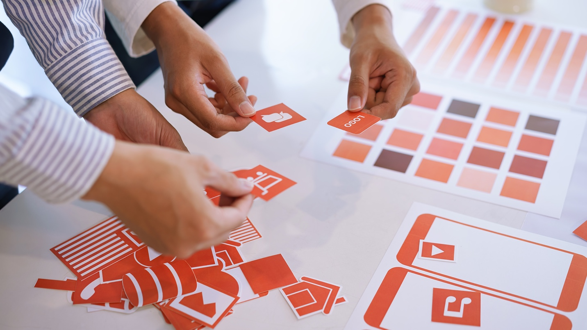
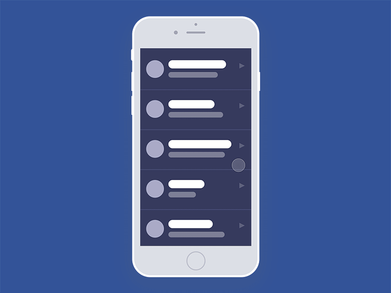
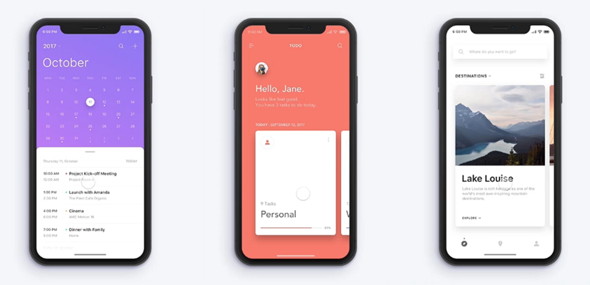
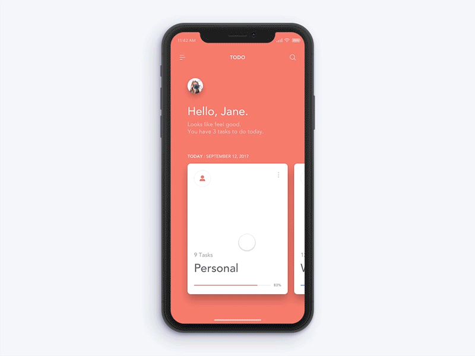
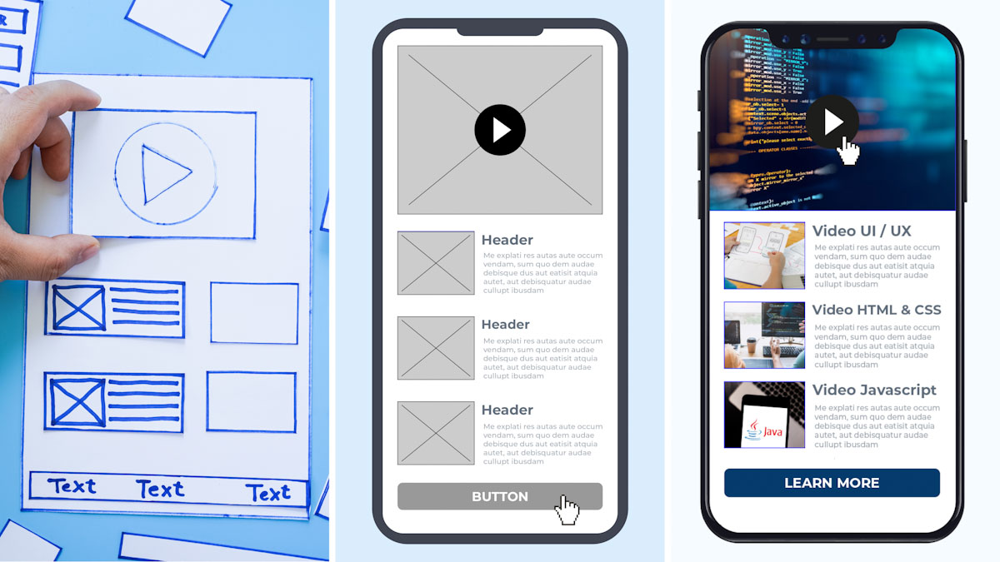

## Introduction

This lesson will look at what prototyping is and why designers must complete this step in the design process.

## What is a prototype?

A prototype is a mid to high fidelity design deliverable of the final UI of your website or app. It is also functional and should show how the website would function.

A prototype is also:

- a model or sample of a new product

- a mockup to test and evaluate how a process or concept would function

- a way for designers to see if their interface works, get feedback, spot weaknesses, and iron out errors

- a chance to make amendments and updates as necessary

- a model or mockup of a UI design, in any stage of the process, to view the functionality, usability, and flow of the product

- a mockup that gets laid out in a way that represents the real thing

- a process that should be seen as a time-saving tool.

_Figure 1: An example of a high-fidelity prototype created in Adobe XD (Source: letsxd.com)_

It's vitally important for UI designers to test their designs. This allows them to identify errors and tweak features. Prototyping enables just that - reviewing your designs in action, in an interactive setting. It's a great way to test and explore the system within the team and present the product to a client. With a prototype, you can get feedback, brainstorm ideas, and ensure that the product is heading in the right direction.

We have spoken about the different levels of fidelity with regards to wireframing. There are also different types - or levels - of prototyping fidelity, making testing possible at any part of the process. Design fidelity refers here to the level of detail and functionality within the prototype.

Below we will explore the following levels of fidelity:

1. Low fidelity - paper.

2. Medium fidelity - clickable.

3. High fidelity - advanced.

### Low fidelity - paper

This is the most basic prototype level, with minimal detail. It is usually done on paper, with any design features drawn up with a pen. This is the idea testing phase, with simple processes to get feedback on the concept.

The advantage of this type of prototype is that there is no visual aspect to distract from the project outlook. It is a very accessible way to prototype, as everyone can draw! It's also quick to set up.

_Figure 2: Paper prototyping_

### Medium fidelity - clickable

This process usually consists of wireframe designs with limited visual design. Typically with black and white basic layout designs, this prototype level allows for testing the user-flow, information architecture and basic functionality.

It is a lesser-used level of the prototype but still brings useful feedback to the project. A medium-fidelity prototype should essentially demonstrate the screen layouts and have basic clickability and navigation between screens.

_Figure 3: An example of a low to medium fidelity prototype (Source: Jad Limcaco)_

### High fidelity - advanced

This is the closest to the final product you can get before actual development. These designs include colour, typography, imagery, navigation, etc. and usually look exactly like the final product is planned to look.

It's a great way to present final designs and concepts for clients, as it looks and behaves like the real deal, but without the time and resources spent on developing the product that will possibly need multiple timely amendments.

This version should be almost fully functional, with as many features, motions, functionality and visual elements as possible.

_Figure 4: High fidelity prototyping by Jae-seong Jeong (Source: dribbble.com/johnjbrown)_

_Figure 5: High fidelity prototyping by Jae-seong Jeong (Source: dribbble.com/johnjbrown)_

As we have discussed in the previous lesson, it's advisable to start with a low fidelity wireframe (pen and paper) and then take your design digitally to a medium-fidelity wireframe. After that, the prototyping phase starts, where you will give your design functionality. In this phase, the UI of the website should also be added and finalised.

So, which one should you use? There is no one-size-fits-all solution. Each situation should be evaluated and decided individually and according to where you are in the design process. For example, a paper prototype is probably the best option for the earliest version when you are just starting.

When you have done more work on the product's functionality than the UI, medium-fidelity will work well. However, when the process has advanced to where your designs are close to a final phase, a high-fidelity prototype will probably showcase the product best.

_Figure 6: Low, medium and high-fidelity prototypes_

## Basics

Some principles to keep in mind:

- always start with the lowest fidelity wireframe

- don't get attached to your ideas and be open to feedback

- don't spend too much time on intricate details that will possibly change

- it doesn't have to be perfect (yet); it just needs to work

- functionality is key.

## The testing process

How does the testing process work? Here are two primary phases you may come across and use in your workflow (please click on the tabs to reveal more information).

_Internal testing_

Run through your designs with your team members or with other designers. It's a great way to bounce ideas, brainstorm solutions and get informal feedback.

_Stakeholder testing_

This phase involves clients and non-designers, allowing you to include the opinions of a broader range of people. It can be uncomfortable, but it's an opportunity for valuable feedback, as most probably see the design from a new perspective.

Remember that feedback is your biggest asset in the design process. It allows for a fresh perspective on the work, a chance for you to look at it in a new light and for improvements to be made. There is a lot to be learnt from testing and feedback processes; be open to listening.

|  |  READ [What is Prototyping?](https://www.interaction-design.org/literature/topics/prototyping)(p.168-190) (3 hours) |
| :-: | :-- |

| WATCH  Video: [Rapid Prototyping in UX design - Importance of Prototyping](https://www.youtube.com/watch?v=Krw_GQfoYG0) (2m 25s)|
| :-: |

|   Video: [UX Design: 6 Paper Prototyping](https://www.linkedin.com/learning/ux-design-6-paper-prototyping/benefits-of-paper-prototyping?u=43268076) (24m) |
| :-: |

## Lesson Task

### Brief

Create a paper prototype of the home page for a dog walking website. Remember to keep it simple and focus on the interaction rather than the design's finer details. Colours, typography, etc., will come later.

A paper prototype aims to give the user something physical to use and play around with. A paper prototype is different from a wireframe or a mockup because those are 2D, whereas a paper prototype is 3D and much more physically engaging.

Instead of jumping straight into a wireframe design of the site created on your computer, you can try using a paper prototype to test assumptions about how the user interacts with the product. One advantage of paper prototyping is that it's much cheaper to make and build than a coded site that needs to be re-coded. You can move elements around on the page or create new elements in a few moments.

You create the paper prototypes to be simple illustrations of the sorts of elements you would like to include in your interface. They don't need to be smart drawings. A more straightforward design often works best.

When you have a primary paper interface, please take it to users for usability testing and see how they interact with it. Because it looks like it is in such an early stage of development, users will be quick to provide honest feedback, and it helps them generate good 'what if' ideas. What if you put a button here? What if you only had one form on the page?

Paper prototyping focuses users and designers on keeping things simple and on the broader concepts rather than specific details.

### Level 1 Process

Draw, cut, paste, and do whatever you'd like to the page. Ensure you keep the design in a physical form so that users can interact with it.

Take the design to a user(s) and get them to interact with it. Listen for feedback, ask them to play around with the design and 'click' items to see what they do. You'll get quick feedback before you've spent time coding anything. Invite suggestions for changes and make them while you're in the session.

### Level 2 Process

Add other pages like product lists or the product pages themselves to your paper prototype.
