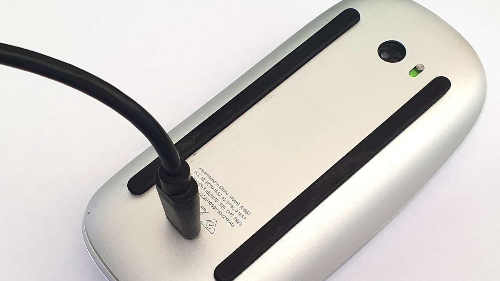
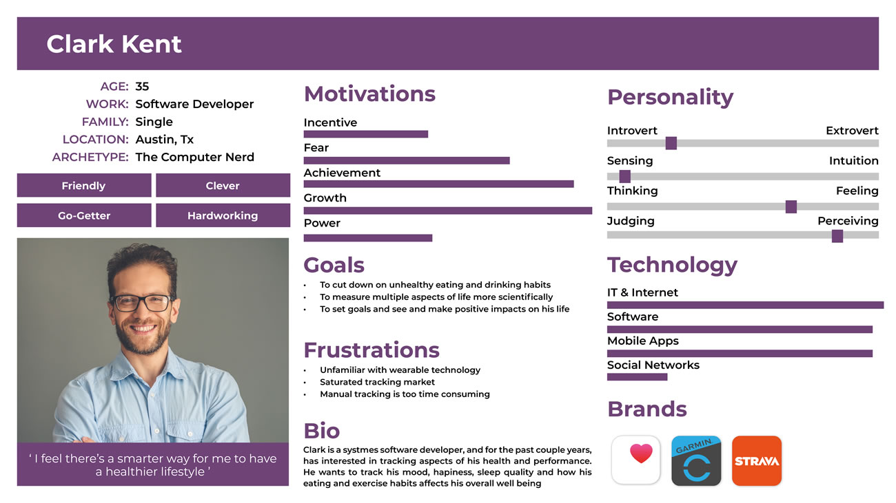
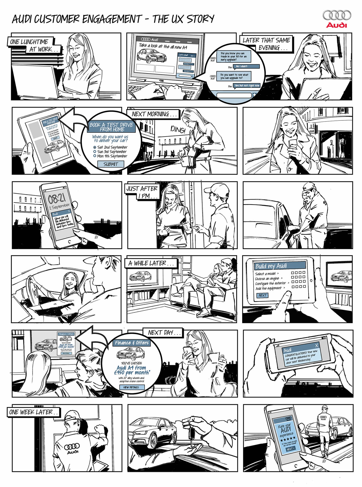
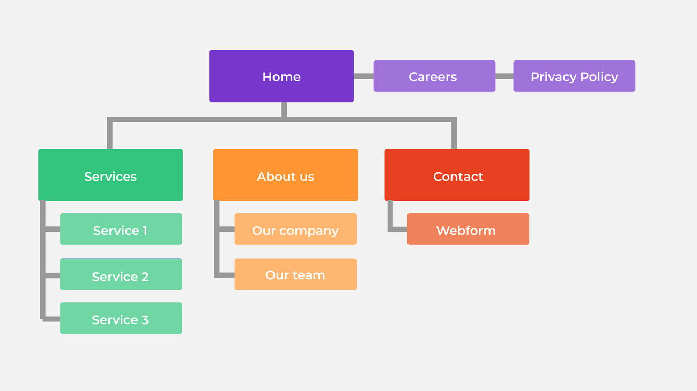
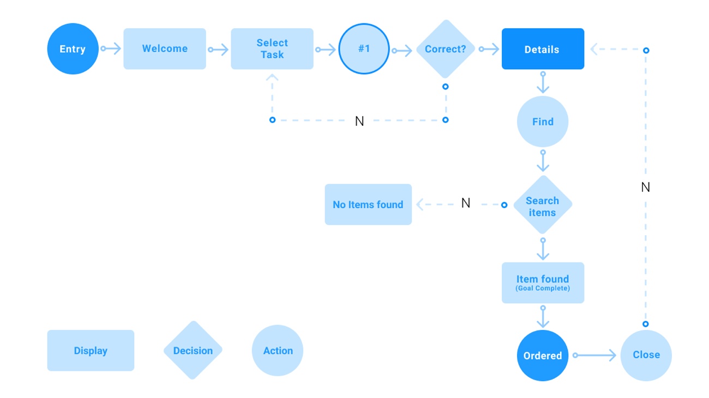
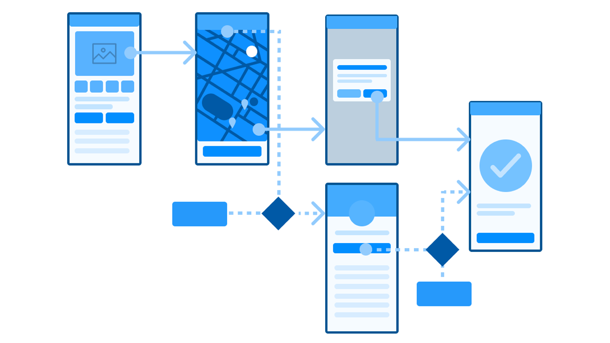
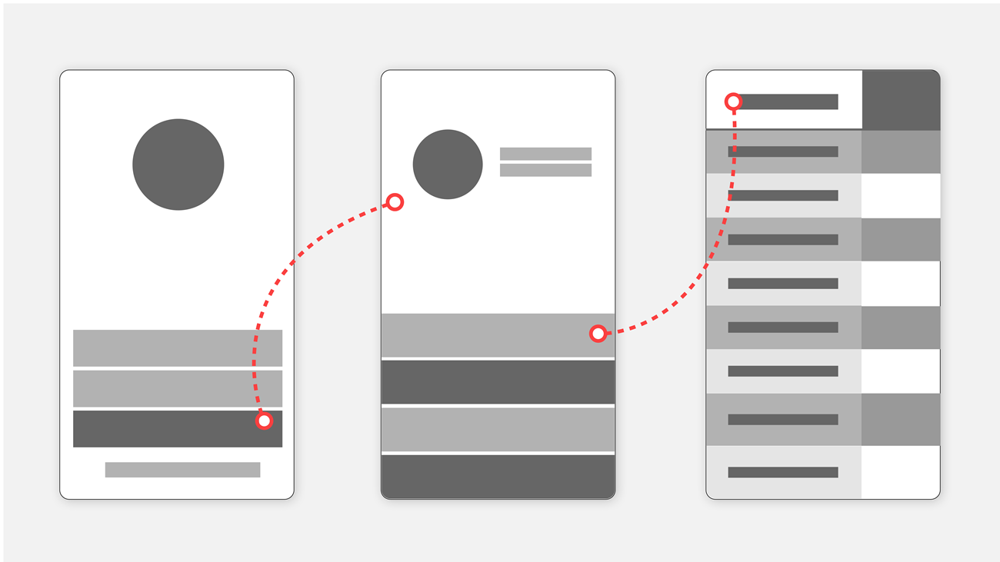
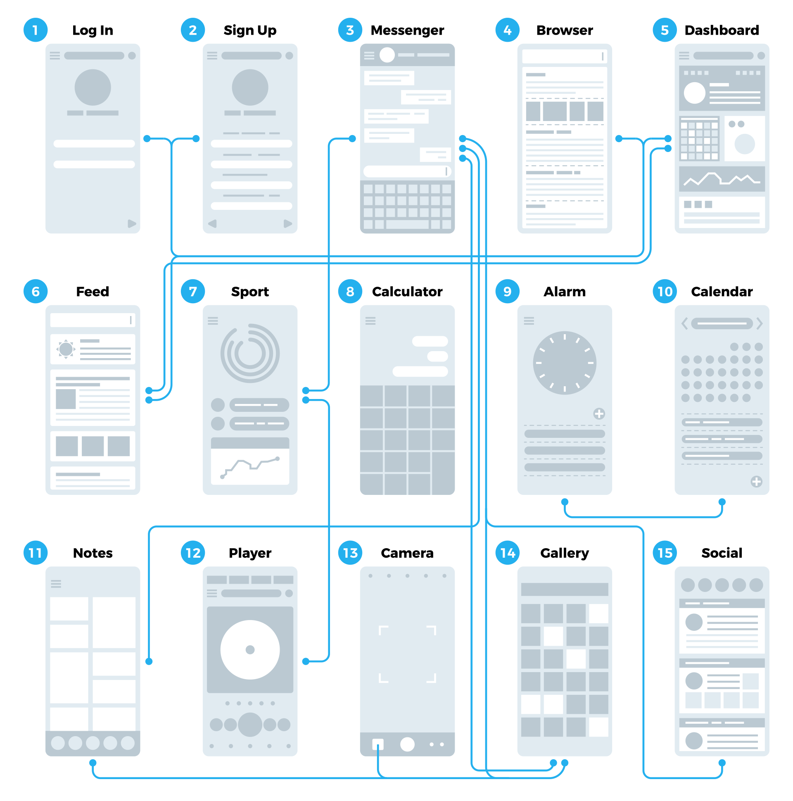

## Introduction

This lesson will explore user experience (UX) design and the tasks and process a UX designer needs to conduct to ensure a good user experience.

## What is UX design?

'User experience design' can mean different processes to different teams. There is no standard definition. Donald Norman, an engineer at Apple, coined the term 'UX design' in the 1990s.

UX design refers to how a product (website/app/platform) has been set up to create a comfortable, functional, smooth and enjoyable experience. The main goal of UX design is to make a website or app user-friendly.

UX permeates all of our interactions in the digital and physical world. Anything we use to complete a task represents a UX. Take the mouse illustrated in the image below, for example. When the mouse runs out of battery life, the user can charge it by connecting the USB to the mouse's bottom.

But herein lies the problem; when the mouse is connected to the USB charger, the user can't use it. Even though the design of the mouse is sleek and stylish, it's unusable while charging. Would you say this is good or bad UX?

_Figure 1: This is a bad UX experience for a user who has to work while the mouse is charging._

To design a successful user experience, you need to be adaptable, a good communicator and someone with high empathy levels. You should be able to place yourself in the user's position and understand what is important to them.

The UX design process includes various tasks like:

- user research
- user persona creation

- setting up information architecture
- creating user flows
- conducting user testing.

These concepts are discussed in depth later in this lesson. UX design can also include working with a UI designer to design wireframes and create prototypes.

UX design doesn't include a product's visual design; this would be the user interface designer's role.

UX has been described as making an interface useful or the 'flesh and bones' behind the UI, while UI design makes an interface look good.

## User-friendly

The UX designer has one goal: to ensure the website/app is easy to understand and use, intuitive to navigate and make users feel good.

A product that leaves users frustrated, confused or lost doesn't have good UX. The ideal is to have a website/app that looks good and has a useful UI. If an app only looks nice but doesn't work as you intend it to, there's no point in using it.

_Figure 2: A UX designer defining user experience._

## Tasks and processes

UX design is built on research. Planning and processes to achieve this include:

### User research

The first part of the process is to figure out who your new website/app/service/platform/system is for. Who is the target audience? What does the user want? User research will make the design process more manageable and possibly also help the product to be successful.

UX research usually starts with quantitative and qualitative research. Quantitative research refers to numbers and statistics, and information about quantities. For example, you can let users complete an online survey to answer questions about their eating habits (e.g., how many times a week they eat fast food).

At the end of the research, you’ll have data in numeric form, and you'll most likely be able to spot a pattern at a glance or be able to process it to discover patterns; for instance, 70% of users eat fast food three times a week.

### Examples of quantitative data

- your coffee cups hold 250ml coffee
- between 9 a.m. – 11 a.m. you had 100 users on your site

- 90% of your users access your site through their mobile device.

Qualitative research refers to a user’s behaviour and gathers non-numerical data such as user opinions and reasons for their behaviour. We now know most users eat fast food three times a week, but we need to find out why.

What are the reasons and motivations behind this decision? It could be because of their busy lifestyle or that they crave something delicious. Qualitative research is conducted by observing a user and conducting interviews and surveys with open-ended questions.

### Examples of qualitative data

- Q: Was the checkout process effortless?
- - A: No, I found the process frustrating because I couldn’t find the 'add to cart' button.
- Q: Was it easy for you to get in touch with us?
- - A: Yes, the contact form made it easy to submit a query, and the confirmation message I received gave me peace of mind.

## User personas and storyboards

Target audience research will assist in the creation of user personas. These personas are fictional, but they represent users' needs, goals and lifestyles to help you better understand your audience and identify where the users’ needs lie.

_Figure 3: An example of a user persona._

Storyboards take these user personas and place them in real-life situations to determine how a person could use your product and where they will interact with it.

_Figure 4: Storyboard of Audi’s customer engagement (source: slickandquick.com)._

## Information architecture

Information architecture (IA) is structuring a website to ensure the content is presented in an orderly fashion and information is structured intuitively for the end-user.

Information should be laid out logically so that content across the website or app is easy to find and navigate. Imagine reading a book without chapters organised in the right sequence or browsing a website with no landing page; the user will be confused.

Humans crave structure and will interact much better with a system that is intuitive and sensible.

_Figure 5: Information on the architecture of a simple website._

### User flows

Mapping the basic user journey and route a user will follow - from beginning to end - when using your product is the user flow and helps you optimise and plan the user's process and experience.

_Figure 6: User flow beginning (planning) stage (Source: [careerfoundry.com](http://careerfoundry.com/))._

_Figure 7: User flow end stage (Source: [careerfoundry.com](http://careerfoundry.com/))._

### Wireframes and prototypes

Wireframes and prototypes are things that UI designers usually work on with UX designers and are the beginning stages of the visual design process. This topic will be covered more thoroughly later on in the programme.

_Figure 8: An example of a simple wireframe._

_Figure 9: An example of wireframes within a user flow._

| WATCH  Video: [What is UX Design? (Video Guide](https://www.youtube.com/watch?v=v6n1i0qojws) (5m 6s) by CareerFoundry.    Video: [[UX Design: 1 Overview](https://www.youtube.com/watch?v=v6n1i0qojws) (13m). |
| :-: |

 | READ  Article: [UX Design Defined](https://www.invisionapp.com/design-defined/ux-design/) (5m).

|   Article: [All Design is UX Design](https://www.invisionapp.com/inside-design/all-design-is-ux-design/) (5m). |
| :-: |

**In Book: ''_Don’t Make Me Think_'**

| Chapter 4: Animal, Vegetable, or Mineral |
| :--------------------------------------: |

| Chapter 5: Omit needless words (1h) |
| :---------------------------------: |

## Lesson Task

Search for three products you interact with daily. These can include the coffee machine you use every morning, the weather app you use to see if rain is predicted, and the remote control of your TV, etc.

Think of how you interact with these products. Which elements do you consider bad UX, and which do you consider good UX? Make a list of each product's positives and negatives, and think about how you can improve each product's overall user experience.
