## Introduction

Typography is the process of arranging letters, words, and text for almost any context you can imagine. It’s simple. If you get it right your target audience will understand your message instantly. If you get wrong, they will be left confused and unimpressed. In this lesson, we look at the basics of typography, what the difference between a font and typeface is, and the small details that will create a lasting impression with your target audience.

> NOTE This lesson contains 4 activities that you should complete.

## What does typography mean?

Typography is the art and technique of arranging type to make language visible.

The arrangement of type involves the selection of typefaces, point size, line length, leading (line spacing), adjusting the spaces between groups of letters (tracking), and adjusting the space between pairs of letters (kerning).

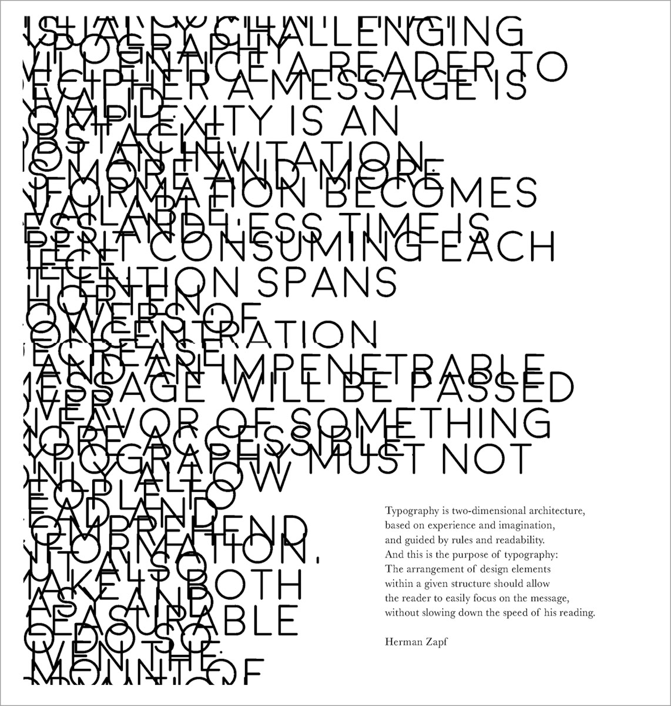

_Figure 1. A good explanation on typography by Herman Zapf (Morgan Cole, 2019)_

Typesetters, compositors, typographers, graphic designers, art directors, comic book artists, graffiti artists, clerical workers, and anyone else who arranges type for a product perform typography. Until the digital age, typography was a specialized occupation. The use of computers has opened typography to new generations of visual designers and lay users. It has been said that "typography is now something everybody does".

## Typography and semantics

The word "semantics" refers to the meaning behind a word. In other words, the concept or idea it is expressing. Apart from the arrangement of letters to express the idea, designers often enhance that by changing the shape or colour or placement of the word (all the letters together) to further emphasise the idea.

### Understanding type

Many people define typography as the art or practice of arranging letters and words. This description is perhaps too broad and simplistic for us to make any real sense of what typography is about. What kinds of letters and words are we talking about? And how are they created?

Let’s look at it in more detail:

- Typography is about how letters and words are arranged,

- How these letters and words are composed in relation to each other, and

- How they are placed within an artwork.

Typography comes into play when we:

- Choose fonts

- Decide on the spacing of letters, words, and lines

- Choose the size of letters and the length of lines

- Ensure that the copy is easy to read on different media and screen sizes.

### Seeing typography

In our daily lives, we are surrounded by so much typographic matter and designs that we don’t even notice it anymore. Go and grab a magazine, chocolate wrapper, or your mobile phone. Look at all the different types of these different elements. Can you see that a lot of time, energy, and detail went into each design? Did you ever think about the fact that a chocolate wrapper not only has to showcase the branding of the product, but it also must communicate nutritional value? It’s not news to us that the text in the books, magazines, or websites we read and use on a daily basis is easy to follow. It is easy to follow not just because of its informative and entertaining content, but also because it was designed typographically, allowing us to read with ease.

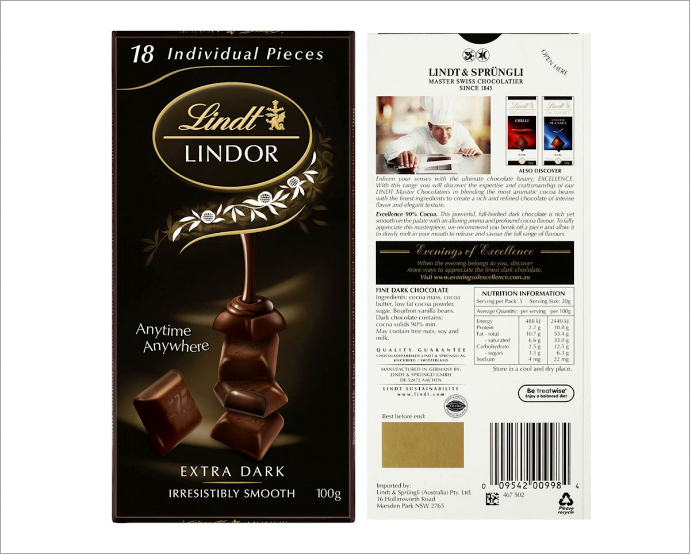

_Figure 2. Lindt chocolate wrapper front and back (Ally’s Basket, 2020)_

## Typography in daily life

Imagine removing all the typography from the main local road. How would we find our way around if we couldn’t read the names of streets or shops? If there were no labels on products, how would we know how much of a medication to take? Or for how long the cake should be in the oven? Without typography, life would be inconvenient and confusing.

Although typography can be found in almost every aspect of our lives, identifying what it is can be quite difficult. It’s almost like listening to music. You may know that you are listening to Poker Face by Lady Gaga, but do you know what style of music it is? Which instruments are being played? What timing is the music set to and in which key it is played? Recognising typography is similar in many ways. Awareness of what we are looking at in the case of typography is part of the key to understanding the subject.

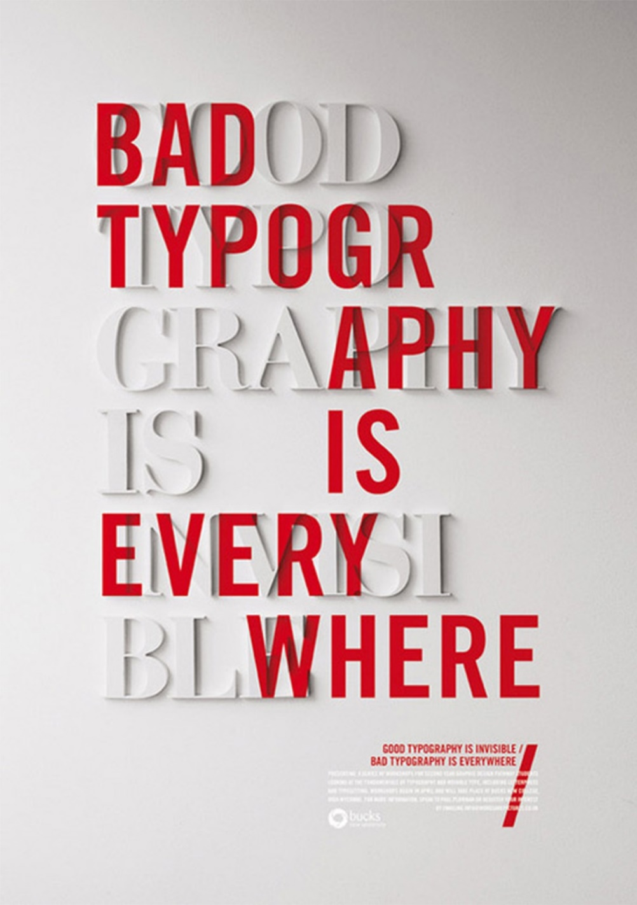

_Figure 3. Bad typography is everywhere. Good typography is invisible (Craig Ward, 2016)._

### The nature of typography

Here’s an interesting question: are all kinds of writing and letters seen as typography? The answer is definitely no! To find out why we have to take a look at history. Johannes Gutenberg from Germany invented a moveable metal type during the mid-fifteenth century. Printing from moveable metal types meant that once a text had been printed, the characters could be rearranged to form new texts. This innovation, along with the technology of the mechanical press, allowed for the production of multiple copies of texts in a much easier, faster, and cheaper way than producing handwritten manuscripts (which was the case before Gutenberg’s invention).

The technology of duplicating letters plays an important role in the definition of typography. Although modern technologies have changed dramatically since Gutenberg’s time, the basic nature of typography has changed very little.

## Typography and semantics (continued)

### What typography is

After reading the section above, we can add the following to our definition of typography: typography allows for the arrangement of letters and words (along with other visual material) to be reassembled and replicated as few or as many times as needed to communicate a message.

Typography is of course also bound by the medium or technology through which it is distributed. For example, the typography on a poster will be approached differently from the typography of a news website. When words are viewed on small screens, like that of smartphones, people should still be able to read it with ease.

Keep in mind that typography isn’t just a creative art or craft, it is a very technical subject that demands certain standards. To achieve this, typographers tap into practices and methods that were established over hundreds of years.

Typography uses signs (letters) to represent spoken and written language. There are, however, elements of language that typography doesn’t have any signs for (like tone of voice). There are also other “typographic” signs that have no utterance in language. Letters are signs that represent sound, but as signs alone, they have no meaning, just as the individual sounds (phonemes) have no meaning. Only when arranged together do they form words; and words are in turn signs (or labels) used to describe our environment, experiences, and concepts.

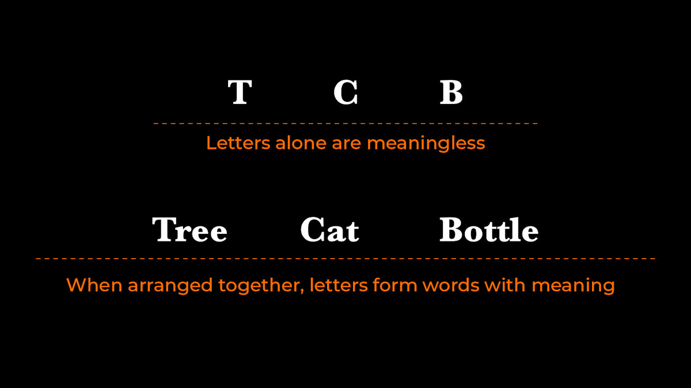

_Figure 4. Letters alone are meaningless. Words with meaning._

Typography can be looked at on different levels. There is the holistic view. This involves looking at the page, layout, composition, number of columns, and interaction of text and images. And then there is the detailed view: the choice of typeface, sizes, letter-spacing, word-spacing, line length, line-spacing, use of ligatures, small caps, drop caps, and so on.

|  | TIP  When working with typography and layout, always take a step back and look at the "big picture" (holistic view/macro view). |
| :-: | :-- |

These two levels are sometimes referred to as “macro” and “micro” typography. One is often neglected in favour of the other. Some designers see the macro view as “creative” typography or graphic design. However, spending time understanding the finer details of typography (the micro view) can only benefit the designer and the design.

Remember, the main purpose of typography is to convey information and to make reading easy, not to hinder it. It is also important for typography to act appropriately. So, when you work with typography, keep the content and the context of the text in mind.

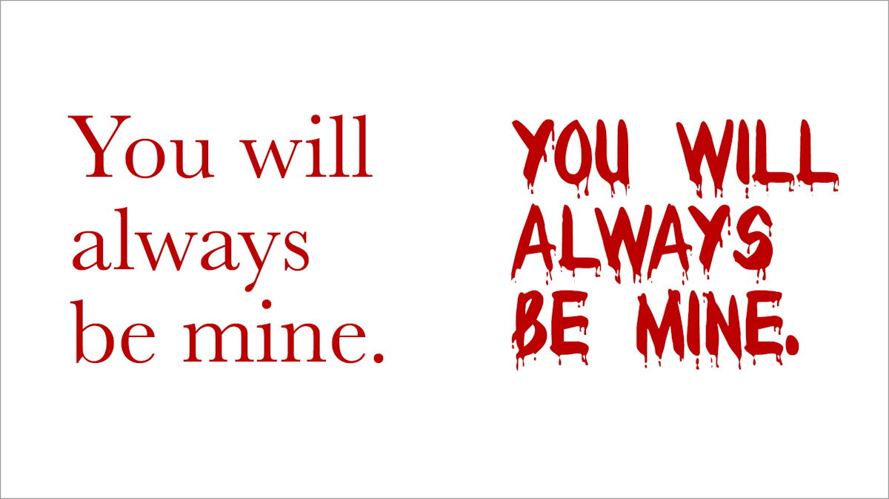

_Figure 5. An example of how the type of font can change the context of the message._

### Making appropriate choices

If asked to design and develop a website for a conference on the future of medical equipment, we wouldn’t expect to see out-dated fonts being used. At the same time, we wouldn’t expect to see something so ultra-modern that it looks like it's from outer space.

Keep the expectations of your target audience in mind, since that will play a role in your use of typography. That doesn’t mean that typography should be boring. Typographically speaking, however, your design shouldn’t turn up to the party in a Malibu Barbie costume when the invitation is for black-tie only!

Beatrice Warde said that good typography should be like drinking wine from a crystal glass. We should be allowed to concentrate on the wine and not be distracted by the container that carries it.

This is also true when we are reading a novel. We want to get into the narrative, get to know the characters and the plot. We’re not necessarily interested or even aware of the type and typography that carries this information.

Of course, there are exceptions to the rule. For example, if we are at a busy train station, we do want to be aware of the typography around us, because we need to figure out how to get from point A to point B, or just buy a ticket. Firstly, we should notice the typography and secondly, it should be easy to read.

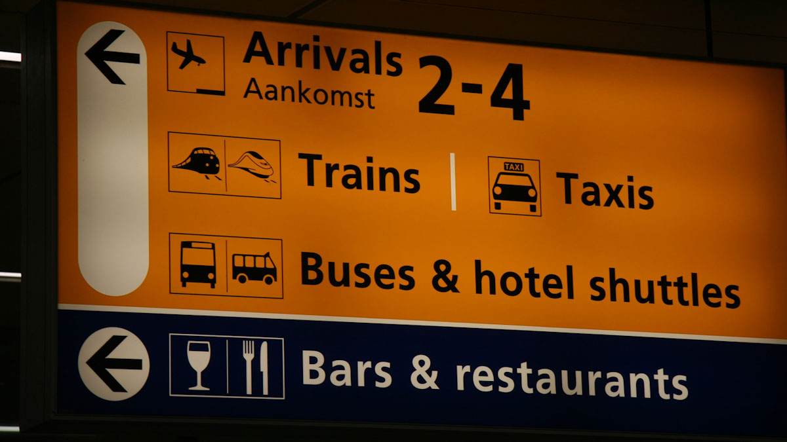

_Figure 6. Example of trilingual sign (John van Weelden, 2018)._

Did you know that people read before they read? That may sound odd, but we do this all the time without even noticing it. The layout, composition, use of colour, choice of typefaces, size of type, the width of columns, and other aspects within a design all combine to send out signals that we “read” as a whole before getting down to the job of actually reading the text. If the first “read” doesn’t draw viewers in, they won’t bother to do the second read. That is why both macro and micro typography deserves attention.

Take a quick look at these two websites:

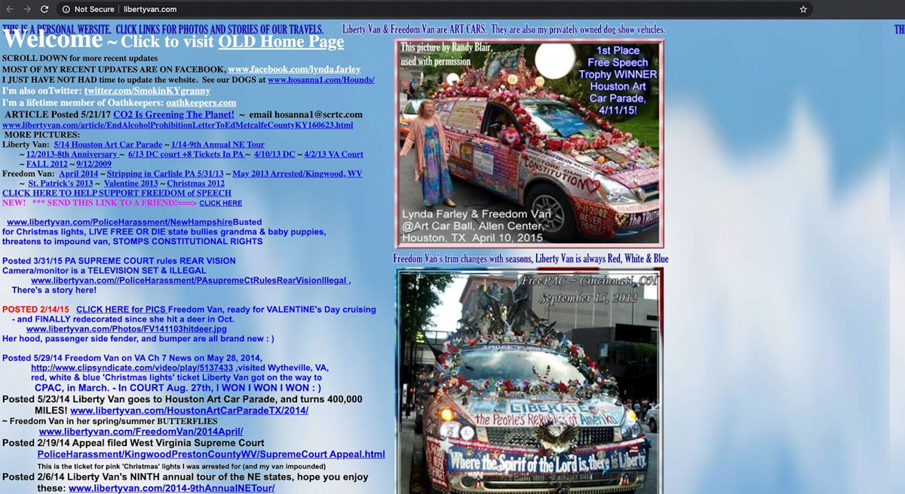

_Figure 7. An example of a website where information is hard to comprehend._

_Figure 8. This website is trustful and the information easy to comprehend._

At a glance you can easily make a decision on which of the websites is more trustful and inviting to actually read the article.

### What typography is not

To understand what typography is, it is also important to determine what typography is not. To do this, we need to clearly distinguish typography from other closely related subjects, crafts, and activities.

Students beginning to study typography often have difficulty recognising the difference between lettering and typography, particularly when that lettering is used within a graphic design context. This could be a highly stylised product name on a piece of packaging supported by typographic matter. In fact, it’s not such an easy job for even experienced graphic designers to make such distinctions sometimes!

Let’s take a look at what typography is not:

- Typography isn’t… handwriting

- Typography isn’t… lettering

- Typography isn’t… carving letters into stone or wood by hand

- Typography isn’t… sign-writing

- Typography isn’t… graffiti

- Typography isn’t… building letters out of matchsticks

In short, typography does not involve producing letters uniquely and one-by-one by hand (or tool).

This does not mean that the above ways of creating letters cannot lead to typography. A typographer may be inspired by handwriting, matchsticks, or graffiti and create a typeface that looks similar to that. There are even fonts that allow letters to appear different each time. For example, Johannes Gutenberg’s original Textura type contained alternative versions of letters that helped the type appear closer to the handwriting look that he tried to create.

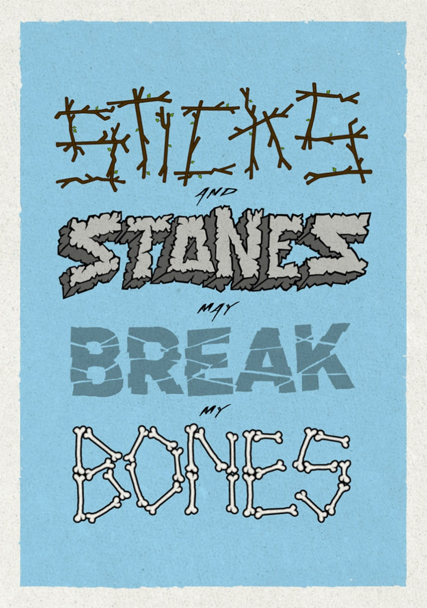

_Figure 9. Artwork by Simon Ålander (Simon Ålander, 2011)_

Remember when you first started school and learnt about the ABCs and how to write? It’s quite a lengthy and intense process. Learning typography is very similar - it doesn’t happen overnight! Focus on getting the basics right at first; then take your time to experiment with different techniques.

## Typographic basics

We will take a look at some basic and universal terms and concepts that you need to master when working with typography.

**Typeface or font**

Designers are often unsure of the difference between the terms “typeface” and “font”, as they are both well-used terms for pretty much the same thing.

The Thesaurus dictionary defines it as follows:

- Font = a set of type of one particular face and size.

- Typeface = a particular design of type.

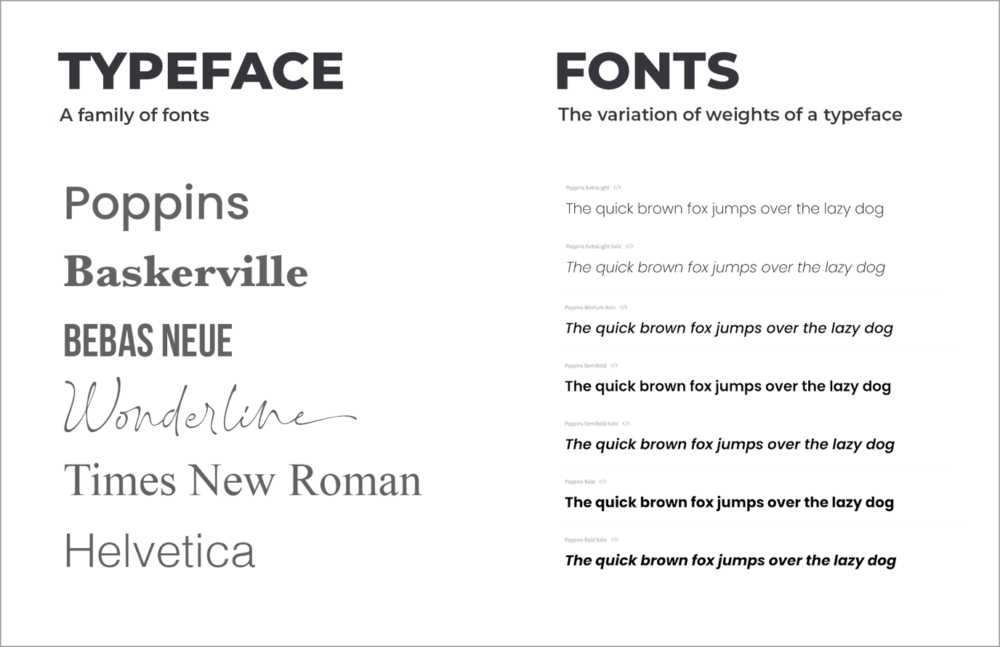

_Figure 10. An example of typefaces and fonts._

In other words, a typeface is a family of fonts (such as Arial Regular, Arial Italic, Arial Bold, Arial Black and Arial Narrow). A font is one weight or style within a typeface family (such as Arial Regular).

The FontShop's description of the difference between a typeface and font is excellent. They describe it as: A typeface is what you see – a font is what you use to make it happen.

**Typeface classifications**

There are many different classifications of typefaces, but the two most common types you will hear of are serif and sans serif. Serif typefaces are the more traditional ones. They are distinguished by a short line or finishing stroke on the end of character strokes and stems (see the picture below). Sans serif typefaces are distinguished by their lack of any serifs. They only became popular in the nineteenth century and as a result, they are considered modern.

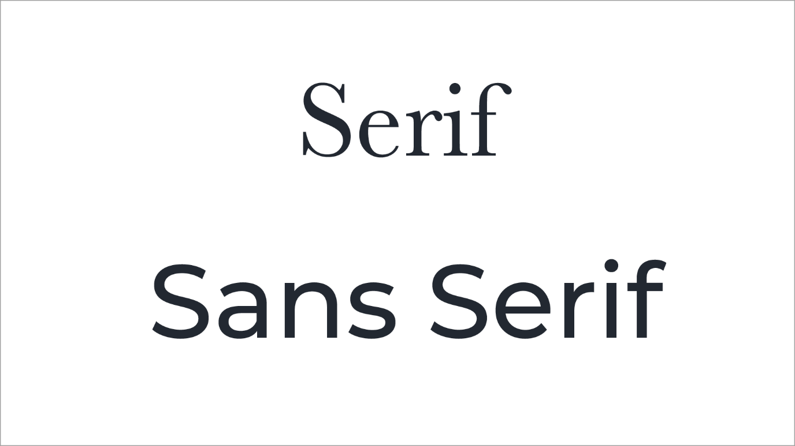

_Figure 11. An example of serif and sans serif font._

As you can see, there are a few different classes of typefaces and it's worth learning classifications to get a better overview. Through the years there have been different types of classifications, but here is the classification system that is most popular and used today.

**Anatomy**

Below are some of the basic parts of the anatomy of typographic characters.

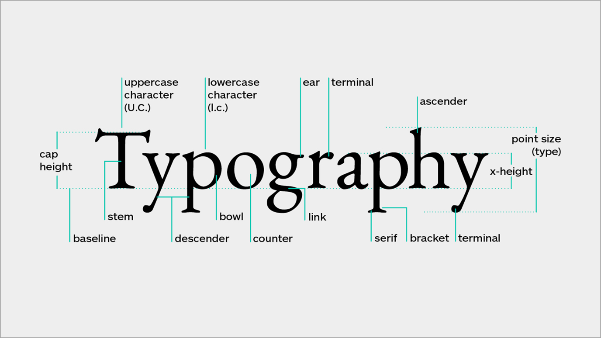

_Figure 12. Anatomy of typography (Nikita Prokhorov, 2019)._

**Kerning and Tracking**

Kerning is the adjustment of the spacing between individual characters. Tracking, however, is the spacing of a group of characters.

These two are often confused. Use this simple way to remember the difference between the two: “tracking” sounds like the lines of railway tracks which consist of individual tracks grouped together into one long track line, whereas “kerning” sounds like the kernel of a seed, which is one (individual) object.

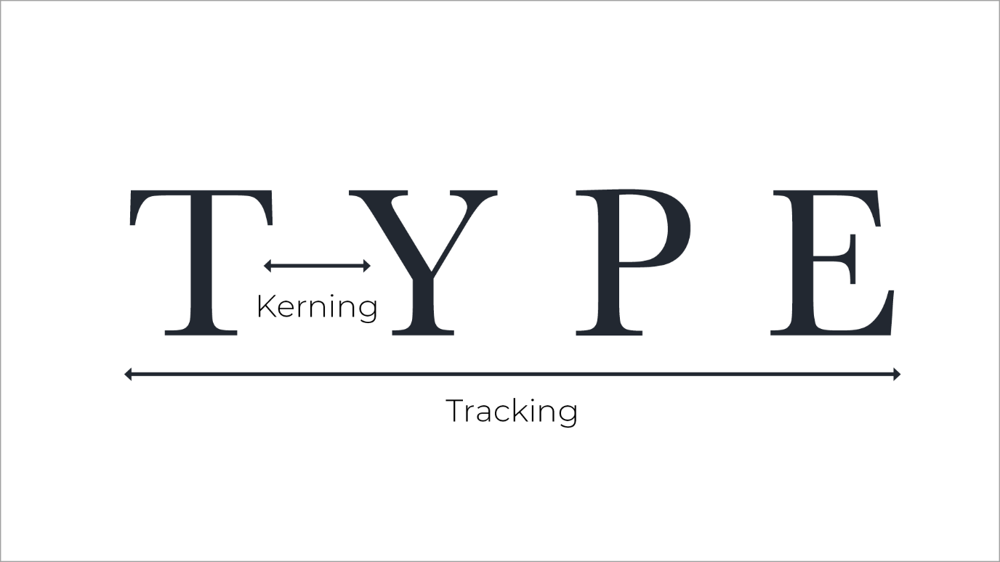

_Figure 13. Kerning and Tracking._

**Alignment**

- Generally, text should be left-aligned, simply because we are used to reading from left to right.

- Only centre or right-align text if it is a small number, such as a heading or caption.

- Justifying text (where it has a straight edge on both sides) should be used in moderation too. It looks nice and neat in some situations, but too much of it will make a layout look rigid.

- If you justify text in a small column size, it can cause irregular spacing between words as the software attempts to adjust your text to fit.

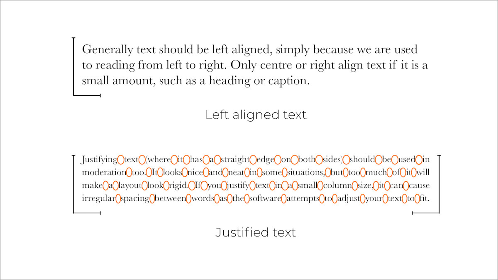

_Figure 14. Left aligned and justified text._

**Measure**

This refers to the length of lines of text in a paragraph or column. Most people tend to just refer to it as column width though. Measure is an important thing to get right in typography because it can be crucial to the readability of the text. If the measure is too wide the text may be difficult to read since the eye has to move a lot more after each line is read.

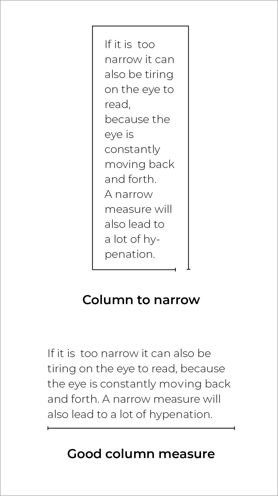

_Figure 15. Column measure._

**Leading**

Vertical line spacing is referred to as leading in typography. In the old days of printing and setting blocks of type, strips of lead were inserted between the lines based on how much space was needed. Leading’s role in typography is to ensure that there is enough space between the lines to make it readable. As with all matters of typography, it is a balance between reading comfort and aesthetic style.

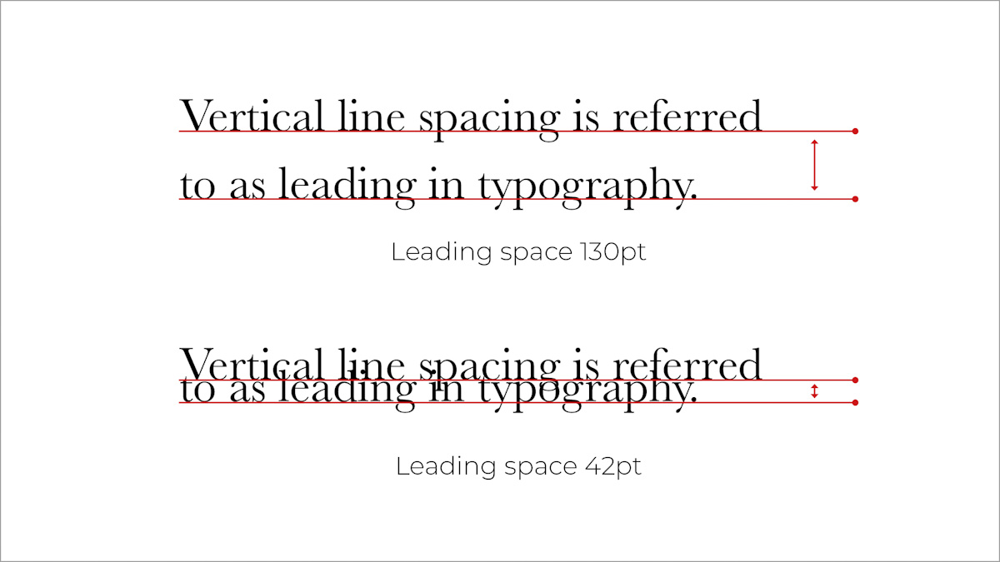

_Figure 16. Leading spacing._

**Ligatures**

When parts of the anatomy of characters either clash, or appear too closely together, they can be combined in ligatures. These can be for functional or decorative reasons depending on how obvious the clash is. Mostly, this is only an issue with serif fonts, although sometimes sans serifs will need ligatures to be set too.

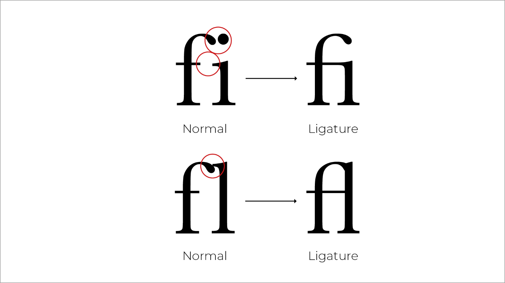

_Figure 17. Ligatures._

**Hyphenation**

Neither designers nor copywriters like hyphenation very much, but it is sometimes needed to prevent rag problems (there is a description in the next tab).

If you have to use hyphens:

- avoid having a lot of them in a block of copy

- especially avoid having one follow another

**Rag**

Rag refers to the uneven vertical edge of a block of type. Since text is normally left-aligned, rag can usually be seen along the right-hand edge. It is important to pay attention to the rag because it can make it difficult for the viewer to read the text. Usually, it can easily be fixed by reworking the line breaks or by editing the copy.

Look at the examples below. They may look quite similar to an untrained eye, but can you see that the edge of the paragraph on the left-hand side is more uneven than the one on the right? If you struggle to see it, squint a little.

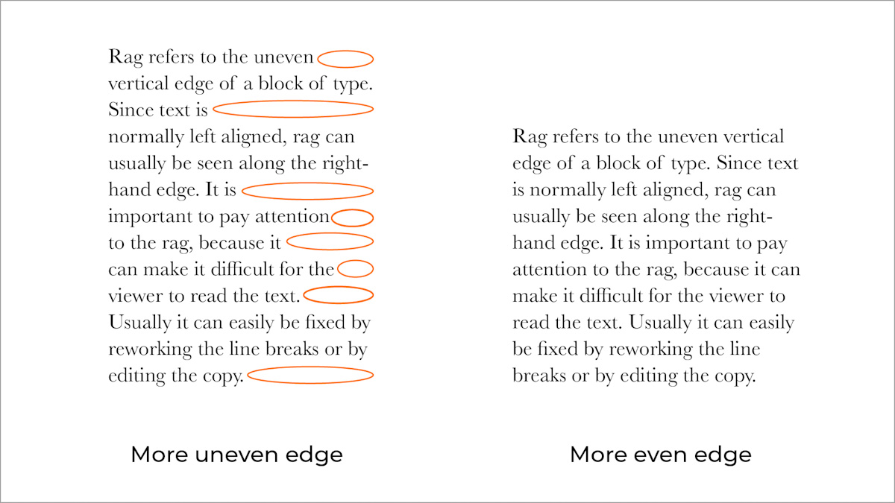

_Figure 18. An example of rag._

**Widows and orphans**

- WIDOW - If a single word or short line of copy is left at the end of a column, it is called a widow.

- ORPHAN - If a single word or a short line of copy appears at the top of the following column, it is called an orphan.

Both are considered bad typography because they create distracting shapes in a block of type. They can usually be easily fixed in the same way as the rag: by reworking the line breaks in the column or by editing the copy.

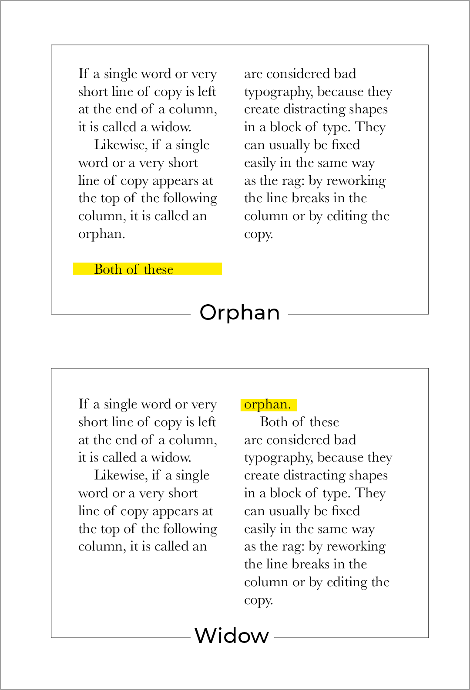

_Figure 19. An example of an orphan and a widow_

## Type families

The term “type family” refers to all the variations of a typeface or font, like different weights, widths, and italics. Type families are useful design tools because they offer designers a set of variations that work together to create harmony and clean designs. To give an artwork a feeling of unity, many designers restrict themselves to using only two type families in a project. This creates a typographic hierarchy.

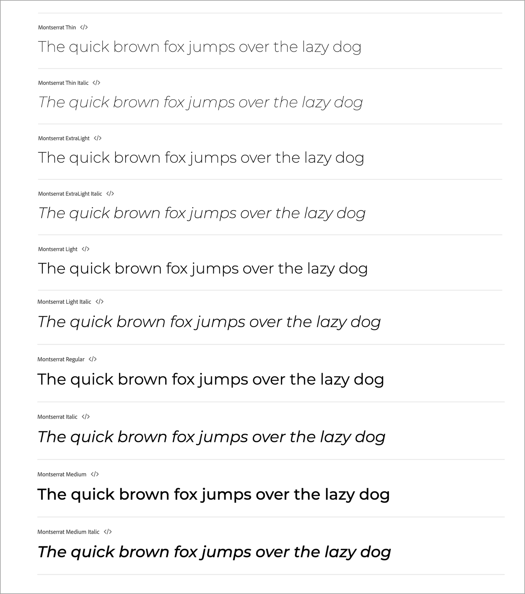

_Figure 20. An example of a typeface family_

### Typeface variations

Typefaces can have many weight variations. The naming of these variations can be quite confusing and abstract. What is the difference between a semi-bold and a medium? What about extra black, heavy, and ultra-black? The variety of names makes it hard to compare different weights from different families. This is one of the main reasons why Adrian Frutiger developed his special grid system.

### Frutiger’s grid

Adrian Frutiger is known for creating the Univers font family as well as a special numbering system to identify the width and weight of each of the family’s 21 original letters. He designed this numbering system to get rid of the confusion caused by different naming systems such as thin, black, heavy, etc. The diagram he created for the Univers family provides a sense of order between the different weight and width relationships. The grid uses numbers to identify the different cuts. Some of these numbers have been adopted by other typefaces and are still being used today. For example, the main numbers in Helvetica are 55 for Roman, 75 for bold, 35 for thin, and 25 for light. This grid system may seem daunting at first, but it can be quite a useful tool if you figure out how it works.

### Using this system

At first glance, the grid may seem complicated but it’s actually quite easy to understand once you get into the swing of things. Look at the grid below. The italic version of a font, 56, can be used seamlessly with its Roman, 55, for example. Varying character width is easily achieved by moving one row down the grid from 55 to 65, or if a bold is required, down to 75.

### Numbering systems

Frutiger’s numbering system has been applied to various typefaces, including Frutiger’s Serifa, Avenir, Glyphic, Frutiger and Helvetica Neue.

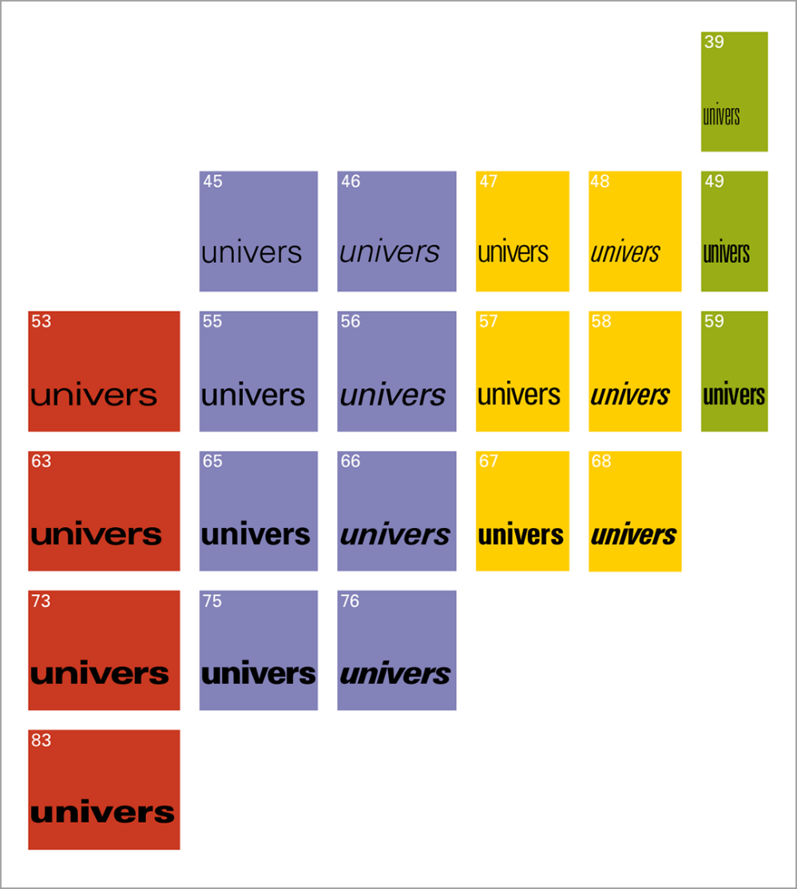

_Figure 21. Frutiger’s grid (James Brook, 2011)_

### Combining type weights

The grid is especially useful for combining different types of weights. The 65 is different enough from the 45 to stand apart from it, plus moving to italics, 46, can be done seamlessly. The difference between 25 and 95 might be too great for general usage, but it can perhaps be used to create a specific effect. The beauty of the grid is that even when choosing a heavier cut like 95, an italic option is instantly available in 96. Visual harmony is produced by combining weights that are two places apart from each other on the grid, like 65 and 45. Weights that are too similar, for example, 65 and 55, should preferably not be used together.

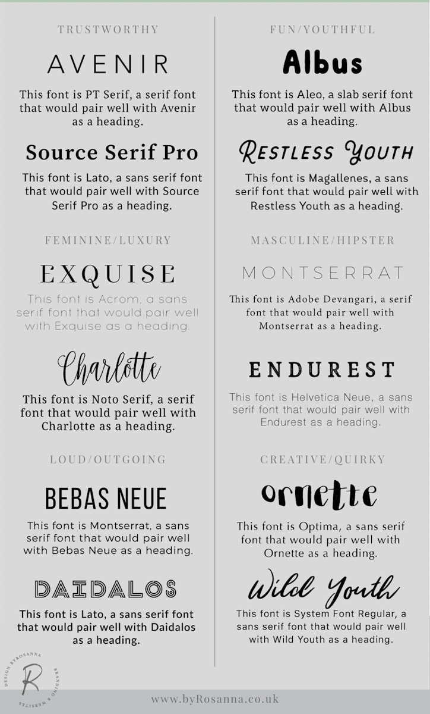

_Figure 22. A good example of different fonts working together (byrosanna.co.uk, 2017)_

Training your eyes to see what works and what doesn’t, takes time. And as with everything in life, the more you practise the better you’ll get. This is particularly true when it comes to design, especially the art in typography and colour. Hopefully, after these lessons you will see colour more clearly and look at typography in a different way.

## Activities

### Activity 1

**READ**

In his book Design for Hackers, David Kadavy gives you a short and exciting introduction into the history of typography from the "beginning" until the birth of "web font". Chapter: 'Medium and Form in Typography' (from page 37) (2h) | | :-: |

### Activity 2

**WATCH**

Video: [The History of Typography - Animated Short ](https://www.youtube.com/watch?v=wOgIkxAfJsk) (5m 9s) by Ben Barrett-Forest

### Activity 3

**READ**

Knowing and understanding classification is important, but it is not always enough to make a decision on choosing the right typefaces.

In his book Design for Hackers, David Kadavy suggests that we focus more on the overall structure of letterforms to understand the mood a typeface communicates. Section: 'Looking At Letter Structure. The Form of the Skeleton' (page 297) (1h)

_"A nearly limitless choice of fonts, of varying degrees of quality. Letters that were once carefully chiselled into marble, or cast out of lead can now be reproduced in limitless numbers with just a few clicks. Publishing technology has come a long way, and with it, the number of fonts available to designers has exploded." - David Kadavy_

### Activity 4

**READ**

From Design for Hackers by David Kadavy:  
Chapter: 'Choosing and Pairing Fonts' (pages 291-310). Pay close attention to the informational graphic on page 308 and use it as a cheat-sheet for your future projects. (2h)

## Lesson Task

### Goal

To get some experience in selecting typefaces for a particular brand and target audience.

### Brief

Choose and combine typefaces for a website for a company that sells socks called ‘Funky Monkey’. These socks are not just you average type of sock. They are designed for active people that do vigorous training on a daily basis. They are of high quality and consist of modern designs that are the major attraction for most customers.

The target audience:

- The target audience is 20 – 35 years.

- 50% male 50% female.

- Currently training for a big triathlon event.

- Want to look stylish while training.

- Loyal to two athletic brands.

- Being active is a part of their daily routine.

- Follow triathletes on Instagram.

This is the logo of the company:

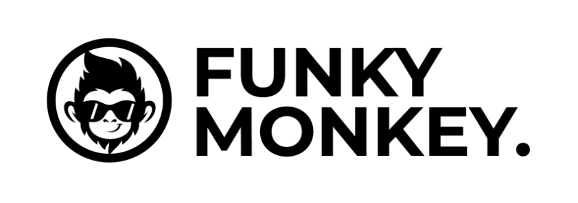

|  | NOTE  The Lesson Tasks are not submitted to Moodle and won’t be assessed by tutors. They are mainly for you to practise your skill as a designer and to prepare for the Course Assignment (CA) to come. |
| :-: | :-- |

### Bibliography

Morgan Cole, 2019. Visual Design. [Online] Available at: https://www.behance.net/gallery/75640265/Visual-Design [Accessed 10 July 2020].

Ally’s Basket, 2020. Lindt Excellence Supreme Dark Chocolate. [Online] Available at: https://www.allysbasket.com/chocolate/10268-lindt-excellence-supreme-dark-chocolate-90-cocoa-100g-block.html [Accessed 10 July 2020].

Craig Ward, 2016. Simply Ad Type. [Online] Available at: https://simplyadtype.wordpress.com/2016/03/01/good-typography-is-invisible-bad-typography-is-everywhere/ [Accessed 10 July 2020].

John van Weelden, 2018. Schiphol Airport. [Online] Available at: https://unsplash.com/photos/oLRc49-qjpY [Accessed 10 July 2020].

Simon Ålander, 2011. Sticks and stones may break my bones. [Online] Available at: https://www.flickr.com/photos/coffeemademedoit/5465343984/in/photostream/ [Accessed 10 July 2020].

Nikita Prokhorov, 2019. What Is Typography? A Deep Dive Into All Terms And Rules. [Online] Available at: https://www.shillingtoneducation.com/blog/what-is-typography/ [Accessed 10 July 2020].

James Brook, 2011. The Frutiger Grid. [Online] Available at: https://jamesbrook.wordpress.com/2011/01/25/the-frutiger-grid/ [Accessed 10 July 2020].

byrosanna.co.uk, 2017. Choosing Fonts & Typefaces That Work for Your Brand. [Online] Available at: https://www.byrosanna.co.uk/blog/fonts-typefaces-brand?utm_content=buffer5f4e5&=&utm_medium=social&=&utm_source=pinterest.com&=&utm_campaign=buffer [Accessed 10 July 2020].
