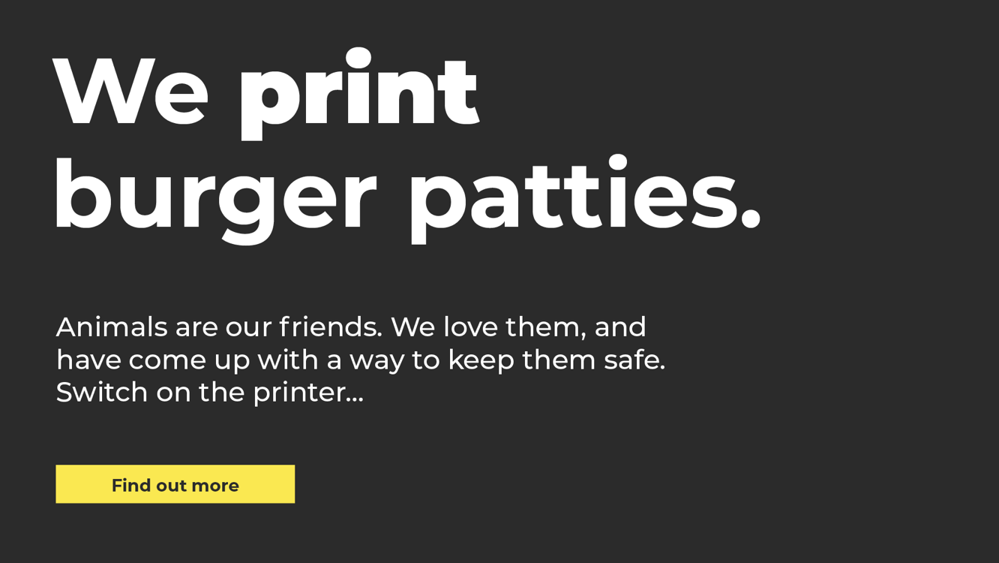
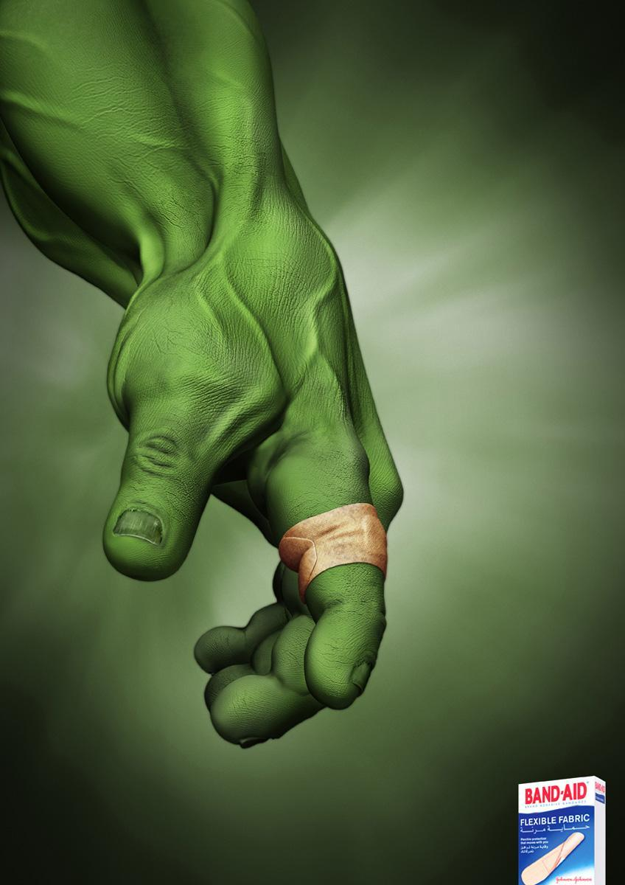
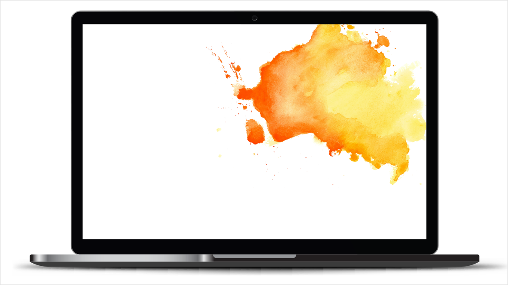
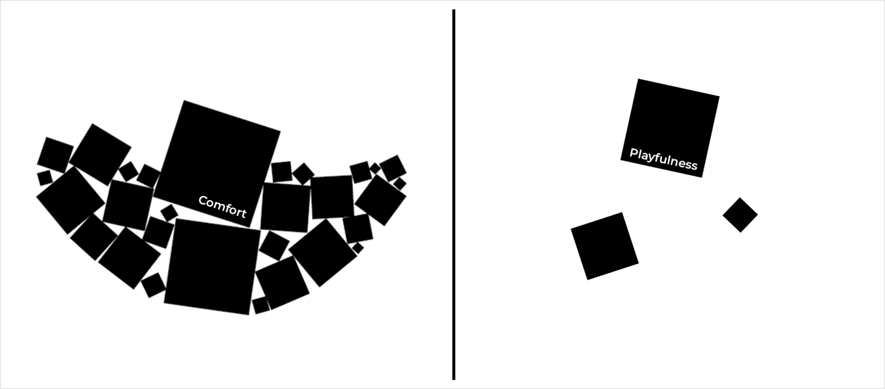
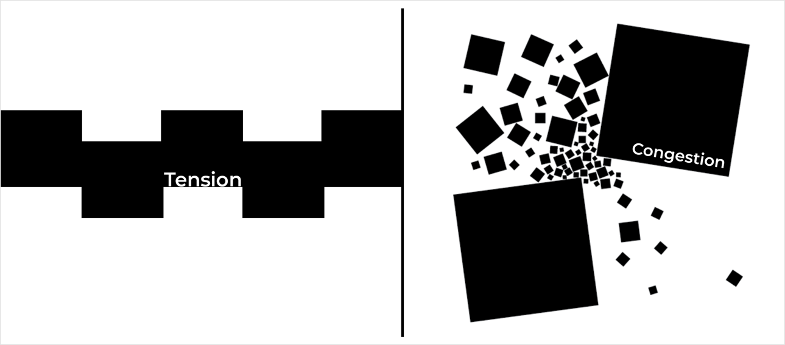
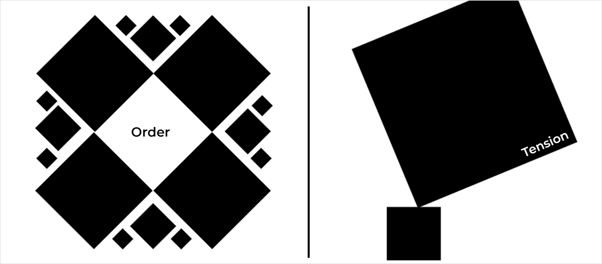
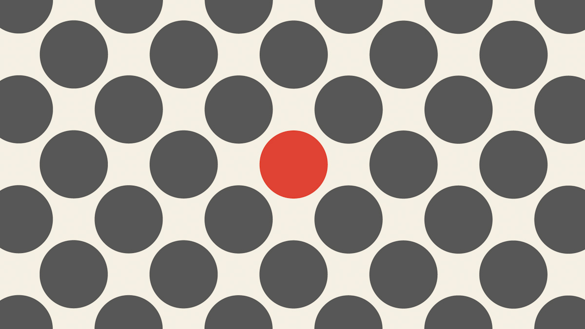

## Introduction

This lesson presents an introduction in establishing visual hierarchy in design. It presents an overview on how to organise visual elements to guide online users in knowing which actions to take when entering a website.

> NOTE This lesson contains 3 activities that you should complete. 

## What is visual hierarchy?

In design, visual hierarchy is achieved when elements are arranged and placed in spaces according to their rank of importance. For example, on a website, the logo and menu items would be at the top, because they are the first elements a user would see when entering the site. The logo tells the story of the business and the menu directs the user to where they want to go and helps guide them to reach the end goal. The goal may be to purchase a product or read a news article that sparks their interest. In short, visual hierarchy is achieved when elements are logically and strategically placed to guide the user to perform the desired action.

## Organising visual language

One needs to understand the importance of visual language before starting to design (Malamed, 2009, p. 10). A picture is more than just a two-dimensional image on a flat surface. It reflects the creator's intent and it communicates information. It is the result of creative play and thoughtful decisions. It gives the viewer a visual experience. In other words, each picture has a purpose. Designers assume that viewers will understand their message. They believe that when the viewer looks at the colours, shapes, and lines, a form of communication will take place. Designers also assume that the viewer will look at the picture in a set sequence (in other words, the viewer's eye will travel to the most important parts first and to the least essential elements last). The designer has control over this sequence.

When you plan your design, you need to decide what you want the viewer to focus on first. What are the most important parts of the design? The viewer might have to read the headline first before the picture or the body copy would make sense.

_Figure 1. Visual hierarchy is achieved with different font sizes, widths, and colour_

To complicate the matter even further, certain cultures (and even age groups) see things in different ways. That means that you can't simply assume that everyone will see the image in the same way you do. As a designer, you will most probably have a better understanding of perception because you work with visuals every day. Because of this, you will also understand the concept of visual language better. So, what comes naturally to you might have to be spelled out to the viewer.

This does not mean that your viewer is unintelligent and should be treated that way (you can't add an instruction manual along with each design to explain the concept). All it means is that you should use the tools of perception to your advantage. The viewer should be able to take in the message easily and comfortably.

It demands us to merge information and knowledge and to use it imaginatively to create purpose in the search for fresh information. This highlights the importance of being able to use information (from a client brief) and take it to new heights in your design. The message should be clearly understood and the viewer should feel enriched when consuming information. To achieve this, each element of your design should have intent and purpose; never add something simply because you want to fill a space with visuals.

Fortunately, the ability to perceive is naturally strong in most viewers. That means that designers don't have to use intricate tools and complicated methods to express information. They should simply understand the underlying principles at work when visual language is being perceived. And then, of course, as with all forms of creativity, designers should also make their own observations. This will help them to think logically, use the design fundamentals wisely, and gain an individual understanding of the process.

Our eyes are remarkably alert and responsive (Malamed, 2009). This helps us perform tasks that are necessary for survival in our environment. At the same time, we can use our sight to see and understand pictures. For example, without even thinking about it, we constantly scan our surroundings to extract information about what is "out there". If there is anything important or unusual, we notice it.

Similarly, without even thinking about it, we scan a picture or design to gain information. We immediately notice if there is anything important or interesting. All of this happens effortlessly before we have consciously focused our attention. The following print advert by the Agency Network JWT serves as an excellent example of how a well-designed advert can immediately capture the imagination of the audience (JWT, 2010).

_Figure 2. Band-aid Hulk. A good example of visual hierarchy achieved by the agency network JWT (JWT, 2010)_

So how does one communicate using a visual language? How do you know where to place all the different elements? Let's take a look at the most important mechanics of perception and how the designer can use these to make perception easier for viewers:

The first rule of thumb is to direct the eyes of the viewer. The importance of this becomes clear when considering this quote by Jack Frederick Meyers:

> _"If the viewer's eyes are permitted to wander at will through a work, then the artist has lost control." - Meyers (1989)_

The designer needs to decide what the order of perception will be. This means that the designer has to decide what the viewer will see first, and what the viewer will see last, which parts of the design should be emphasised and which parts are relevant, but not crucial.

So how does one do this? How do you direct someone else's eyes? We will now look at the fundamentals of visual language. These fundamentals are useful tools that will help you achieve a good visual balance. Apart from using these fundamentals, it is also important to make your own observations. Scroll through a website. What draws your attention? What colours and layouts do you notice first? If possible, get feedback from the people who view your designs. Did they react in the way you intended?

## The fundamentals of visual language

The most common way to communicate is verbally. When you tell a friend a story, you are communicating verbally by making use of spoken words in a certain language. The same thing happens when visual communication takes place. But instead of spoken words, we use visuals to communicate certain information to our audience. Visual communication can complicate getting the message across. That is why these fundamentals of visual language can assist in storytelling and exhibiting the most essential information.

**_Position_**

The boundaries that form the edges of a graphic, also known as the frame, have a powerful effect on a composition. Whether it is a postcard, a page, a poster, or a screen, the frame creates meaning for the elements inside it. It is generally accepted that the position of an object within a frame creates a certain tension. This tension affects the perceived importance of an object and thus where we place our attention. Look at this webpage with a big splat of colour near the edge of the screen:

_Figure 3. Paint splash in near the edge of the page_

Now look at the same splat of colour right in the centre of the screen. Which would be more comfortable to focus on?

_Figure 4. Paint splash in the centre of the page._

Most people would find the paint splat in the middle of the screen more comfortable to look at because there is plenty of white space in-between the image and the frame of the screen.

If you think carefully about where you place each element, you can create a visual hierarchy to direct the viewer's eyes. The position of each element conveys its importance. Start with the most important element and work your way down to the least important element. For example, in a magazine spread, the information graphic might be the most dominant element, followed by a headline and then body copy.

## A standard visual hierarchy consists of three levels - primary, secondary, and tertiary.

- The primary level of a design refers to the visual that draws the reader’s attention to the most important information of the design. This can be a bold headline or a striking image, for example.
- The secondary level refers to information that is still important, but not as important as the headline or the main graphic. Scannable information like sub-headlines and infographics that help the reader to stay with the design and get more information about the product.
- The tertiary level is the main text or body text of your designs. Here the reader will get all the necessary information about the product. It’s the smallest type in the design, but it still needs to be large enough to be completely readable.

Our understanding of positioning in a frame is a metaphor for how we view hierarchies in the world. We speak of people who have important positions as being at the top. Likewise, we expect the same in pictures. We anticipate that elements at the top of a page will be the most important. In fact, research shows that objects in the top half of a picture are considered more active, dynamic, and potent. In other words, they have more visual weight. Think of where the call-to-action button of a webpage normally appears. The best place would be above the fold so that the user immediately sees it when he/she enters the website. Above the fold refers to the upper half of a webpage that is instantly visible to the online user without them scrolling down. Research also shows that viewers spend more time viewing the left upper half of the page than the right lower half. Placing a company’s logo on the left upper hand of the screen, for example, would give it more visual power. The user would remember the brand more clearly. There's one thing we can be sure of: changing the position of an object in a frame changes its impact on the viewer.

Look at the following layouts. What feeling arise when you look at them?

_Figure 5. Gestalt compositions (Iott, 2012)_

Now view the following images one at a time and consider if you agree with the descriptions given below.

_Figure 6. An example of compositions comfort and playfulness (Iott, 2012)_

The first image (left) brings a feeling of comfort to the viewer as the different elements are placed in the form of a hammock. The second image (right) is more playful because the elements are placed in the middle and their orientation is unpredictable and more carefree.

_Figure 7. An example of compositions tension and congestion (Iott, 2012)_

The layout on the left can be described as tension in a sense. There is no room to breathe because there is no white space present between the various elements. The layout on the right represents a feeling of congestion as the elements are placed to represent somewhat of a bottleneck effect.

_Figure 8. An example of compositions order and tension (Iott, 2012)_

The layout to the left brings a feeling of order. If you look closely you would notice that the elements are in perfect balance with each other. The layout to the right creates tension as the biggest element are placed on top of a smaller element. It almost feels as if the smaller element would break at any given time.

**_Emphasis_**

Creating energy and life in design is achieved by variation and emphasis. Making everything of the same importance or strength will weaken the design or render it so monotonous that the viewer loses interest. An important aspect of captivating design is the balance between elements in composition – the strategic use of emphasis and balance.

Emphasis can be created by size, weight, position, colour, shape, and style. Contrast and emphasis are often confused and seen as the same thing, but in reality, they are a bit different from each other. Contrast is the difference between two objects whereas emphasis is the impact on an object and how that object forms a focal point in the overall design. Think of a pattern of black dots, and now imagine one dot being red. Your eye would immediately go to the red dot. That would be your focal point, created by emphasis (Invision, 2020).

_Figure 9. An example of emphasis in design._

**_Movement_**

When a design has a dynamic sense of movement, our eyes seem to glide across its screen. Movement can be explained as an energetic force or tension between the lines, textures, shapes, and forms of a graphic. Movement is more than just the repetition of patterns. It sweeps the viewer's attention over a picture. It is a powerful way for designers to direct the viewer's eye to the important elements in a graphic.

Consider your design and how you would like the viewer's eyes to move through this. Do you want the viewer to move across and off your page or do you want the viewer to return his or her eyes back onto the composition?

Look at the example below. Notice how the motion in the image draws your eyes to the call to action button.

_Figure 10. An example of motion on a website._

The Nielsen Norman Group describes visual hierarchy as having control of delivering the experience. It goes on to say that if the user has a hard time in figuring out where to look on a page, it’s more than likely that the layout is missing a clear visual hierarchy. This is 100% accurate. Therefore, it’s essential for you as a designer to think clearly about where to place elements and which elements you what your user to see first. What would make them stay and continue their journey to reach the end goal? (Group, 2020)

## Activities

| **Activity 1** READ  To get a better understanding of emphasis in design read the following article by Mads Soegaard: [Emphasis: Setting up the focal point of your design](https://www.interaction-design.org/literature/article/emphasis-setting-up-the-focal-point-of-your-design) (12m) |
| :-: |

> _"For a user to be able to navigate through all the information in a website or application, that information needs to be clearly presented and have a clear hierarchy". - David Kadavy_

|  | **Activity 2** READ  In David Kadavy's book, _Design for Hackers_, explore some useful tips and techniques for establishing good layouts and visual hierarchies. Chapter 7: Enlivening Information: Establishing a Visual Hierarchy (p.168-190) (3 hours) |
| :-: | :-- |

In 2014 Google developed a new design language - Material Design. Expanding upon the "card" motifs that debuted in Google Now, Material Design makes more liberal use of grid-based layouts, responsive animations and transitions, padding, and depth effects such as lighting and shadows. On their webpage they write:

> _"We challenged ourselves to create a visual language for our users that synthesises the classic principles of good design with the innovation and possibility of technology and science. This is material design. This spec is a living document that will be updated as we continue to develop the tenets and specifics of material design.”_

|  | **Activity 3** WATCH  Video: [The Intricate and Beautiful World of Material Design](https://www.youtube.com/watch?v=VqJm8Xqgmq8) (8m 26s) by XDA. |
| :-: | :-- |

## Lesson Task

### Goal

To practise achieving visual hierarchy in design using typography.

### Brief

To learn the importance of size and weight in achieving visual hierarchy with regards to fonts, use the following for a headline, sub-headline and body copy:

- Headline: Are you still watching?
- Sub headline: It’s been half a day and you are still wearing your pjs.
- Body text: Your loved ones are worried about your mental state because you have been binge watching Game of Thornes for the past 12 hours and they have found you with Cheeto dust on your face. Continue watching or get some fresh air. Either way, we won’t go anywhere.

You can use any font of your choice, but make sure it is easy to read and visually appealing. The headline should draw the user’s attention, the sub-headline should give vital information and the body copy should tell the user exactly what the product is used for and where they can get access.

## Level 1 Process

- Open Adobe XD/Figma and create a new page (1920 x 1080px).
- Create a headline.
- Create a sub headline.
- Add the body text.
- Style the headline, sub headline and body text to form a proper visual hierarchy that will draw the viewer’s attention and give them the information required to make an informed decision.

## Level 2 Process

- Create an action button for ‘continue watching’ and place it underneath the body text or where it will be clearly visible for the online user to see

**Bibliography**

Malamed, C. (2009). _Visual Language for Designers: Principles for Creating Graphics that People Understand._ Rockport Publishers.

JWT. (2010). _Band Aid Hulk_. Retrieved July 2020, from adsoftheworld.com: <https://www.adsoftheworld.com/media/print/band_aid_hulk>

Meyers, J. F. (1989). _The language of visual art: Perception as a basis for design._ Houghton Mifflin Harcourt School.

Iott, A. (2012). _Gestalt Composition_. Retrieved July 2020, from aliciaiott: <https://aliciaiott.wordpress.com/gestalt-composition/>

Invision. (2020). _Principles of design_. Retrieved July 2020, from invisionapp.com: <https://www.invisionapp.com/design-defined/principles-of-design/>

Group, N. N. (2020). _5 Principles of Visual Design in UX_. Retrieved July 2020, from Nielsen Norman Group: <https://www.nngroup.com/articles/principles-visual-design/>
