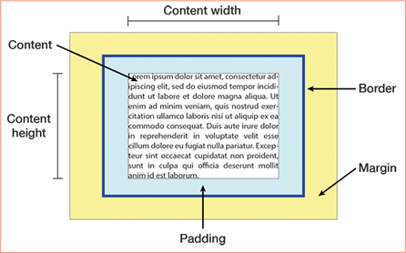

## Introduction

In this lesson, you will be introduced to the CSS Box Model.

### CSS Inline and Block Level Elements

As we have seen, HTML is essentially just text. In terms of page layout, positioning elements based on where they fall in the flow of text would be a difficult, if not outright impossible task. For this reason, CSS provides placement of elements in two ways: either in the flow of text ("inline"), or as an element that ignores its text position ("block-level").

If you are struggling with understanding the difference between inline and block-level elements, you can think of it this way: an example of an inline element might be a single word. It will always be positioned between the words around it. It does not require a new line to exist. It will always flow with the text.

Block-level elements take the width of the container element, and always start on a new line. Unless otherwise specified, they take up the full width of their parent element. A good example of a block-level element might be a paragraph or an image.

In some cases it is useful to have an element that behaves as an inline element but may also have width and height. These are known as inline-block elements.

_Note: Because HTML and CSS are so flexible, a single word may be formatted to behave like a block level element, and a paragraph may be styled like an inline element – it’s all down to how we choose to style our code._

## CSS Display Property

Here we may introduce the CSS display property. This allows us to to set how a specific HTML element is to be displayed, either as an inline or a block-level element. The display property has an extra value in addition: an element may be hidden, by using the display:none value. This will effectively hide the element in question.

The syntax for the display property is as follows:

```css
div {
   display: block; 
}
```

### <div> and <span>

The HTML <div> and <span> elements are two elements that we have not yet discussed. "div" is a commonly accepted abbreviation of "division" , while "span" simply means "from end to end". In contrast to other HTML tags such as headlines, articles, and sections, these tags have no inherent semantic value. This means they are primarily to be used for presentational markup.

The <div> element is most commonly used for block-level elements, while the <span> element is normally used for inline elements. The <div> element allows us, with the help of CSS, to position elements outside of the normal text flow. This opens the door to true page layout for web documents, and this will be one of the most important things we will be focusing on this week. Be aware that, while the <div> tag is most often used for block-level elements, theoretically almost any HTML tags may be styled with CSS to behave as a block level element. Similarly, <span> elements may theoretically be formatted as block level elements. This flexibility is one of the strengths of these technologies. As you start using these different HTML elements, you will see where it is more logical to use one over another. Part of the art of HTML/CSS is choosing where and how to use the right element!

## The CSS Box Model

We use the term "CSS Box Model" specifically when we are using CSS for page layout. The CSS Box Model allows us to control the dimensions, border, and positioning of block-level elements. It also allows us to show or hide these elements on the page.

Here are the elements that may be controlled using the CSS Box Model
- Position: where the element sits on the page, and if it is positioned relatively to other elements
- Width: the element's width
- Height: the element's height, either as relative or absolute values
- Margin: the element's outside margins in relation to other objects
- Padding: the space between the object's content and its border
- Border: the thickness, style, and color of the element's border

Here is how the Box Model Object and its properties may be visualized:


 
All of these properties may be declared using either relative (eg. 50%) or absolute values (600px).

Furthermore, some browsers render CSS Box elements differently. Although this is less of a problem than it used to be, some browsers implement aspects of the CSS Box quite differently, and it is worth being prepared to address this issue.

When we consider the size of a Box element on the page, we must take all the properties into account, and not just width and height. To calculate the width of a box, we need to add the width, the left and right padding, the left and right border, and the left and right margin. By this logic, setting the width of an element to 100% may have unintended consequences if the other properties have non-zero values.
It is important to watch the LinkedIn Learning videos and do the reading, but also to experiment with the code yourself. This is especially true of the box model – you will only have full command over page layout once you fully understand how the box model works in practice.

## Activities

**WATCH**

Video: [The Box Model](https://www.linkedin.com/learning/css-essential-training-1/the-box-model?u=43268076)

## Lesson Task

### Brief

There are practice questions in the master branch of [this repo](https://github.com/Noroff-Education/lesson-task-htmlcss-module2-lesson4). 

Attempt the answers before checking them against the answers in the [answers branch](https://github.com/Noroff-Education/lesson-task-htmlcss-module2-lesson4/tree/answers) of the repo.
