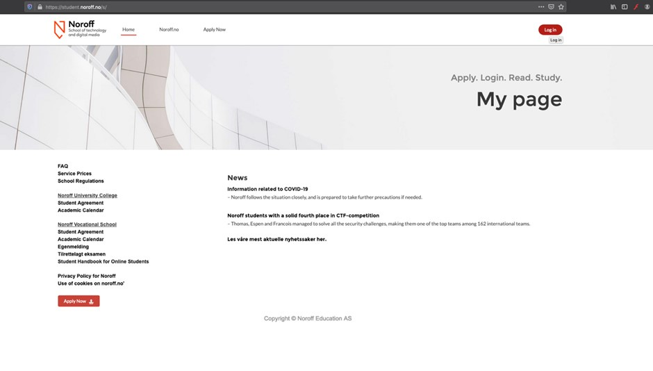

## Introduction

This is the lesson overview. Here you will get a full overview over everything that needs to be done.

## Course language for online students

This course is only offered in English. Most of the course tutors are English, and cannot read or write Norwegian. This means that ALL your communication for this course must be in English only. This includes: forum posts, emails, blogs, reflective journal entries, questions, answers and assignments.

We also encourage you to only use Discord in English, even when speaking with fellow students. This helps tutors and student success managers follow conversations and jump in to help when possible.

## Campus students

We encourage you to use English whenever you communicate with others online.

## Academic and calendar weeks

It is important to understand the difference between an **academic week** and a **calendar week**.

The **Calendar Week** (CW) follows the Norwegian calendar standard, which means that week 01 of the year starts in the first week with 4 weekdays or more (first week with a Thursday).

The **Academic Week** (AW) is normally 40 hours of content (8 hours x 5 days), which is based upon an average full-time student's study pace. We've set up the courses so that a Module in most cases will equal one Academic Week. Please note that we never recommend to combine full-time work with being a full-time student.

### Part-time students

Part-time students, who should study approximately 20 hours per week, will spend two calendar weeks to complete one academic week (or one Module). Or two calendar days to complete one academic day (or one Lesson) for that matter.

## Make your own plan

Being a webstudent is about having the freedom to study whenever you want, within certain limitations. As long as you meet the deadlines listed in your progression plan, it's completely up to you when you want to study.

We recommend that at the start of each module, you spend at least 15-30 minutes to plan ahead. Are you going to spend time on the weekend or in the evenings? Things to consider are also the teacher and tutor-support availability - more on that below.

### Tutors and support

• Tutor support is normally given four days a week (Tuesday - Friday). • Tutors are not available on Mondays, or over weekends – although they might choose to respond if they so wish. • The core time of tutoring is between 09:00 and 14:00 on Tuesday to Friday. • Questions asked within this period will normally be answered within a couple of hours. • Questions asked outside this time might not be answered before the next available tutor-time.

For instance, if you ask a question at 13:59 on a Tuesday, it will normally be answered that same day. If you ask a question at 14:30 on a Wednesday, you might have to wait until Thursday. Any questions asked after 16:00 on Thursdays might not be answered until Monday.

Plan accordingly!

## Feedback types

### Guidance

As one of our main tutoring instruments, guidance is relevant feedback that is given to you as a tool for improving in specific areas. This constructive criticism is provided in order to help you to improve your work, and you should spend time to work through it. In many cases, this feedback also incorporates some teaching, and more clarification of materials. Guidance can be given on Discord and on the forums when requested.

### Assessment

Assessment is direct feedback on what worked and what didn't in a student's Module or Course Assignment.

## Assignments and projects

In the Front-end development programme (FEU), we have a few different types of activities or assignments. This lesson provides a short explanation of what types there are, how you will be given feedback and how your answers will be assessed.

### Lesson Activities (AC)

Inside a lesson, you might find one or more activities. These will have the name Activity, followed by the lesson number and an activity number. For instance, the first activity of Lesson 1.1, will be named Activity 1.1.1.

The lesson activities are often short tasks that won't take long to complete.

If you want to get feedback or help on these, you have to post them on Discord or the relevant forum. Here you can get feedback both from tutors and fellow students. **Activities are not marked. **

### Lesson Tasks (LT)

Normally, each lesson has a task. These are slightly more extensive than an activity, and sometimes they will form part of a module or course assignment. This will be clearly stated though, but generally the main rule for a lesson task is that it is not to be handed in. LTs are normally not marked.

### Module Assignments (MA)

The module assignments are a bit more comprehensive. Here you will take advantage of what you’ve learned in the entire module. Typically these assignments are directly relevant to the upcoming Course Assignment.

Full-time students normally have a full week (7 days) to complete these assignments. Part-time students normally have two full weeks (14 days) to complete the same assignment. You are encouraged before starting the lessons of a module to read through your module/course assignment first. The deadline is usually on a Sunday before 23:59. However, always check submission dates against your progression plan.

These module assignments will normally either be given a pass/fail or numerical grade within one week. You will often receive a summarized set of feedback comments, plus some guidance on what to improve. The passing grade for an MA is 4/10 (40%).

Re-delivery past the submission deadline is not an option for those who haven't delivered at all, or just thrown something together to meet the deadline.

### Course Assignment (CA)

At the end of each course, you will also have to deliver a course assignment. This is normally a bit more extensive than a regular module assignment, and sometimes you will also have more time to complete these. Please note that all Course **Assignment marks will be listed on your Noroff Certificate as pass/fail grades.**

A course assignment will normally be assessed within two weeks, and you will be given concrete feedback on whether or not your approach to the assignment was correct. The passing grade for a CA is 4/10 (40%).

If you fail a CA you will be required to compete a resit with a new assignment brief. This re-sit costs an admin fee of 1500 NOK. More information on resits follows on the next page.

### Projects (P)

Throughout the FEU-programme, there will be a few larger projects/exams. These are graded from A-F, and will show on your Noroff Certificate as well. Refer to your progression plan to get dates for the different projects.

The project will normally be graded within four weeks (20 working days) of completion and delivery. If you receive an F, you will need to resit the project in order to pass the FEU-programme.

## LinkedIn Learning

As a student at Noroff, you get free access to the LinkedIn Learning library of video content for the duration of your studies at Noroff. To activate your account, please follow the steps outlined below.

### 1. Log in

Log into https://student.noroff.no

### 2. Click LinkedIn icon

Once logged in, click on the LinkedIn Learning icon.

### 3. Sync

This will sync your Noroff account with LinkedIn Learning.

Once you have done this, you will be able to access the links within the content to LinkedIn Learning on Moodle. Please note that you need to continue to remain logged into Moodle for this to function properly.

We encourage all you to dig deeper into the themes and topics discussed in the content and LinkedIn Learning is a wonderful resource and worth digging into.

### 4. Troubleshooting

If for any reason you have problems viewing LinkedIn Learning videos at a later stage, please try the following before contacting support:

• Go to student.noroff.no

• Log out if you are logged in

• Log in again

• Click the LinkedIn Learning icon

• Follow any instructions

• You should now be able to view the videos again

## Resits

For all course assignments and projects/exams, the passing grade is 4/10 (40%). Assessments that receive a grade of 39% or lower will appear as a Fail grade on your Noroff Certificate. You need to pass all course assignments, projects and exams in order to pass the FEU-programme.

If students wish to do a resit, they are required to register themselves for it during the resit periods. More information about this can be found under the Resits section on the FEU homepage.

First attempts for all assignments are included in the tuition fee, and each resit will incur an admin fee. You have a total of 3 attempts at an assignment - your first/original attempt and two resit attempts. An unsubmitted assignment counts as an attempt.

You will be invoiced for a resit once it is submitted. If you do not submit a resit on the agreed upon date or fail a resit, you will still be invoiced.

You are always encouraged to attempt a course assignment/project the first time round. Your resit will be a new assignment brief, and tutor support will be limited during the resit period.

### To be eligible for a resit, the student must:

• Show evidence of engagement during the course or provide valid reasons supported by documentation.

• Register for a resit through the proper channel, after the grading of the original assignment, has been finalized.

• Resits due to valid health or other reasoning supported by documentation will be free of charge.

• Students cannot register for a resit unless a grade has been set during the first attempt.

[Costs for resits can be found here.](https://www.noroff.no/en/admission/payment-loans-grants)
