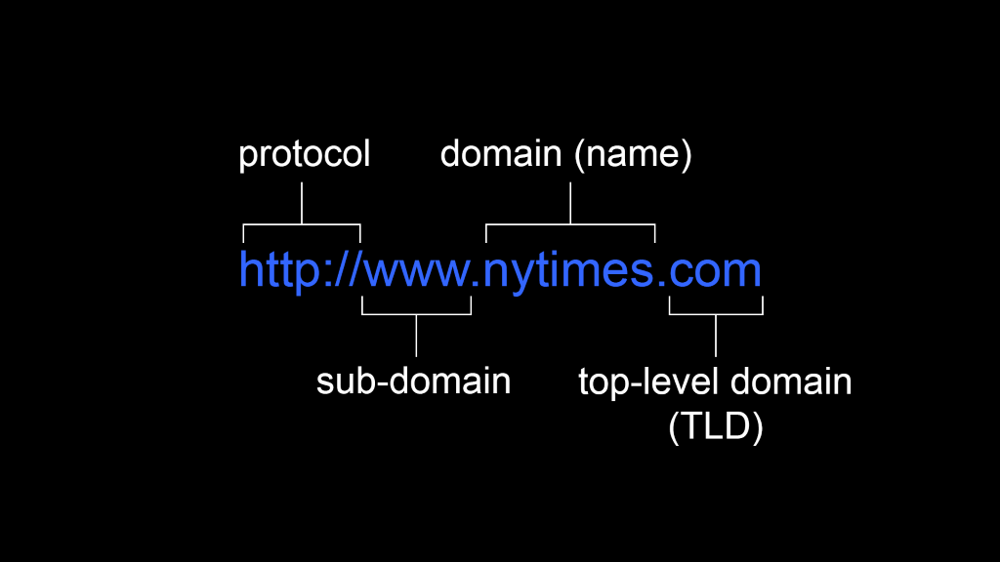
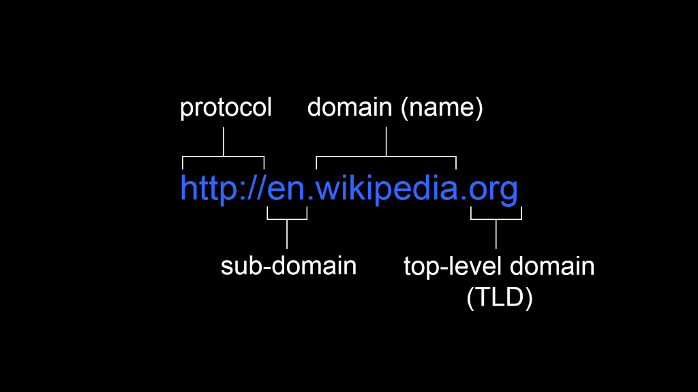

## Introduction

The basis for sharing information on the World Wide Web is hypertext. which allows us to ‘go beyond’ ordinary text and hyperlink across to other files.

In this lesson, we will look at:

- What hypertext is.
- How it is shared on the World Wide Web.

## The Library Metaphor

Imagine you go to your local library. You are looking for a book on a subject. You find this book, borrow it, and take it home. As you begin to read it, you notice that another book is mentioned several times in the text. Eventually you realize that this book has some information you need, so you decide to go back to the library.

You take out this second book, take it home, and repeat the process. Once again, you see this book mentions still other books, meaning more trips to the library. Instead of going to your local library every time you come across a footnote to a referenced text, wouldn’t it be convenient if these texts could be connected in some logical way?

It was this desire to have associative links connecting multiple texts which lead to the use of hypertext.

## Tim Berners-Lee and the World Wide Web

Tim Berners-Lee, a British computer scientist, worked at the largest internet node in Europe, CERN. During his time there, a lot of information was being shared but the sharing process was cumbersome and time-consuming. Berners-Lee’s "great idea" was to combine the existing technologies of the Internet and Hypertext to create the World Wide Web. He wanted to be able to share knowledge and information in a "Web" of documents using hypertext. Working with Robert Cailliau, he proposed a model for the World Wide Web and developed the first web browser/editor, appropriately named WorldWideWeb.

Berners-Lee chose not to license or patent the technology but allowed it to be used by anyone. Some of the first web pages were descriptions of the technology and instructions on how it could be used. The world's first web server was based at CERN and the first web page was launched on the 6th of August, 1991. This page is still active - [have a look](http://info.cern.ch/hypertext/WWW/TheProject.html).

## HyperText Transfer Protocol (HTTP)

The network protocol used to distribute and link web pages, also developed by Berners-Lee's team, is called the HyperText Transfer Protocol. It essentially functions as a client/server protocol where the client (a web browser) will request information from a server (a web server).

With HTTP, all the communication is done using plain text which is why we use HTML (HyperText Markup Language) to structure the text files.

HTTPS stands for HyperText Transfer Protocol Secure and means that the communication between the server and the client is encrypted using either TLS or SSL.

A few reasons to choose use HTTPS are:

- If clients input data on your website, that data can be securely sent.
- Google prefers websites that use HTTPS and ranks them higher in their search results.
- It can protect your website from attacks

## Uniform Resource Locator (URL)

URL stands for Uniform Resource Locator and gives you the specific location of a given resource. On the web a "resource" could be an HTML page, a CSS file, an image, or other item that is available. A URL allows us to identify where on the World Wide Web we can find a specific file.

It is up to the owner of a website to make sure that URLs to their website work and that the resource can still be found at that location. If you change folders or file names, it can affect other sites linking to your content, and you might need to redirect for a user.

## Domain Name System (DNS)

### Top Level Domains

When we talk about web domains, we are talking about addresses which are connected to servers or other devices. Top level domains, as the name implies, are the highest web domains in the domain name system hierarchy. There are currently over 1000 top-level domains and examples of them are .com, .org, and .net.

Each device which connects to a network using the Internet Protocol (IP) is assigned an IP address which is written using a notation that looks like 2001:4860:4860::8888. IP addresses are great, but they aren’t easy to remember – imagine how difficult it would be to remember all the IP addresses of the websites you visit daily! This is where a Domain Name System (DNS) comes into play.

A DNS server will take an IP address and look it up in a table where it will find the domain name associated with the IP address. It will then send this name associated with this IP address and therefore you can type words into your web browser, rather than just numbers. If a DNS server can find a name that matches the IP number, it will work. This also works in reverse – a DNS can translate a domain name to an IP address and this process is referred to as resolving.

While a "master list" is kept by DNS authority, it would be too much work for a single server to handle every single domain name request. For this reason, there are multiple domain name servers distributed around the globe. Each top-level domain has its own authoritative name server. If your local DNS does not have a name for a given IP address, it will contact other DNS servers to obtain it from them. DNS is also used for email addresses, instant messaging, and other instances where a name is easier to remember than an IP address.

In summary, here is what the Domain Name System offers:

- Mapping of IP addresses to domain names and vice versa
- All mapping is stored in a database
- The DNS database is distributed

## Activities

### Activity 1

READ

Interview: Vint Cerf: We Knew What We Were Unleashing on the World (30m)  
Vint Cerf talks about the history of how TCP/IP came to be the standard for network communication.

### Activity 2

READ

Article: Dec. 9, 1968: The Mother of All Demos (30m)

## Lesson Task

### Goal

Familiarize yourself with IP addresses.

### Level 1 Process

Try using an IP address instead of just typing the domain name of a website into your browser. Go to [https://dnschecker.org](https://dnschecker.org) and find the IP address of a website you regularly use. Then copy the IP address and paste it into your browser.

INFO

Hint: Remember to check whether the website uses http or https.

### Level 2 Process

Use only the URL to navigate around Google. Try using this format: [https://www.google.com/search?q=insert+search+term+here](https://www.google.com/search?q=insert+search+term+here)

Then try add "&tbm=vid" to the end of your URL to navigate to the videos page. (tbm=isch takes you to images and tbm=nws takes you to news). When browsing sites over the next few days, look out for parameters in the URL and try figure out what they're used for and adjust them.

Go to [http://httpbin.org/get?name=insert+name&colour=insert+colour](http://httpbin.org/get?name=insert+name&colour=insert+colour) and see how the info in the URL gets sent to the server. Change “insert+name” and insert your own name. You'll see the data displayed in JSON. Try adding other variables to the URL.

Next, go to [http://httpbin.org/forms/post](http://httpbin.org/forms/post) and fill in the form. On the submission page you'll see the data was sent securely and doesn't appear in the URL.
